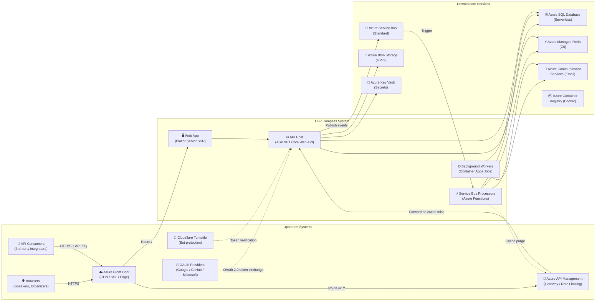
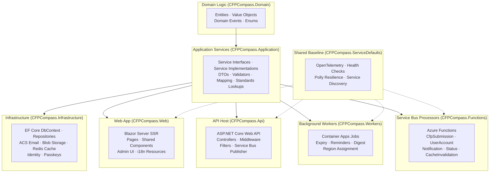

# System Context & Logical Components

---

## Purpose

This document establishes **where CFP Compass fits within its ecosystem** and **how it is logically decomposed** into components with distinct responsibilities. It is the structural foundation for architectural reasoning, defining what is in scope, what is out of scope, and what each logical part of the system is responsible for.

This document focuses on **structural clarity, not behavioral flow**. It describes what components exist and what they own, not how they are implemented or operated.

**Excluded from this document:**
- Detailed component implementation (see `docs/architecture/architecture-specifications.md`)
- Deployment topology and infrastructure provisioning (see `infra/` Terraform modules)
- API endpoint signatures and message schemas (see `docs/api/openapi/` and `docs/api/asyncapi/`)
- Operational runbooks and alerting configuration (see Operations Guide)
- Scope boundaries and architectural guardrails (see `docs/architecture/non-goals-and-guardrails.md`)
- Security controls, threat model, and access policies (see Architecture Guide §Security)

**Companion documents:**
- `docs/architecture-guide.md`   High-level architectural overview, business purpose, and NFRs
- `docs/architecture/architecture-specifications.md`   Component design, communication patterns, failure modes
- `docs/architecture/non-goals-and-guardrails.md`   Intentional scope boundaries

**Intended audience:** Architects, lead developers, and cross-functional stakeholders who need a structural understanding of the system before diving into implementation details.

This document answers: *What is CFP Compass, where does it sit in its ecosystem, and what are the responsibilities of its major components?*

---

## System Context Overview

CFP Compass is a **domain-level web application and public API platform** serving three distinct consumer groups: community speakers (authenticated users), event organizers (unauthenticated submitters), and third-party API consumers (programmatic integrators). It sits at the intersection of several upstream identity and bot-protection services, and depends on a set of managed Azure downstream services for storage, messaging, and communication.

**Key characteristics from a system context perspective:**

- **Public-facing read path:** CFP listings, detail pages, and the public API are accessible without authentication. Azure Front Door (CDN) and APIM (API gateway) sit in front of these paths.
- **Authenticated write path:** Speaker actions (tracking, preferences), submission editing, and organizer claim flows require authentication. ASP.NET Core Identity with OAuth providers handles this.
- **Event-driven write architecture:** All mutating operations from the API flow through Azure Service Bus to Azure Functions before touching the database, decoupling API responsiveness from storage availability.
- **Scheduled batch operations:** Background jobs (digest emails, deadline reminders, CFP archival) run on Azure Container Apps Jobs outside the request/response cycle.
- **Contract-first integration boundary:** All REST endpoints and Service Bus topics have approved OpenAPI 3.1 or AsyncAPI 3.0.0 specifications before implementation, making the integration boundary explicit and governed.

**Upstream interaction pattern:** End users reach CFP Compass via browsers through Azure Front Door. API consumers reach it via APIM. Identity is delegated to OAuth providers (Google, GitHub, Microsoft) or ASP.NET Core Identity directly (passkeys, passwords). Cloudflare Turnstile provides bot protection on the public submission form.

**Downstream interaction pattern:** CFP Compass writes to Azure SQL (authoritative state), caches in Azure Managed Redis (performance), sends email via Azure Communication Services (notifications), stores images in Azure Blob Storage (logos), and buffers write events in Azure Service Bus (resilience).

**Delivery semantics:** The public API follows an HTTP request/response model for reads (synchronous) and HTTP 202 Accepted with async processing for writes (eventually consistent, polled via status endpoint). Service Bus delivers events at least once; all processors are idempotent.

**Separation of concerns:**
- **Azure Front Door** owns: edge caching, SSL termination, DDoS protection, and global routing.
- **Azure API Management** owns: API key management, rate limiting, developer portal, and response caching for public GET endpoints.
- **CFP Compass** owns: domain logic, data persistence, email dispatch, CFP lifecycle management, user authentication, and background processing.
- **Azure Functions** own: asynchronous write processing from Service Bus messages.
- **Azure SQL** owns: authoritative domain state.

**Strategic outcome:** This architecture positions CFP Compass to serve public read traffic at low cost (CDN + APIM cache), accept write operations resiliently (Service Bus buffering), and operate with minimal idle cost (serverless SQL + Consumption-plan Functions).

### System Context Diagram

> **Note:** The Web App calls Application services directly (in-process); it does not make HTTP calls to the API Host for the same-process Blazor Server rendering. The `Web → API` arrow represents cases where the Web app initiates actions that go through the full API stack (e.g., OAuth callback handling, form POSTs routed through MVC controllers). All write operations from the API use the asynchronous Service Bus path; the API never writes to SQL directly on the write path.

---

## Upstream Systems (Sources)

Upstream systems are those that initiate interaction with or provide capabilities to CFP Compass. CFP Compass owns its response to these systems; it does not own their behavior.

### Azure Front Door (CDN / Edge / SSL)

**Role:** Azure Front Door Standard is the global entry point for all HTTP traffic to CFP Compass. It provides CDN caching for static assets, SSL termination, DDoS protection, and routing to the correct backend (Web App or APIM).

**What Front Door owns:**
- TLS certificate lifecycle and HTTPS enforcement
- Global anycast routing to the nearest Azure Point of Presence
- CDN caching for static assets (`wwwroot/`) and event logo images (from Azure Blob Storage)
- Origin failover configuration

**What CFP Compass owns:**
- Cache-control headers instructing Front Door on TTL
- Backend health endpoints (`/health`) that Front Door can probe
- Routing configuration (deployed via Terraform)

**What Front Door does NOT own:**

- Application logic or response content
- Authentication or authorization decisions
- Rate limiting (that is, APIM's responsibility for `/v1/*`)

---

### Azure API Management (API Gateway)

**Role:** APIM Developer tier is the API gateway for all public REST API traffic. It validates subscription keys, enforces rate limits, serves the developer portal, and provides response caching for public GET endpoints.

**What APIM owns:**
- Subscription key validation and management
- Rate limiting: 100 req/min (read), 10 req/min (write) per subscription key
- Response caching: 5-minute TTL for listing pages, 1-minute for detail, 60-minute for topics/categories, 24-hour for country/region reference data
- Developer portal for API consumer self-service registration and key management
- CORS headers for API consumers
- Request routing to the API Container App backend (via VNet integration in internal mode)

**What APIM does NOT own:**
- Business logic or API response content
- Authentication of speakers or organizers (that is, ASP.NET Core Identity's responsibility)
- Service Bus event processing

**Integration boundary:** APIM imports the canonical OpenAPI 3.1 spec (`docs/api/openapi/cfp-compass-api-v1.yaml`) directly. The published spec IS the APIM policy source of truth.

---

### OAuth Identity Providers (Google / GitHub / Microsoft)

**Role:** External OAuth 2.0 providers allow speakers to create and log in to CFP Compass accounts using their existing Google, GitHub, or Microsoft identity, without creating a separate password.

**What OAuth providers own:**
- User identity verification (authentication) for social login flows
- OAuth 2.0 token issuance
- User consent flows

**What CFP Compass owns:**
- Linking external OAuth identity to a local ASP.NET Core Identity user record (created on first social login)
- All authorization decisions are made after identity is established.
- Account management (preferences, passkeys, tracking) for the linked local user

**What OAuth providers do NOT own:**
- Any CFP Compass user data or preferences
- Authorization within CFP Compass
- Session management (CFP Compass owns a local cookie session)

---

### Cloudflare Turnstile (Bot Protection)

**Role:** Cloudflare Turnstile provides invisible bot-protection challenges on the public CFP submission form. It is an external verification service; the server-side Turnstile API verifies a token submitted with the form before processing the CFP submission.

**What Turnstile owns:**
- Browser-side bot-detection challenge (JavaScript, invisible to legitimate users)
- Turnstile token issuance and verification API

**What CFP Compass owns:**
- Server-side token verification call to the Cloudflare API before processing any submission
- Honeypot hidden form field (passive secondary layer, no external dependency)
- Fail-closed behavior if Turnstile is unreachable (reject submission, log a warning)

**Responsibility table:**

| Responsibility | Turnstile | CFP Compass |
|----------------|:---------:|:-----------:|
| Browser-side challenge | ✓ |  |
| Token verification | ✓ |  |
| Server-side verification call |  | ✓ |
| Honeypot validation |  | ✓ |
| Submission processing decision |  | ✓ |

---

### End Users (Browsers)

**Role:** Community speakers, event organizers, and anonymous browsers are the primary human users of CFP Compass. They interact via the Blazor Server Web App.

**What end users provide:**
- CFP listing browsing and search input
- Speaker account registration, login, and tracking state updates
- CFP submission form data (organizers)
- Organizer claim requests
- Admin moderation actions (admin role only)

**What CFP Compass provides to end users:**
- Curated, moderated CFP listings.
- Speaker tracking dashboard (Interested → Submitted → Accepted)
- Transactional and digest email notifications
- Submission status updates

---

## Downstream Consumers

Downstream systems are those on which CFP Compass depends to fulfill its responsibilities. CFP Compass owns how it calls these systems; it does not own their behavior.

### Azure SQL Database (Serverless)

**Role:** Azure SQL Database (Serverless, GP S0) is the authoritative source of truth for all CFP Compass domain state: CFPs, users, tracking records, moderation actions, claim requests, notification preferences, API keys, processing status, and all reference data (countries, topics, categories).

**Consumer responsibilities (CFP Compass's obligations to SQL):**
- EF Core code-first migrations for all schema changes, no manual schema modifications
- Global query filters for soft-delete (`IsArchived`)   never hard-delete domain entities.
- Repository pattern abstraction   no raw SQL in Application or Domain layers
- EF Core interceptors for `CreatedAt`/`UpdatedAt` auto-stamping
- Connection string sourced from Key Vault via Managed Identity

**What SQL does NOT provide:**

- Business logic or validation   that lives in CFP Compass's Application and Domain layers
- APIM and Redis handle response caching.

---

### Azure Managed Redis (C0)

**Role:** Distributed cache for API response data, ASP.NET Core session state, and app-level rate-limit counters. Shared across all Container App instances.

**Consumer responsibilities:**
- Key naming conventions that prevent collisions between cache categories (e.g., `cfp:listing:{page}:{filter}`, `session:{id}`)
- Graceful cache miss handling: all cached data is re-derivable from Azure SQL
- Redis key invalidation via `CacheInvalidationProcessor` after successful writes
- ASP.NET Core Data Protection key ring stored in Redis for consistent session decryption across scaled-out instances

---

### Azure Service Bus (Standard)

**Role:** The event messaging backbone for the asynchronous write path. CFP Compass publishes events from the API to Service Bus topics; Azure Functions subscribe and process them.

**Consumer responsibilities:**
- Topic-per-aggregate naming: `cfp-submissions`, `user-accounts`, `notifications`, `processing-status`, `cache-invalidation`
- Message schema conformance with approved AsyncAPI 3.0.0 specifications
- Idempotent message processing in all Function consumers
- Dead-letter queue monitoring and manual triage for messages that exhaust retries

---

### Azure Communication Services (Email)

**Role:** Transactional and scheduled email delivery. All outbound emails (submission confirmations, moderation notifications, deadline reminders, weekly digest) are sent via ACS.

**Consumer responsibilities:**
- Razor-based email templates for all email types (11 templates defined in `CFPCompass.Infrastructure/Email/Templates/`)
- Unsubscribe token generation and validation for one-click unsubscribe
- `List-Unsubscribe` RFC 8058 headers on all digest/marketing emails
- ACS connection string sourced from Key Vault

---

### Azure Blob Storage (GPv2, LRS)

**Role:** Persistent storage for event logo images uploaded during CFP submission. Container: `event-logos`. Images are served publicly via Azure Front Door CDN.

**Consumer responsibilities:**
- Naming convention: `{cfpId}/{guid}.{ext}`   prevents collisions
- Server-side SAS token generation for upload authorization
- File validation before upload: max 2 MB, accepted formats PNG/JPG/WebP, magic bytes validation
- Cleanup of orphaned blobs when CFP is permanently deleted (admin action)

---

### Azure Key Vault (Standard)

**Role:** Centralized secrets management. All connection strings, OAuth credentials, JWT signing keys, APIM subscription keys, and Turnstile secrets are stored in Key Vault.

**Consumer responsibilities:**
- Access via Managed Identity from Container Apps and Functions, no credentials in config
- Key Vault reference injection at startup (Aspire integration packages handle this)
- Secret rotation without application restart, where possible (Key Vault references in Container Apps environment variables support live rotation)

---

### Azure Container Registry (Basic)

**Role:** Private Docker image registry. All four containerized artifacts (`cfpcompass-web`, `cfpcompass-api`, `cfpcompass-workers`, `cfpcompass-functions`) are pushed here by GitHub Actions CI/CD and pulled by Azure Container Apps and Functions at deployment.

**Consumer responsibilities:**
- Image tagging: `latest`, `{git-sha}`, `{semver}` per push
- Container Apps pull via Managed Identity (no registry credentials in app config)
- `CFPCompass.AppHost` and `CFPCompass.ServiceDefaults` are class libraries; they are NOT containerized.

---

## Logical Component Model

The following is a **logical decomposition** of CFP Compass, not a physical or deployment view. These components represent distinct responsibilities that survive implementation changes. They map to but are not identical with the solution's nine .NET projects.

> **Note:** The four deployable service components (Web App, API Host, Background Workers, Service Bus Processors) correspond to four Docker images and four Azure runtime artifacts. The remaining components (Domain Logic, Application Services, Infrastructure, Shared Baseline) are compiled into those artifacts as class libraries. This separation allows each runtime artifact to be independently deployed and scaled while sharing a common codebase.

> [!NOTE]
> The diagram shows logical dependency direction (arrows = "depends on"). All runtime entry points (Web App, API Host, Workers, Service Bus Processors) depend on Application Services and receive the Shared Baseline (dashed lines = consumed at startup). Infrastructure is compiled into the runtime artifacts that need data access or external service integration. The Domain layer has no dependencies.

---

### Domain Logic

**Responsibility:** Domain Logic encapsulates all core business concepts and invariants of the CFP Compass domain. It is the system's stable center; it must not change due to infrastructure or framework choices. This component defines what CFP Compass *is* at a domain level, not how it operates.

**Scope:**

- CFP lifecycle entities: `Cfp`, `ModerationAction`, `ClaimRequest`, `CfpListingCategory`, `CfpTopic`
- User entities: `User`, `UserCfpTracking`, `NotificationPreference`, `ApiKeyRequest`, `UserPasskey`
- Reference entities: `Country`, `Subdivision`, `Category`, `Topic`
- Status enumerations: CFP moderation states, tracking states (Interested/Submitted/Accepted), processing states
- Value objects: ISO 3166 country/subdivision codes, IANA time zone identifiers, UN M.49 world region codes
- Domain events: `CfpApproved`, `CfpRejected`, `CfpArchived`, `ClaimRequested`, `ClaimVerified`

**Out of scope:**
- Persistence, serialization, or query logic
- HTTP, email, or messaging concerns
- Application orchestration or workflow sequencing
- Any NuGet package dependency beyond the standard BCL

*This component exists to answer the question: "What are the fundamental entities, rules, and events of the CFP domain?"*

---

### Application Services

**Responsibility:** Application Services orchestrate domain operations in response to external requests. They coordinate domain entities, define the interfaces that Infrastructure must implement, and translate between DTOs (external) and domain objects (internal). This is the primary behavior layer; it answers "what does CFP Compass do?" without saying "how."

**Scope:**

- `ICfpService`, `ISubmissionService`, `ITrackingService`, `IClaimService`, `IAdminService`, CFP domain services
- `IUserService`, `INotificationService`, `IEmailService`   user and notification services
- `ICacheService`, `IServiceBusPublisher`, `IBlobStorageService`   infrastructure interface contracts
- FluentValidation validators for all incoming request DTOs (country code, IANA TZ, URL, file size)
- AutoMapper profiles for entity ↔ DTO transformation
- ISO 3166 / IANA TZ / UN M.49 lookup services (validate inputs, auto-assign WorldRegion)

**Out of scope:**
- Infrastructure implementation details (EF Core, Redis, ACS)
- HTTP pipeline (request routing, middleware, status codes)
- UI rendering or component behavior

*This component exists to answer: "What operations can be performed on CFP Compass data, and what rules govern them?"*

---

### Infrastructure

**Responsibility:** Infrastructure implements all Application Service interfaces using real external systems. It owns all external integration code, database access, email delivery, cache operations, file storage, and identity management. It is the adapter layer that translates the application's abstract interface contracts into concrete Azure SDK calls.

**Scope:**
- EF Core 10 `CfpCompassDbContext`   code-first, all migrations, global query filters, interceptors
- Repository implementations (`CfpRepository`, `UserRepository`, etc.) over EF Core
- `AcsEmailService`, implementing `IEmailService`, wraps `Azure.Communication.Email` SDK; Razor email template rendering
- `RedisCacheService`, implementing `ICacheService`, wraps `StackExchange.Redis`
- `BlobStorageService`, implementing `IBlobStorageService`, wraps `Azure.Storage.Blobs`
- `ServiceBusPublisher`, implementing `IServiceBusPublisher`, wraps `Azure.Messaging.ServiceBus`
- ASP.NET Core Identity configuration, `Fido2NetLib` passkey store, and OAuth middleware configuration

**Out of scope:**
- Business logic or validation (belongs in Application or Domain)
- HTTP pipeline or request handling
- UI concerns

*This component exists to answer: "How does CFP Compass store, retrieve, and communicate data using real external systems?"*

---

### Web App (Blazor Server)

**Responsibility:** The Web App renders all user interfaces for speakers, organizers, and admins. It is a Blazor Server (SSR) application. HTML is rendered server-side for SEO and initial load, with SignalR-driven interactivity for authenticated dashboards and admin pages. It calls Application Services directly (in-process DI injection), avoiding an HTTP round-trip to the API Host for same-process rendering.

**Scope:**
- Public pages: Home (CFP listing), CfpDetail, PastCfps, CfpHistory, Submit (public form), EditSubmission
- Authentication pages: Register, Login (email/password + passkey + OAuth), ForgotPassword, ResetPassword
- Speaker dashboard: MyTracking (3-state tracking), ApiAccess (API key management)
- Organizer flow: ClaimCfp (claim verification UI)
- Admin pages: AdminDashboard, PendingSubmissions, ReviewSubmission, ManageUsers, ApiRequests, ManageClaims
- Shared components: `CfpCard`, `FilterPanel`, `TrackingButtons`, `StatusBadge`, `CountryPicker`, `SubdivisionPicker`, `TimeZonePicker`, `PasskeyPrompt`
- i18n: All user-facing strings via `IStringLocalizer<T>`; English-only for MVP; `.resx` resource files in place for future locales

**Out of scope:**
- Direct database access (all data flows through Application Services)
- Service Bus publishing (write operations that need async processing go through the API layer)
- Background job logic (belongs in Workers)

*This component exists to answer: "What do users see and interact with in CFP Compass?"*

---

### API Host (ASP.NET Core Web API)

**Responsibility:** The API Host exposes CFP Compass's REST API, accessible via APIM by external consumers and directly by the Web App for operations that require the full HTTP pipeline (OAuth callbacks, form POSTs). On the read path, it delegates to Application Services and returns data. On the write path, it validates input, publishes a Service Bus event, and returns HTTP 202 Accepted immediately.

**Scope:**
- REST API: `/v1/cfps`, `/v1/topics`, `/v1/categories`, `/v1/countries`, `/v1/regions`
- Speaker API: `/v1/me/tracking`, `/v1/me/preferences`
- Submission API: `/v1/submissions` (with async write + polling)
- Claims API: `/v1/claims`
- Admin API: `/v1/admin/*`
- Cloudflare Turnstile server-side token verification on submission endpoint
- ASP.NET Core Rate Limiting middleware (per-IP limits for login, registration, submission)
- CORS policy restricted to `cfpcompass.com`

**Out of scope:**
- Long-running processing (DB writes go through Service Bus → Functions)
- UI rendering (belongs in Web App)
- Scheduled work (belongs in Workers)

*This component exists to answer: "How does CFP Compass expose its capabilities to external consumers and the Web App over HTTP?"*

---

### Background Workers

**Responsibility:** Background Workers run scheduled operations that maintain CFP Compass data hygiene and deliver notifications outside the request/response cycle. Each job is a cron-triggered Container Apps Job execution that starts, runs to completion, and exits.

**Scope:**
- `CfpExpiryJob`   archives CFPs > 7 days past deadline (daily midnight UTC)
- `DeadlineReminderJob`   sends reminders for tracked CFPs at 7/3/1 days before the deadline (daily 6 AM UTC)
- `WeeklyDigestJob`   sends new + closing-soon CFP digest to opted-in users (Sunday 8 AM UTC)
- `WorldRegionAssignmentJob`   assigns the UN M.49 world region to CFPs with a null WorldRegion (every 6 hours)

**Out of scope:**
- Real-time or on-demand processing (belongs in API + Functions)
- User-initiated operations (belongs in Web App or API)
- Service Bus message consumption (belongs in Functions)

*This component exists to answer: "What scheduled housekeeping and notification work does CFP Compass need to do outside of user requests?"*

---

### Service Bus Processors (Azure Functions)

**Responsibility:** Service Bus Processors are Azure Functions that execute the asynchronous write path. They subscribe to Service Bus topics, process events (validating, persisting, notifying), and update processing status records so callers can poll for completion. They are the write engine of CFP Compass, decoupled from the API via Service Bus, and resilient via retry and dead-letter queues.

**Scope:**
- `CfpSubmissionProcessor` → `cfp-submissions`: persist CFP to SQL, run duplicate detection
- `UserAccountProcessor` → `user-accounts`: persist user events to SQL
- `NotificationProcessor` → `notifications`: render and send ACS transactional emails
- `StatusUpdateProcessor` → `processing-status`: update polling status records (Pending → Completed | Failed)
- `CacheInvalidationProcessor` → `cache-invalidation`: purge APIM response cache + Redis keys
- `HealthCheckFunction`   HTTP trigger for Container Apps health probe (`GET /api/health`)

**Out of scope:**

- Scheduled work (belongs in Workers)
- HTTP request handling for end users (belongs in API or Web)
- Business logic (belongs in Application Services   Functions, delegate to them)

*This component exists to answer: "How are write operations processed asynchronously, reliably, and independently of API availability?"*

---

### Shared Baseline (ServiceDefaults)

**Responsibility:** The Shared Baseline is a class library that ensures every deployable service component (Web App, API Host, Workers, Service Bus Processors) has a consistent operational baseline. A single call to `AddServiceDefaults()` at startup configures OpenTelemetry exporters, health check endpoints, Polly resilience policies, and Aspire service discovery uniformly, without per-service boilerplate.

**Scope:**
- OpenTelemetry: traces (`System.Diagnostics.Activity`, W3C `traceparent`), metrics (OTLP), structured logs (Serilog correlation)
- Health checks: `GET /health` aggregate dependency status, `GET /alive` liveness
- Polly resilience: retry policies for transient errors on SQL, Redis, HTTP
- Service discovery: Aspire resource URL injection in development; environment variable injection in production

**Out of scope:**
- Business logic or data access
- Service-specific configuration (timeouts, feature flags, those belong in each service's config)

*This component exists to answer: "How do we ensure every service in CFP Compass is observable, resilient, and consistently configured?"*

---

## Data Flow Summary

The following describes the two primary operational flows for implementation-focused readers:

### Public CFP Discovery (Read Path)

1. **Browser request** → Azure Front Door → routes to Web App Container App
2. **Web App (Blazor Server SSR)** renders CFP listing page server-side (SEO-friendly HTML)
3. Web App calls `ICfpService.GetApprovedCfpsAsync()` in-process → Application Service queries SQL via Infrastructure
4. Reference data (countries, topics) served from `IMemoryCache` (24h TTL); bypasses SQL.
5. Response rendered as HTML; Front Door CDN caches static assets

### CFP Submission (Write Path   Asynchronous)

1. **Organizer fills out submission form** on Web App → `POST /v1/submissions` (via API)
2. **API validates** input (FluentValidation) + verifies Cloudflare Turnstile token
3. **API publishes** the `CfpSubmissionCreated` event to the `cfp-submissions` Service Bus topic
4. **API returns HTTP 202 Accepted** + `{ "statusUrl": "/v1/submissions/{id}/status" }`
5. **`CfpSubmissionProcessor`** (Azure Function) subscribes, persists `Cfp` to Azure SQL, and runs duplicate check.
6. **`StatusUpdateProcessor`** updates the `ProcessingStatus` record: `Pending → Completed.`
7. **`NotificationProcessor`** sends the ACS submission confirmation email to the organizer.
8. **`CacheInvalidationProcessor`** (after admin approval) purges APIM listing cache + Redis keys.
9. **Caller (or admin)** polls status endpoint → sees `Completed` → CFP now visible in public listing (after moderation)

---

## Summary

CFP Compass is a domain-level web application and public API platform operating within a managed Azure service ecosystem. Its structural design reflects three deliberate separations of concern:

1. **Read vs. write path separation:** Public reads are served from APIM response cache and Redis, shielding the system from Azure SQL cold starts. Writes are buffered in Service Bus and processed asynchronously, decoupling API responsiveness from storage availability.

2. **UI vs. API boundary:** The Blazor Server Web App calls Application Services directly (in-process), avoiding an unnecessary HTTP hop. The ASP.NET Core API Host serves external consumers via APIM. Both entry points share the same Application Services and domain logic.

3. **Synchronous vs. scheduled work:** On-demand user requests are served by the Web App and API Host. Time-based housekeeping (archival, reminders, digest) is handled by isolated Container Apps Jobs, with no competition for request-serving resources.

This logical component model provides the stable architectural foundation for `docs/architecture/architecture-specifications.md` (component design detail), `docs/api/openapi/` (REST API contracts), and `docs/api/asyncapi/` (Service Bus event contracts). Changes to individual components, swapping a caching technology, adding a new job, or extending the API   should be evaluated against these component boundaries to ensure they remain well-contained.
