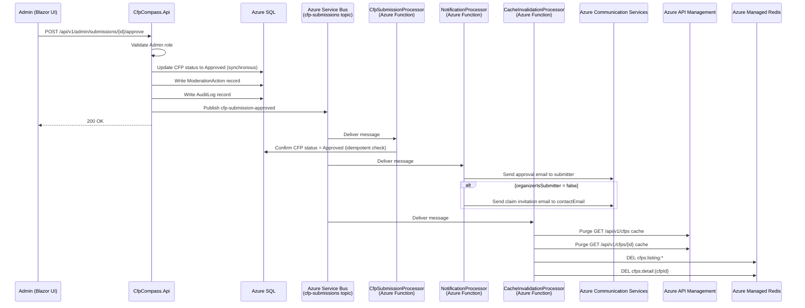

**Event:** CFP Submission Approved (`cfp-submission-approved`)

# Overview

The `cfp-submission-approved` event is published by `CfpCompass.Api` when an admin approves a CFP submission via `POST /api/v1/admin/submissions/{id}/approve`. This event is the gateway between the moderation pipeline and the public-facing CFP listing.

Upon receipt, consumers perform three distinct actions:
- **`CfpSubmissionProcessor`** confirms the CFP record status in Azure SQL as `Approved` (it is updated synchronously at API time, but this event confirms downstream consistency).
- **`NotificationProcessor`** sends the approval notification email to the submitter and, when `organizerIsSubmitter = false`, sends the organizer claim invitation email to `contactEmail`.
- **`CacheInvalidationProcessor`** purges the APIM response cache for the CFP listing and the individual CFP detail endpoints, and invalidates the Redis cache keys, so the newly approved CFP appears immediately for API consumers.

This event is the most consequential in the submission lifecycle — it makes a CFP publicly visible.

---

# Subscription Details

| Property                    | Value                                         |
| --------------------------- | --------------------------------------------- |
| **Domain**                  | CFP Compass — Submission Pipeline             |
| **Transport Mechanism**     | `sbns-cfpcompass.{env}` (Azure Service Bus Standard) |
| **Topic**                   | `cfp-submissions`                             |
| **Content Type**            | `application/json`                            |
| **Expected Schema Version** | `1.0`                                         |
| **Message TTL**             | 24 hours                                      |
| **Dead-letter after**       | 3 failed delivery attempts                    |

**Subscribers:**

| Subscription Name              | Consumer                                    | Filter |
| ------------------------------ | ------------------------------------------- | ------ |
| `cfp-submission-processor`     | `CfpSubmissionProcessor` (Azure Function)   | `EventType = 'cfp-submission-approved'` |
| `notification-processor`       | `NotificationProcessor` (Azure Function)    | `EventType = 'cfp-submission-approved'` |
| `cache-invalidation-processor` | `CacheInvalidationProcessor` (Azure Function) | `EventType = 'cfp-submission-approved'` |

---



**Flow Description:**

1. The admin reviews the submission in the admin UI and clicks "Approve."
2. `CfpCompass.Api` validates the Admin claim, synchronously updates the CFP record to `Approved` in Azure SQL, writes `ModerationAction` and `AuditLog` records, publishes the `cfp-submission-approved` event, and returns `200 OK`.
3. `CfpSubmissionProcessor` performs an idempotent status confirmation — if the CFP is already `Approved`, it logs a no-op and completes.
4. `NotificationProcessor` sends the approval notification email to the submitter. If `organizerIsSubmitter = false`, it additionally generates a claim verification token and sends the claim invitation email to `contactEmail`.
5. `CacheInvalidationProcessor` purges all APIM response cache entries for listing and detail endpoints, and invalidates the corresponding Redis keys, ensuring the approved CFP is visible on the next API request.

---

# Message Contract (as produced)

## System Properties

| Property        | Value                              | Description |
| --------------- | ---------------------------------- | ----------- |
| `MessageId`     | Auto-generated UUID                | Unique identifier for this approval event. |
| `ContentType`   | `application/json`                 | Declares payload format. |
| `CorrelationId` | `{cfpId}` (UUID)                   | Links to the CFP record and original submission. |
| `Label`         | `CfpSubmissionApproved`            | Human-readable event type label. |

## Application Properties

| Property               | Description                                       | Possible Values |
| ---------------------- | ------------------------------------------------- | --------------- |
| `EventType`            | Identifies the event for subscription filtering.  | `cfp-submission-approved` |
| `SchemaVersion`        | Schema contract version.                          | `1.0` |
| `OrganizerIsSubmitter` | Whether the submitter is the event organizer. Used by `NotificationProcessor` to determine if a claim invitation should also be sent. | `true`, `false` |

## Payload

```json
{
  "cfpId": "3fa85f64-5717-4562-b3fc-2c963f66afa6",
  "approvedAt": "2026-01-12T14:00:00Z",
  "adminUserId": "a1b2c3d4-e5f6-7890-abcd-ef1234567890",
  "cfpUrl": "https://techconf.example.com/cfp",
  "submitterEmail": "organizer@example.com",
  "contactEmail": "cfp@techconf.example.com",
  "organizerIsSubmitter": true,
  "eventName": "TechConf 2026",
  "schemaVersion": "1.0"
}
```

| Field                  | Type    | Required | Description |
| ---------------------- | ------- | :------: | ----------- |
| `cfpId`                | string  | ✔️       | UUID of the CFP record that was approved. |
| `approvedAt`           | string  | ✔️       | ISO 8601 UTC timestamp of the admin approval action. |
| `adminUserId`          | string  | ✔️       | UUID of the admin user who approved the submission. Written to `AuditLog`. |
| `cfpUrl`               | string  | ✔️       | The CFP URL. Included for cache invalidation key construction and email content. |
| `submitterEmail`       | string  | ✔️       | Email address for the approval notification. |
| `contactEmail`         | string  | ✔️       | Organizer contact email. Used for claim invitation when `organizerIsSubmitter = false`. |
| `organizerIsSubmitter` | boolean | ✔️       | Determines whether `NotificationProcessor` also sends a claim invitation. |
| `eventName`            | string  | ✔️       | Event name for inclusion in the approval notification email. |
| `schemaVersion`        | string  | ✔️       | Schema version. Expected: `1.0`. |

---

# Processing Rules

**Idempotency**
`CfpSubmissionProcessor` verifies the CFP record status before acting. If the status is already `Approved`, no update is made and the message is completed successfully.

`CacheInvalidationProcessor` uses cache key patterns (prefix-based wildcard for listings, exact key for detail) — repeated cache purge calls are inherently safe (purging a cache entry that does not exist is a no-op).

`NotificationProcessor` checks the `EmailLog` table for a prior `SubmissionApproved` email sent for this `cfpId`. If found, it skips sending to prevent duplicate emails on re-delivery.

**Schema Validation**
Messages with missing required fields or unsupported `schemaVersion` are dead-lettered.

**Claim Invitation Triggering**
`NotificationProcessor` generates a fresh claim verification JWT (7-day, single-use) at processing time and embeds it in the claim invitation email. The token is persisted to the `ClaimRequest` record before the email is sent.

**Cache Invalidation Scope**
`CacheInvalidationProcessor` invalidates:
- APIM cache: `GET /api/v1/cfps` (all listing cache entries matching the endpoint path pattern)
- APIM cache: `GET /api/v1/cfps/{cfpId}` (specific detail entry)
- Redis: `cfps:listing:*` (wildcard DEL for listing cache variations)
- Redis: `cfps:detail:{cfpId}` (exact key)

---

# Error Handling

**Transient Failures**
All three subscribers retry independently per their Azure Functions Service Bus trigger retry policy (3 retries, exponential backoff).

**Partial Failure Isolation**
If `CacheInvalidationProcessor` fails and dead-letters, the CFP is still approved and the notification email is still sent. The listing cache will naturally expire within 5 minutes (APIM TTL) — the staleness window is bounded. Operations staff can manually trigger cache invalidation via the admin cache refresh endpoint.

**Poison Messages**
Dead-lettered messages are held in the subscription's dead-letter queue. Monitoring alerts fire when dead-letter queue depth exceeds 0 on the `cfp-submissions` topic in production.

**Logging**
All processing outcomes are logged with `CorrelationId` (`cfpId`), `adminUserId`, `organizerIsSubmitter`, and cache invalidation result in Azure Log Analytics.

---

# Governance

**Producers**
Only `CfpCompass.Api` (via the admin approve action) may produce `cfp-submission-approved` events.

**Consumers**

| Consumer                     | Access Level | Notes |
| ---------------------------- | ------------ | ----- |
| `CfpSubmissionProcessor`     | Subscribe    | Idempotent status confirmation. |
| `NotificationProcessor`      | Subscribe    | Approval email; optionally claim invitation email. |
| `CacheInvalidationProcessor` | Subscribe    | APIM cache purge + Redis invalidation. |

**Schema Governance**
Changes to the payload must be coordinated with all three consumers. `organizerIsSubmitter` is particularly critical — removing or renaming it would break the `NotificationProcessor` claim invitation logic.

---

# Related Specifications

**Related API Contracts:**
- [**Admin API Contract**](../apis/admin.md): Defines `POST /api/v1/admin/submissions/{id}/approve` which produces this event.
- [**Claims API Contract**](../apis/claims.md): The claim invitation email sent by `NotificationProcessor` initiates the claim flow.

**Related Event Contracts:**
- [**cfp-submission-created**](./cfp-submission-created.md): The event that created the submission now being approved.
- [**cfp-submission-rejected**](./cfp-submission-rejected.md): The alternative admin decision event on the same topic.
- [**organizer-claim-requested**](./organizer-claim-requested.md): The claim request event that may follow approval when `organizerIsSubmitter = false`.

**Related Architecture Sections:**
- Architecture §4 — API Design (cache invalidation via Service Bus events)
- Architecture §7 — Background Services (CacheInvalidationProcessor, NotificationProcessor)
- Architecture §8 — Email Flows (Submission Approved, Claim Invitation emails)
- Architecture §13 — Audit Logging
