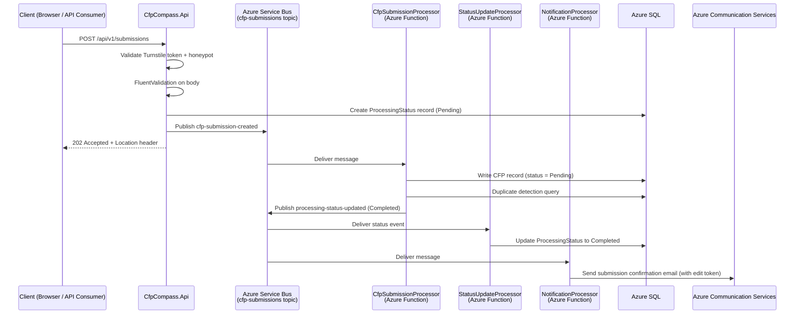

**Event:** CFP Submission Created (`cfp-submission-created`)

# Overview

The `cfp-submission-created` event is published by `CfpCompass.Api` when a new CFP submission passes initial validation and bot protection checks — either via the public anonymous submission form (`POST /api/v1/submissions`) or via the APIM-authenticated write endpoint (`POST /api/v1/cfps`).

This event initiates the asynchronous write pipeline. Upon receipt, the `CfpSubmissionProcessor` writes the CFP record to Azure SQL, performs duplicate detection, and transitions the submission to `Pending` status. The `NotificationProcessor` sends the submission confirmation email with an edit token link. The `StatusUpdateProcessor` updates the processing status record that callers poll via `GET /api/v1/submissions/{id}/status`.

The event is the authoritative signal that a new CFP has entered the moderation queue.

---

# Subscription Details

| Property                    | Value                                         |
| --------------------------- | --------------------------------------------- |
| **Domain**                  | CFP Compass — Submission Pipeline             |
| **Transport Mechanism**     | `sbns-cfpcompass.{env}` (Azure Service Bus Standard) |
| **Topic**                   | `cfp-submissions`                             |
| **Content Type**            | `application/json`                            |
| **Expected Schema Version** | `1.0`                                         |
| **Message TTL**             | 24 hours                                      |
| **Dead-letter after**       | 3 failed delivery attempts                    |

**Subscribers:**

| Subscription Name             | Consumer                        | Filter |
| ----------------------------- | ------------------------------- | ------ |
| `cfp-submission-processor`    | `CfpSubmissionProcessor` (Azure Function) | `EventType = 'cfp-submission-created'` |
| `status-update-processor`     | `StatusUpdateProcessor` (Azure Function)  | `EventType = 'cfp-submission-created'` |
| `notification-processor`      | `NotificationProcessor` (Azure Function)  | `EventType = 'cfp-submission-created'` |

---



**Flow Description:**

1. The client submits a CFP via `POST /api/v1/submissions` or `POST /api/v1/cfps`.
2. `CfpCompass.Api` validates bot protection, validates the request body, creates a `ProcessingStatus` record in Azure SQL with status `Pending`, and publishes the `cfp-submission-created` event to the `cfp-submissions` topic.
3. The API immediately returns `202 Accepted` with a `Location` header pointing to the status polling endpoint.
4. `CfpSubmissionProcessor` dequeues the message, writes the CFP record to Azure SQL with status `Pending`, performs duplicate detection (checking `cfpUrl` against existing records), and flags duplicates on the submission record for admin review.
5. `StatusUpdateProcessor` receives the processing outcome event and updates the `ProcessingStatus` record to `Completed`.
6. `NotificationProcessor` dequeues the message, generates a single-use 72-hour edit token, and sends the submission confirmation email to `submitterEmail` via Azure Communication Services.

---

# Message Contract (as produced)

## System Properties

| Property        | Value                              | Description |
| --------------- | ---------------------------------- | ----------- |
| `MessageId`     | `{submissionId}` (UUID)            | Unique message identifier. Used for Service Bus deduplication within the 24-hour deduplication window. |
| `ContentType`   | `application/json`                 | Declares payload format. |
| `CorrelationId` | `{submissionId}` (UUID)            | Used for distributed tracing. Matches the `id` in the 202 response and the status polling endpoint. |
| `Label`         | `CfpSubmissionCreated`             | Human-readable event type label. |

## Application Properties

| Property      | Description                                      | Possible Values |
| ------------- | ------------------------------------------------ | --------------- |
| `EventType`   | Identifies the event type for subscription-level filtering. | `cfp-submission-created` |
| `SchemaVersion` | Schema contract version.                       | `1.0` |
| `SubmissionSource` | Indicates whether the submission came from the public form or the API. | `PublicForm`, `ApiConsumer` |

## Payload

```json
{
  "cfpId": "3fa85f64-5717-4562-b3fc-2c963f66afa6",
  "submittedAt": "2026-01-10T09:00:00Z",
  "submitterEmail": "organizer@example.com",
  "contactEmail": "cfp@techconf.example.com",
  "eventName": "TechConf 2026",
  "cfpUrl": "https://techconf.example.com/cfp",
  "cfpCloseDate": "2026-03-31",
  "organizerIsSubmitter": true,
  "submissionSource": "PublicForm",
  "turnstileVerified": true,
  "schemaVersion": "1.0"
}
```

| Field                  | Type    | Required | Description |
| ---------------------- | ------- | :------: | ----------- |
| `cfpId`                | string  | ✔️       | UUID assigned at submission time. Matches the `submissionId` in the API response. |
| `submittedAt`          | string  | ✔️       | ISO 8601 UTC timestamp of when the submission was received. |
| `submitterEmail`       | string  | ✔️       | Email of the person who filled in the submission form. Edit token is sent here. |
| `contactEmail`         | string  | ✔️       | Organizer contact email from the form. Claim invitation sent here when `organizerIsSubmitter = false`. |
| `eventName`            | string  | ✔️       | Name of the event as provided in the submission. |
| `cfpUrl`               | string  | ✔️       | CFP URL. Used for duplicate detection. |
| `cfpCloseDate`         | string  | ✔️       | ISO 8601 date. Used by the confirmation email to display the deadline. |
| `organizerIsSubmitter` | boolean | ✔️       | Determines whether a claim invitation email is sent on approval. |
| `submissionSource`     | string  | ✔️       | `PublicForm` or `ApiConsumer`. Informs metrics and audit trails. |
| `turnstileVerified`    | boolean | ✔️       | `true` if Cloudflare Turnstile verification passed. Always `true` for processed events (honeypot-discarded submissions are never published). `false` is unexpected and should trigger a dead-letter alert. |
| `schemaVersion`        | string  | ✔️       | Schema version for consumer validation. Expected value: `1.0`. |

---

# Processing Rules

**Idempotency**
`CfpSubmissionProcessor` checks for an existing CFP record with the same `cfpId` before writing. If the record already exists (re-delivery), the processor skips the insert and updates the processing status to `Completed` without error.

**Schema Validation**
Messages with missing required fields or an unsupported `schemaVersion` are rejected and moved to the dead-letter queue. Supported versions: `1.0`.

**Duplicate Detection**
After writing the CFP record, the processor queries for existing records where `cfpUrl` matches an existing `Approved` or `Pending` CFP. If a match is found, the `flaggedDuplicate` field on the new CFP record is set to `true`. The submission proceeds to the admin moderation queue regardless — it is not auto-rejected.

**Ordering**
The `cfp-submissions` topic is not session-enabled. Message ordering across partitions is not guaranteed. Processors must handle out-of-order delivery gracefully (e.g., a `cfp-submission-updated` event arriving before the initial `cfp-submission-created` is resolved). The `CfpSubmissionProcessor` handles this via upsert semantics.

---

# Error Handling

**Transient Failures**
Retry according to the Azure Functions Service Bus trigger retry policy (3 retries with exponential backoff before dead-lettering).

**Poison Messages**
Messages that fail processing after 3 attempts are moved to the `cfp-submissions` dead-letter queue for manual review. Operations staff monitor dead-letter queue depth via Azure Monitor alerts.

**Turnstile Anomaly**
If `turnstileVerified = false` is found in a delivered message (which should not occur under normal operation), the processor logs a `Warning`-level event with the `cfpId` and dead-letters the message.

**Logging**
All processing outcomes (success, duplicate detected, validation failure, dead-letter) are logged with the `CorrelationId` (`cfpId`) in Azure Log Analytics at the appropriate severity level.

---

# Governance

**Producers**
Only `CfpCompass.Api` may publish to the `cfp-submissions` topic. No other service or component is authorized to produce messages on this topic.

**Consumers**

| Consumer                     | Access Level | Notes |
| ---------------------------- | ------------ | ----- |
| `CfpSubmissionProcessor`     | Subscribe    | Primary write processor. |
| `StatusUpdateProcessor`      | Subscribe    | Updates processing status records for caller polling. |
| `NotificationProcessor`      | Subscribe    | Sends submission confirmation email with edit token. |

**Schema Governance**
Any change to the payload schema must increment `schemaVersion` and be coordinated across all three consumers before the producer deploys the updated payload. Breaking schema changes require a versioned migration plan.

**Environment Access**

| Environment | Access Notes |
| ----------- | ------------ |
| Development | All team members via Aspire Service Bus emulator or Azure Service Bus dev namespace. |
| Staging     | Deployment service principal + on-call engineers. |
| Production  | Deployment service principal only. PIM-based access for incident response. |

---

# Related Specifications

**Related API Contracts:**
- [**Submissions API Contract**](../apis/submissions.md): Defines `POST /api/v1/submissions` which produces this event.
- [**CFPs API Contract**](../apis/cfps.md): Defines `POST /api/v1/cfps` (APIM path) which also produces this event.

**Related Event Contracts:**
- [**cfp-submission-updated**](./cfp-submission-updated.md): Published when a submitter edits a pending or rejected submission.
- [**cfp-submission-approved**](./cfp-submission-approved.md): Published when an admin approves the submission after moderation review.
- [**cfp-submission-rejected**](./cfp-submission-rejected.md): Published when an admin rejects the submission.

**Related Architecture Sections:**
- Architecture §4 — Async Write Pattern (POST/PUT → 202 → Service Bus → Function → SQL)
- Architecture §7 — Service Bus Message Processors
- Architecture §8 — Email Flows (Submission Confirmation email)
