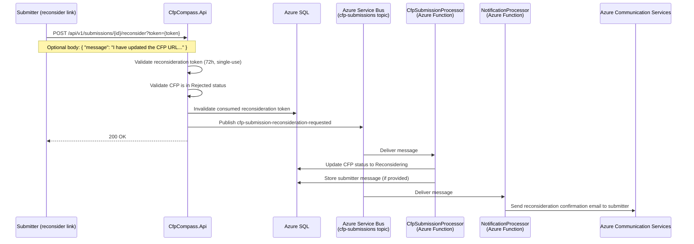

**Event:** CFP Submission Reconsideration Requested (`cfp-submission-reconsideration-requested`)

# Overview

The `cfp-submission-reconsideration-requested` event is published by `CfpCompass.Api` when a submitter requests that their previously rejected CFP submission be reconsidered by the moderation team. This is triggered by `POST /api/v1/submissions/{id}/reconsider`, which is authenticated using the single-use reconsideration token delivered in the rejection email.

Upon receipt, `CfpSubmissionProcessor` updates the CFP status from `Rejected` to `Reconsidering` in Azure SQL, placing the submission back in the admin moderation queue. `NotificationProcessor` sends a confirmation email to the submitter acknowledging receipt of the reconsideration request.

The reconsideration event does not bypass the admin moderation step — it is simply a signal that the submitter believes the rejection was in error or that they have addressed the rejection reason. Admins see reconsidering submissions alongside pending submissions in the moderation queue and can approve or reject again.

---

# Subscription Details

| Property                    | Value                                         |
| --------------------------- | --------------------------------------------- |
| **Domain**                  | CFP Compass — Submission Pipeline             |
| **Transport Mechanism**     | `sbns-cfpcompass.{env}` (Azure Service Bus Standard) |
| **Topic**                   | `cfp-submissions`                             |
| **Content Type**            | `application/json`                            |
| **Expected Schema Version** | `1.0`                                         |
| **Message TTL**             | 24 hours                                      |
| **Dead-letter after**       | 3 failed delivery attempts                    |

**Subscribers:**

| Subscription Name          | Consumer                                   | Filter |
| -------------------------- | ------------------------------------------ | ------ |
| `cfp-submission-processor` | `CfpSubmissionProcessor` (Azure Function)  | `EventType = 'cfp-submission-reconsideration-requested'` |
| `notification-processor`   | `NotificationProcessor` (Azure Function)   | `EventType = 'cfp-submission-reconsideration-requested'` |

---



**Flow Description:**

1. The submitter receives the rejection email with the reconsideration link.
2. The submitter navigates to the reconsideration page and clicks "Request Reconsideration," optionally providing a message to the moderation team.
3. `CfpCompass.Api` validates the reconsideration token (signature, 72-hour expiry, single-use), validates the CFP is in `Rejected` status, invalidates the consumed token, publishes the event, and returns `200 OK`.
4. `CfpSubmissionProcessor` updates the CFP status from `Rejected` to `Reconsidering` and stores the optional submitter message on the `ModerationAction` record for admin context.
5. `NotificationProcessor` sends a reconsideration confirmation email to the submitter, confirming the request has been received and will be reviewed by the team.
6. The submission now appears in the admin moderation queue under the `Reconsidering` filter alongside `Pending` submissions.

---

# Message Contract (as produced)

## System Properties

| Property        | Value                              | Description |
| --------------- | ---------------------------------- | ----------- |
| `MessageId`     | Auto-generated UUID                | Unique identifier for this reconsideration event. |
| `ContentType`   | `application/json`                 | Declares payload format. |
| `CorrelationId` | `{cfpId}` (UUID)                   | Links to the CFP record and its full moderation history. |
| `Label`         | `CfpSubmissionReconsiderationRequested` | Human-readable event type label. |

## Application Properties

| Property        | Description                                       | Possible Values |
| --------------- | ------------------------------------------------- | --------------- |
| `EventType`     | Identifies the event for subscription filtering.  | `cfp-submission-reconsideration-requested` |
| `SchemaVersion` | Schema contract version.                          | `1.0` |

## Payload

```json
{
  "cfpId": "3fa85f64-5717-4562-b3fc-2c963f66afa6",
  "requestedAt": "2026-01-16T10:00:00Z",
  "submitterEmail": "organizer@example.com",
  "eventName": "TechConf 2026",
  "message": "I have corrected the CFP URL. It is now publicly accessible at https://techconf.example.com/cfp-2026.",
  "schemaVersion": "1.0"
}
```

| Field            | Type   | Required | Description |
| ---------------- | ------ | :------: | ----------- |
| `cfpId`          | string | ✔️       | UUID of the CFP record for which reconsideration is requested. |
| `requestedAt`    | string | ✔️       | ISO 8601 UTC timestamp of the reconsideration request. |
| `submitterEmail` | string | ✔️       | Email of the submitter who requested reconsideration. Used for the confirmation email. |
| `eventName`      | string | ✔️       | Event name for inclusion in the confirmation email. |
| `message`        | string | No       | Optional message from the submitter to the moderation team. Max 1000 characters. Stored on the `ModerationAction` record for admin reference. Null if not provided. |
| `schemaVersion`  | string | ✔️       | Schema version. Expected: `1.0`. |

---

# Processing Rules

**Idempotency**
`CfpSubmissionProcessor` checks the current CFP status before updating. If the CFP is already in `Reconsidering` status (re-delivery), no update is made and the message is completed without error.

`NotificationProcessor` checks the `EmailLog` table for a prior `ReconsiderationConfirmed` email for this `cfpId`. If found, it skips sending to prevent duplicate confirmation emails.

**Schema Validation**
Messages missing required fields or with an unsupported `schemaVersion` are dead-lettered.

**Token Lifecycle**
The reconsideration token is invalidated at API time (before the event is published) by the API. A submitter cannot submit multiple reconsideration requests for the same rejection by replaying the token. If the submitter's rejection email token has a 72-hour window, only one reconsideration request per rejection cycle is possible.

**Submitter Message Storage**
The `message` field (when present) is stored on a new `ModerationAction` record of type `ReconsiderationNote`, linked to the `cfpId`. It is displayed in the admin moderation UI alongside the CFP detail when reviewing a `Reconsidering` submission.

**Admin Queue Visibility**
After `CfpSubmissionProcessor` updates the status to `Reconsidering`, the submission appears in the admin moderation queue. The queue displays both `Pending` and `Reconsidering` submissions, with `Reconsidering` items visually differentiated and their submission history (original `Pending` → `Rejected` → `Reconsidering`) accessible to admins.

---

# Error Handling

**Transient Failures**
Retry per the Azure Functions Service Bus trigger retry policy (3 retries, exponential backoff).

**Token Already Used**
Token validation happens at the API before the event is published. A used token never produces an event — the `401 Unauthorized` response is returned to the caller directly. Dead-lettered reconsideration events indicate infrastructure failures, not token abuse.

**Email Delivery Failure**
If the confirmation email cannot be sent after retries, the message is dead-lettered. The CFP status will already be `Reconsidering` (updated by `CfpSubmissionProcessor`). Operations staff can manually trigger the confirmation email from the admin UI if needed.

**Logging**
Processing outcomes logged with `CorrelationId` (`cfpId`), `submitterEmail`, `message` presence (boolean, not content), and email delivery outcome in Azure Log Analytics.

---

# Governance

**Producers**
Only `CfpCompass.Api` may produce `cfp-submission-reconsideration-requested` events, and only after successful reconsideration token validation. The token constraint naturally limits production to one event per rejection cycle per submission.

**Consumers**

| Consumer                 | Access Level | Notes |
| ------------------------ | ------------ | ----- |
| `CfpSubmissionProcessor` | Subscribe    | Updates status to Reconsidering; stores submitter message. |
| `NotificationProcessor`  | Subscribe    | Sends reconsideration confirmation email. |

**Schema Governance**
The `message` field is optional. Consumers must handle null gracefully. Any change to the max length of `message` must be coordinated with the admin UI that displays it and the database column constraint.

---

# Related Specifications

**Related API Contracts:**
- [**Submissions API Contract**](../apis/submissions.md): Defines `POST /api/v1/submissions/{id}/reconsider` which produces this event.
- [**Admin API Contract**](../apis/admin.md): Defines the moderation queue where `Reconsidering` submissions appear.

**Related Event Contracts:**
- [**cfp-submission-rejected**](./cfp-submission-rejected.md): The preceding event in the lifecycle; delivers the reconsideration token in the rejection email.
- [**cfp-submission-approved**](./cfp-submission-approved.md): The event that may follow when the admin approves the reconsidered submission.

**Related Architecture Sections:**
- Architecture §4 — Async Write Pattern and Submission Endpoints
- Architecture §5 — Token Strategy (72-hour single-use tokens for email links)
- Architecture §7 — Service Bus Message Processors (CfpSubmissionProcessor, NotificationProcessor)
- Architecture §8 — Email Flows (Reconsideration Confirmed email template)
