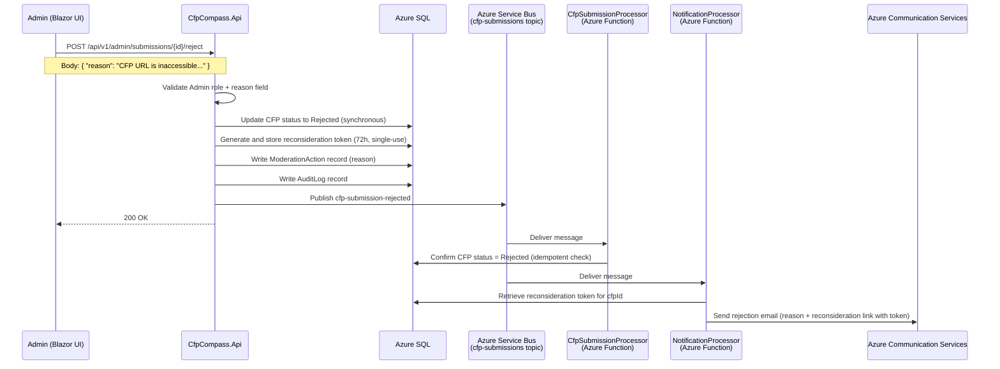

**Event:** CFP Submission Rejected (`cfp-submission-rejected`)

# Overview

The `cfp-submission-rejected` event is published by `CfpCompass.Api` when an admin rejects a CFP submission via `POST /api/v1/admin/submissions/{id}/reject`. Rejection may occur from either `Pending` or `Reconsidering` status.

Upon receipt, `CfpSubmissionProcessor` confirms the CFP record status in Azure SQL as `Rejected`. `NotificationProcessor` sends a rejection notification email to the submitter that includes the admin-provided reason and a reconsideration link containing a fresh single-use 72-hour token.

The rejection flow keeps the submission in the system (not deleted) and gives the submitter a path to address the admin's concerns through the reconsideration mechanism.

---

# Subscription Details

| Property                    | Value                                         |
| --------------------------- | --------------------------------------------- |
| **Domain**                  | CFP Compass — Submission Pipeline             |
| **Transport Mechanism**     | `sbns-cfpcompass.{env}` (Azure Service Bus Standard) |
| **Topic**                   | `cfp-submissions`                             |
| **Content Type**            | `application/json`                            |
| **Expected Schema Version** | `1.0`                                         |
| **Message TTL**             | 24 hours                                      |
| **Dead-letter after**       | 3 failed delivery attempts                    |

**Subscribers:**

| Subscription Name          | Consumer                                   | Filter |
| -------------------------- | ------------------------------------------ | ------ |
| `cfp-submission-processor` | `CfpSubmissionProcessor` (Azure Function)  | `EventType = 'cfp-submission-rejected'` |
| `notification-processor`   | `NotificationProcessor` (Azure Function)   | `EventType = 'cfp-submission-rejected'` |

---



**Flow Description:**

1. The admin reviews the submission in the admin UI, provides a rejection reason, and clicks "Reject."
2. `CfpCompass.Api` validates the Admin claim and the required `reason` field (min 10 characters).
3. The API synchronously updates the CFP record to `Rejected` in Azure SQL, generates and persists a reconsideration token (72-hour, single-use JWT), writes `ModerationAction` and `AuditLog` records, publishes the event, and returns `200 OK`.
4. `CfpSubmissionProcessor` performs an idempotent status confirmation.
5. `NotificationProcessor` retrieves the pre-generated reconsideration token from Azure SQL, constructs the reconsideration link (`/submit/reconsider/{cfpId}?token={token}`), and sends the rejection email to the submitter with the reason and reconsideration link.

---

# Message Contract (as produced)

## System Properties

| Property        | Value                              | Description |
| --------------- | ---------------------------------- | ----------- |
| `MessageId`     | Auto-generated UUID                | Unique identifier for this rejection event. |
| `ContentType`   | `application/json`                 | Declares payload format. |
| `CorrelationId` | `{cfpId}` (UUID)                   | Links to the CFP record and original submission. |
| `Label`         | `CfpSubmissionRejected`            | Human-readable event type label. |

## Application Properties

| Property        | Description                                       | Possible Values |
| --------------- | ------------------------------------------------- | --------------- |
| `EventType`     | Identifies the event for subscription filtering.  | `cfp-submission-rejected` |
| `SchemaVersion` | Schema contract version.                          | `1.0` |
| `PreviousStatus` | Status of the submission before rejection.       | `Pending`, `Reconsidering` |

## Payload

```json
{
  "cfpId": "3fa85f64-5717-4562-b3fc-2c963f66afa6",
  "rejectedAt": "2026-01-12T14:05:00Z",
  "adminUserId": "a1b2c3d4-e5f6-7890-abcd-ef1234567890",
  "reason": "The CFP URL provided (https://example.com/cfp) returned a 404 error. Please resubmit with a valid, publicly accessible CFP URL.",
  "submitterEmail": "organizer@example.com",
  "eventName": "TechConf 2026",
  "previousStatus": "Pending",
  "schemaVersion": "1.0"
}
```

| Field            | Type   | Required | Description |
| ---------------- | ------ | :------: | ----------- |
| `cfpId`          | string | ✔️       | UUID of the CFP record that was rejected. |
| `rejectedAt`     | string | ✔️       | ISO 8601 UTC timestamp of the rejection action. |
| `adminUserId`    | string | ✔️       | UUID of the admin who rejected the submission. Written to `AuditLog`. |
| `reason`         | string | ✔️       | The rejection reason provided by the admin. This text is included verbatim in the rejection email. Min 10, max 1000 characters. |
| `submitterEmail` | string | ✔️       | Email address to receive the rejection notification. |
| `eventName`      | string | ✔️       | Event name for inclusion in the rejection email subject and body. |
| `previousStatus` | string | ✔️       | CFP status before rejection. One of: `Pending`, `Reconsidering`. |
| `schemaVersion`  | string | ✔️       | Schema version. Expected: `1.0`. |

---

# Processing Rules

**Idempotency**
`CfpSubmissionProcessor` verifies the current CFP status. If already `Rejected`, the message is completed without further action.

`NotificationProcessor` checks the `EmailLog` table for a prior `SubmissionRejected` email for this `cfpId`. If found, it skips sending to prevent duplicate rejection emails on message re-delivery.

**Schema Validation**
Messages missing required fields or with an unsupported `schemaVersion` are dead-lettered.

**Reconsideration Token**
The reconsideration token is generated and persisted to Azure SQL **at API time** (before the event is published), not at `NotificationProcessor` processing time. This ensures the token is available even if the event is retried. `NotificationProcessor` retrieves the current valid token by `cfpId` from the `ClaimRequest`-adjacent `ReconsiderationToken` record.

**reason Field Verbatim Inclusion**
The `reason` field content is included verbatim in the rejection email. Admins are expected to write reasons appropriate for direct submitter communication. The system does not sanitize or transform the reason text — it is already validated (min/max length) at the API layer.

**No Cache Invalidation**
Rejected CFPs are not publicly visible (they are in `Rejected` status, not `Approved`). No cache invalidation is required for rejection events.

---

# Error Handling

**Transient Failures**
Retry per the Azure Functions Service Bus trigger retry policy (3 retries, exponential backoff).

**Email Delivery Failure**
If Azure Communication Services is unavailable when `NotificationProcessor` attempts to send the rejection email, the message is retried. After 3 failures, the message is dead-lettered. Operations staff review dead-lettered messages and can manually resend the rejection email via the admin UI's "Resend notification" action.

**Poison Messages**
Dead-lettered messages are monitored via Azure Monitor alerts. Dead-letter queue depth > 0 in production triggers an alert.

**Logging**
Processing outcomes are logged with `CorrelationId` (`cfpId`), `adminUserId`, `previousStatus`, and email delivery outcome in Azure Log Analytics.

---

# Governance

**Producers**
Only `CfpCompass.Api` (via the admin reject action) may produce `cfp-submission-rejected` events. The `reason` field is required and validated before the event is published.

**Consumers**

| Consumer                 | Access Level | Notes |
| ------------------------ | ------------ | ----- |
| `CfpSubmissionProcessor` | Subscribe    | Idempotent status confirmation. |
| `NotificationProcessor`  | Subscribe    | Rejection email with reason and reconsideration link. |

**Schema Governance**
The `reason` field is critical for the user-facing rejection email. Any change to its maximum length must be coordinated with the email template (`SubmissionRejected.cshtml`) and validated against email client rendering constraints.

---

# Related Specifications

**Related API Contracts:**
- [**Admin API Contract**](../apis/admin.md): Defines `POST /api/v1/admin/submissions/{id}/reject` which produces this event.
- [**Submissions API Contract**](../apis/submissions.md): Defines `POST /api/v1/submissions/{id}/reconsider` — the next step available to the submitter after rejection.

**Related Event Contracts:**
- [**cfp-submission-created**](./cfp-submission-created.md): The event that created the submission now being rejected.
- [**cfp-submission-reconsideration-requested**](./cfp-submission-reconsideration-requested.md): The event that may follow when the submitter uses the reconsideration link.
- [**cfp-submission-approved**](./cfp-submission-approved.md): The alternative admin decision on the same submission.

**Related Architecture Sections:**
- Architecture §4 — Admin Endpoints (reject action)
- Architecture §7 — Background Services (NotificationProcessor)
- Architecture §8 — Email Flows (Submission Rejected email template)
- Architecture §13 — Audit Logging
