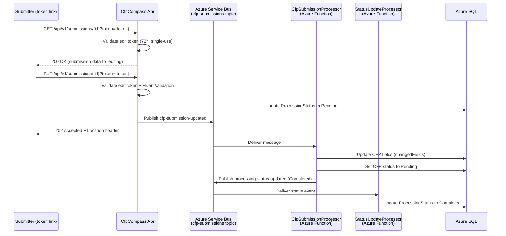

**Event:** CFP Submission Updated (`cfp-submission-updated`)

# Overview

The `cfp-submission-updated` event is published by `CfpCompass.Api` when a submitter edits a CFP that is currently in `Pending` or `Rejected` status. This is triggered by `PUT /api/v1/submissions/{id}` (token-authenticated, public form path) or `PUT /api/v1/cfps/{id}` (APIM-authenticated API path).

When received, `CfpSubmissionProcessor` updates the CFP record in Azure SQL and resets its status to `Pending`, returning the submission to the admin moderation queue for fresh review. `StatusUpdateProcessor` updates the processing status record visible via the status polling endpoint.

This event does **not** trigger a notification email to the submitter — the act of editing is submitter-initiated and implicitly acknowledged. Admin notification of the re-queued submission occurs through the normal moderation queue display.

---

# Subscription Details

| Property                    | Value                                         |
| --------------------------- | --------------------------------------------- |
| **Domain**                  | CFP Compass — Submission Pipeline             |
| **Transport Mechanism**     | `sbns-cfpcompass.{env}` (Azure Service Bus Standard) |
| **Topic**                   | `cfp-submissions`                             |
| **Content Type**            | `application/json`                            |
| **Expected Schema Version** | `1.0`                                         |
| **Message TTL**             | 24 hours                                      |
| **Dead-letter after**       | 3 failed delivery attempts                    |

**Subscribers:**

| Subscription Name          | Consumer                                   | Filter |
| -------------------------- | ------------------------------------------ | ------ |
| `cfp-submission-processor` | `CfpSubmissionProcessor` (Azure Function)  | `EventType = 'cfp-submission-updated'` |
| `status-update-processor`  | `StatusUpdateProcessor` (Azure Function)   | `EventType = 'cfp-submission-updated'` |

---



**Flow Description:**

1. The submitter receives a submission confirmation or rejection email containing a token link.
2. The submitter navigates to the edit page (`GET /api/v1/submissions/{id}?token={token}`), which validates the 72-hour single-use token and returns the current submission data.
3. The submitter modifies fields and submits the edit form (`PUT /api/v1/submissions/{id}?token={token}`).
4. `CfpCompass.Api` validates the token, validates the body with FluentValidation, updates the `ProcessingStatus` record to `Pending`, publishes the `cfp-submission-updated` event, and returns `202 Accepted`.
5. `CfpSubmissionProcessor` dequeues the message, applies only the changed fields to the CFP record in Azure SQL, and sets the CFP status back to `Pending` (regardless of previous status — both `Pending` and `Rejected` re-enter the queue).
6. `StatusUpdateProcessor` updates the `ProcessingStatus` record to `Completed`.

---

# Message Contract (as produced)

## System Properties

| Property        | Value                              | Description |
| --------------- | ---------------------------------- | ----------- |
| `MessageId`     | Auto-generated UUID                | Unique message identifier for this update event. Distinct from the original submission's `MessageId`. |
| `ContentType`   | `application/json`                 | Declares payload format. |
| `CorrelationId` | `{cfpId}` (UUID)                   | Links this update to the original submission and the status polling endpoint. |
| `Label`         | `CfpSubmissionUpdated`             | Human-readable event type label. |

## Application Properties

| Property        | Description                                      | Possible Values |
| --------------- | ------------------------------------------------ | --------------- |
| `EventType`     | Identifies the event type for subscription filtering. | `cfp-submission-updated` |
| `SchemaVersion` | Schema contract version.                         | `1.0` |
| `PreviousStatus` | The CFP's moderation status before this update was requested. | `Pending`, `Rejected` |

## Payload

```json
{
  "cfpId": "3fa85f64-5717-4562-b3fc-2c963f66afa6",
  "updatedAt": "2026-01-15T11:30:00Z",
  "submitterEmail": "organizer@example.com",
  "previousStatus": "Rejected",
  "changedFields": ["eventDescription", "cfpCloseDate", "topicIds"],
  "schemaVersion": "1.0"
}
```

| Field            | Type     | Required | Description |
| ---------------- | -------- | :------: | ----------- |
| `cfpId`          | string   | ✔️       | UUID of the CFP record being updated. Matches the submission ID issued at creation. |
| `updatedAt`      | string   | ✔️       | ISO 8601 UTC timestamp of when the edit was received by the API. |
| `submitterEmail` | string   | ✔️       | Email of the submitter who initiated the edit. Used for audit trail. |
| `previousStatus` | string   | ✔️       | CFP status before this update. One of: `Pending`, `Rejected`. Consumers use this to determine if a notification is warranted. |
| `changedFields`  | string[] | ✔️       | List of field names that differ from the previous version. Allows processors to perform targeted updates rather than full replacement. May be empty if the submitter saved without changes (still valid). |
| `schemaVersion`  | string   | ✔️       | Schema version for consumer validation. Expected value: `1.0`. |

---

# Processing Rules

**Idempotency**
`CfpSubmissionProcessor` uses the `cfpId` and `updatedAt` timestamp to detect re-delivery. If a CFP record with the same `cfpId` already has an `UpdatedAt` value equal to or newer than the event's `updatedAt`, the update is treated as a duplicate and skipped. The processing status is set to `Completed` without error.

**Schema Validation**
Messages with missing required fields or an unsupported `schemaVersion` are rejected and moved to the dead-letter queue.

**Status Reset**
Regardless of the `previousStatus` value in the payload, `CfpSubmissionProcessor` unconditionally sets the CFP status to `Pending` after applying field updates. This ensures all updated submissions go through admin review.

**changedFields Semantics**
`CfpSubmissionProcessor` applies all fields from the updated submission body to the CFP record (full replacement of mutable fields). The `changedFields` array is informational — used for audit trail and potential future targeted update optimizations. It does not restrict which fields the processor writes.

**No Notification Trigger**
Unlike `cfp-submission-created`, this event does not trigger a confirmation email to the submitter. The `NotificationProcessor` subscription filter excludes this event type.

---

# Error Handling

**Transient Failures**
Retry per the Azure Functions Service Bus trigger retry policy (3 retries with exponential backoff).

**Poison Messages**
Messages failing all retries are moved to the dead-letter queue. Admins are alerted via Azure Monitor dead-letter queue depth alarm.

**Stale Token Delivery**
If the API receives a `PUT` with an already-expired or already-used token, it returns `401` before publishing the event. As a result, dead-lettered `cfp-submission-updated` messages should not originate from token abuse — they indicate infrastructure or processing failures.

**Logging**
Processing outcomes are logged with `CorrelationId` (`cfpId`), `previousStatus`, and `changedFields` count in Azure Log Analytics.

---

# Governance

**Producers**
Only `CfpCompass.Api` may publish to the `cfp-submissions` topic. The `cfp-submission-updated` event is published only after successful token validation and FluentValidation of the request body.

**Consumers**

| Consumer                  | Access Level | Notes |
| ------------------------- | ------------ | ----- |
| `CfpSubmissionProcessor`  | Subscribe    | Applies field updates and resets status to Pending. |
| `StatusUpdateProcessor`   | Subscribe    | Updates processing status record for caller polling. |

**Schema Governance**
Payload schema changes must increment `schemaVersion` and be coordinated with both consuming functions before the producer deploys. `changedFields` enum values may grow (additive change) without a version bump; structural changes require a new version.

---

# Related Specifications

**Related API Contracts:**
- [**Submissions API Contract**](../apis/submissions.md): Defines `PUT /api/v1/submissions/{id}` which produces this event.
- [**CFPs API Contract**](../apis/cfps.md): Defines `PUT /api/v1/cfps/{id}` (APIM path) which also produces this event.

**Related Event Contracts:**
- [**cfp-submission-created**](./cfp-submission-created.md): The initial event for a new submission on this same topic.
- [**cfp-submission-approved**](./cfp-submission-approved.md): May follow this event when an admin reviews the re-queued submission.
- [**cfp-submission-rejected**](./cfp-submission-rejected.md): May follow if the admin again rejects after review.

**Related Architecture Sections:**
- Architecture §4 — Async Write Pattern
- Architecture §5 — Token Strategy (72-hour single-use edit tokens)
- Architecture §7 — Service Bus Message Processors
