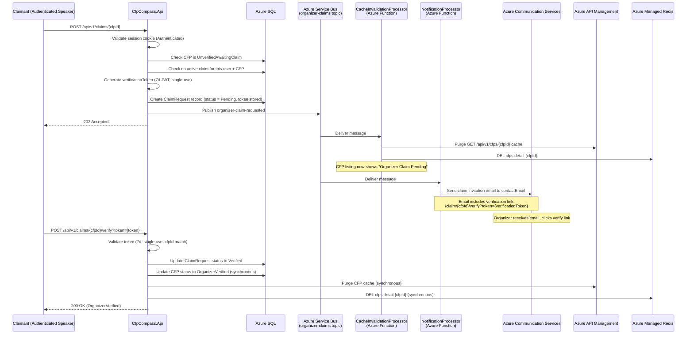

**Event:** Organizer Claim Requested (`organizer-claim-requested`)

# Overview

The `organizer-claim-requested` event is published by `CfpCompass.Api` when an authenticated speaker initiates a claim for an unverified CFP listing via `POST /api/v1/claims/{cfpId}`. This event is produced on the `organizer-claims` topic — the dedicated aggregate topic for organizer ownership workflows.

Unverified CFP listings arise when a community member submits a CFP on behalf of an event but indicates they are not the organizer (`organizerIsSubmitter = false`). Upon admin approval of such a submission, the listing is published as "Unverified — Awaiting Organizer Claim." Any authenticated speaker may then initiate a claim. The claim verification email is sent to the `contactEmail` provided at submission time — only someone with access to that inbox can complete verification.

Upon receipt of this event:
- **`CacheInvalidationProcessor`** updates the CFP listing status indicator to "Organizer Claim Pending" to reflect the in-progress claim in the public listing.
- **`NotificationProcessor`** generates and sends the claim verification email to `contactEmail`, embedding the `verificationToken` as a link to the verification page.

---

# Subscription Details

| Property                    | Value                                         |
| --------------------------- | --------------------------------------------- |
| **Domain**                  | CFP Compass — Organizer Claims                |
| **Transport Mechanism**     | `sbns-cfpcompass.{env}` (Azure Service Bus Standard) |
| **Topic**                   | `organizer-claims`                            |
| **Content Type**            | `application/json`                            |
| **Expected Schema Version** | `1.0`                                         |
| **Message TTL**             | 24 hours                                      |
| **Dead-letter after**       | 3 failed delivery attempts                    |

**Subscribers:**

| Subscription Name              | Consumer                                    | Filter |
| ------------------------------ | ------------------------------------------- | ------ |
| `cache-invalidation-processor` | `CacheInvalidationProcessor` (Azure Function) | `EventType = 'organizer-claim-requested'` |
| `notification-processor`       | `NotificationProcessor` (Azure Function)    | `EventType = 'organizer-claim-requested'` |

---



**Flow Description:**

1. An authenticated speaker navigates to an unverified CFP listing and clicks "Claim this listing."
2. `CfpCompass.Api` validates the session, confirms the CFP is in `UnverifiedAwaitingClaim` status, and ensures no active claim already exists for this user and CFP.
3. The API generates a 7-day single-use verification token (JWT, signed with `Jwt-SigningKey`), creates a `ClaimRequest` record in Azure SQL, publishes the `organizer-claim-requested` event to the `organizer-claims` topic, and returns `202 Accepted`.
4. `CacheInvalidationProcessor` purges the APIM and Redis cache entries for the CFP detail page, so the "Organizer Claim Pending" status is reflected immediately.
5. `NotificationProcessor` sends the claim invitation email to the CFP's `contactEmail` with a verification link embedding the `verificationToken`.
6. The organizer clicks the verification link, which calls `POST /api/v1/claims/{cfpId}/verify?token={token}`.
7. The API validates the token, updates the `ClaimRequest` to `Verified`, updates the CFP to `OrganizerVerified`, and synchronously invalidates the caches.

---

# Message Contract (as produced)

## System Properties

| Property        | Value                              | Description |
| --------------- | ---------------------------------- | ----------- |
| `MessageId`     | `{claimId}` (UUID)                 | Unique identifier for this claim event. Used for deduplication. |
| `ContentType`   | `application/json`                 | Declares payload format. |
| `CorrelationId` | `{cfpId}` (UUID)                   | Links this claim event to the CFP record. |
| `Label`         | `OrganizerClaimRequested`          | Human-readable event type label. |

## Application Properties

| Property        | Description                                       | Possible Values |
| --------------- | ------------------------------------------------- | --------------- |
| `EventType`     | Identifies the event for subscription filtering.  | `organizer-claim-requested` |
| `SchemaVersion` | Schema contract version.                          | `1.0` |

## Payload

```json
{
  "claimId": "c9d0e1f2-a3b4-5678-9012-cdef34567890",
  "cfpId": "3fa85f64-5717-4562-b3fc-2c963f66afa6",
  "claimantUserId": "a1b2c3d4-e5f6-7890-abcd-ef1234567890",
  "claimantEmail": "speaker@example.com",
  "contactEmail": "cfp@techconf.example.com",
  "eventName": "TechConf 2026",
  "requestedAt": "2026-01-15T09:00:00Z",
  "verificationToken": "eyJhbGciOiJIUzI1NiIsInR5cCI6IkpXVCJ9...",
  "tokenExpiresAt": "2026-01-22T09:00:00Z",
  "schemaVersion": "1.0"
}
```

| Field               | Type   | Required | Description |
| ------------------- | ------ | :------: | ----------- |
| `claimId`           | string | ✔️       | UUID of the `ClaimRequest` record created at initiation time. |
| `cfpId`             | string | ✔️       | UUID of the CFP for which the claim is being initiated. |
| `claimantUserId`    | string | ✔️       | UUID of the authenticated speaker who initiated the claim. |
| `claimantEmail`     | string | ✔️       | Email of the claimant. For audit trail only — not used for the verification email. |
| `contactEmail`      | string | ✔️       | The CFP's organizer contact email. This is the address the verification email is sent to. |
| `eventName`         | string | ✔️       | Event name for the claim invitation email subject and body. |
| `requestedAt`       | string | ✔️       | ISO 8601 UTC timestamp of the claim initiation. |
| `verificationToken` | string | ✔️       | The 7-day single-use JWT verification token. `NotificationProcessor` embeds this in the verification link. The token is also persisted in Azure SQL (`ClaimRequest.Token`) before the event is published. |
| `tokenExpiresAt`    | string | ✔️       | ISO 8601 UTC timestamp when the verification token expires. Included in the email to communicate the deadline to the organizer. |
| `schemaVersion`     | string | ✔️       | Schema version. Expected: `1.0`. |

---

# Processing Rules

**Idempotency**
`CacheInvalidationProcessor` and `NotificationProcessor` both use the `claimId` to detect re-delivery. Cache invalidation is safe to repeat (purging a non-existent cache entry is a no-op). `NotificationProcessor` checks the `EmailLog` table for a prior `ClaimInvitation` email for this `claimId` before sending.

**Schema Validation**
Messages missing required fields or with an unsupported `schemaVersion` are dead-lettered.

**Token Inclusion in Event**
The `verificationToken` is included in the event payload to allow `NotificationProcessor` to construct the email link without a database round-trip. The token is also persisted to the `ClaimRequest` record in Azure SQL before the event is published. If the `NotificationProcessor` needs to re-send (e.g., after a failure), it retrieves the current token from Azure SQL via the `claimId`.

**One Active Claim per CFP**
The API enforces this constraint before publishing the event. Only one `ClaimRequest` in `Pending` status may exist per `cfpId` at a time. Re-delivery of the same event does not violate this constraint because the `ClaimRequest` record already exists.

**Cache Invalidation Scope**
`CacheInvalidationProcessor` invalidates:
- APIM cache: `GET /api/v1/cfps/{cfpId}` (detail endpoint — the status display changes to "Organizer Claim Pending")
- Redis: `cfps:detail:{cfpId}`
  
The listing-level cache (`GET /api/v1/cfps`) is not invalidated because the CFP was already publicly visible (just unverified). Only the detail-level status indicator changes.

---

# Error Handling

**Transient Failures**
Both subscribers retry independently per the Azure Functions Service Bus trigger retry policy (3 retries, exponential backoff).

**Email Delivery Failure**
If the claim invitation email cannot be delivered after all retries, the message is dead-lettered. The `ClaimRequest` record persists in `Pending` status. Operations staff can retrigger the email from the admin UI (`POST /api/v1/admin/claims/{cfpId}/assign` or a future admin-triggered resend action).

**Expired Token**
If the organizer does not click the verification link within 7 days, the token expires. The submitter must contact admin for assistance — there is no self-service token resend in the MVP. The `ClaimRequest` record remains `Pending` until it is resolved by admin or expires per a future cleanup job.

**Logging**
Processing outcomes logged with `CorrelationId` (`cfpId`), `claimId`, `claimantUserId`, `contactEmail` (masked), and email delivery outcome in Azure Log Analytics.

---

# Governance

**Producers**
Only `CfpCompass.Api` (via `POST /api/v1/claims/{cfpId}`) may produce `organizer-claim-requested` events on the `organizer-claims` topic.

**Consumers**

| Consumer                     | Access Level | Notes |
| ---------------------------- | ------------ | ----- |
| `CacheInvalidationProcessor` | Subscribe    | Updates CFP detail listing status to "Organizer Claim Pending." |
| `NotificationProcessor`      | Subscribe    | Sends claim invitation email to `contactEmail` with verification link. |

**Schema Governance**
The `verificationToken` field is security-sensitive. Payload schema changes that affect this field require coordinated deployment of both the API and the `NotificationProcessor`. The token format (JWT) must remain consistent with the verification endpoint's validation logic.

**Environment Access**

| Environment | Notes |
| ----------- | ----- |
| Development | Aspire Service Bus emulator; claim emails logged to local dev email sink (MailDev or similar). |
| Staging     | Full Azure Service Bus; emails sent to test inboxes only. |
| Production  | Full Azure Service Bus; emails sent to real `contactEmail` addresses. PIM-based access for incident response. |

---

# Related Specifications

**Related API Contracts:**
- [**Claims API Contract**](../apis/claims.md): Defines `POST /api/v1/claims/{cfpId}` (initiation) and `POST /api/v1/claims/{cfpId}/verify` (completion). Full claim lifecycle described there.
- [**Submissions API Contract**](../apis/submissions.md): The `organizerIsSubmitter = false` flag in a submission is the precondition for the `UnverifiedAwaitingClaim` status that enables this claim flow.
- [**Admin API Contract**](../apis/admin.md): `POST /api/v1/admin/claims/{cfpId}/assign` provides the fallback for failed email verification.

**Related Event Contracts:**
- [**cfp-submission-approved**](./cfp-submission-approved.md): Approval of a submission with `organizerIsSubmitter = false` sets the CFP to `UnverifiedAwaitingClaim` and sends the initial notification that triggers a claimant to visit the listing.

**Related Architecture Sections:**
- Architecture §4 — Claims Endpoints
- Architecture §5 — Token Strategy (7-day expiry for claim verification tokens)
- Architecture §7 — Service Bus Message Processors (CacheInvalidationProcessor, NotificationProcessor)
- Architecture §8 — Email Flows (Claim Invitation email template)
- Architecture §13 — Organizer Claim Spoofing (threat model)
