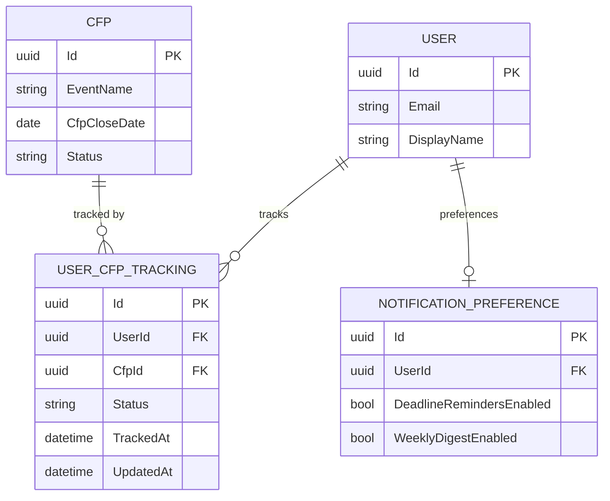

# CFP Tracking Data Model

## Purpose

The `UserCfpTracking` entity is the system-of-record for an authenticated speaker's engagement with a specific CFP listing. It models a speaker's personal progression through a three-state workflow: expressing initial interest (`Interested`), confirming they have submitted a talk proposal (`Submitted`), and recording a successful outcome (`Accepted`).

This model is authoritative. No upstream system feeds tracking data; all records are created and updated by authenticated speakers via the web application or the speaker-facing API endpoints. Tracking records are never publicly visible — they are scoped entirely to the owning user.

Tracking data drives two downstream processes: the `DeadlineReminderJob` (which uses tracked CFPs with approaching deadlines to send timely notifications) and the `WeeklyDigestJob` (which highlights closing-soon CFPs to users with active interests).

## Schema Definition

### ER Diagram



### Fields

| Field | Type | Nullable | Description |
|---|---|---|---|
| `Id` | `uuid` | No | Primary key. GUID generated at first tracking action. |
| `UserId` | `uuid` | No | FK to `User.Id`. Indexed as part of composite unique constraint. |
| `CfpId` | `uuid` | No | FK to `Cfp.Id`. Indexed as part of composite unique constraint. |
| `Status` | `nvarchar(50)` | No | Enum stored as string: `Interested`, `Submitted`, `Accepted`. See workflow states below. |
| `TrackedAt` | `datetimeoffset` | No | Timestamp when the user first tracked this CFP (initial `Interested` action). Set once on creation. |
| `UpdatedAt` | `datetimeoffset` | No | Timestamp of the most recent status update. Maintained by EF Core interceptor. |

### Tracking Status Workflow

| Status | Meaning | Typical Transition |
|---|---|---|
| `Interested` | Speaker has bookmarked this CFP and intends to submit. | Initial state when user clicks "I'm Interested". |
| `Submitted` | Speaker has sent a talk proposal to the event. | Speaker clicks "I've Submitted" after sending their proposal. |
| `Accepted` | Speaker's proposal was accepted by the event. | Speaker clicks "I've Been Accepted" after receiving acceptance notice. |

**Progression rules:**
- Any state may be set directly without requiring the preceding state (e.g., a speaker may mark `Accepted` directly if they forgot to update earlier steps).
- The natural forward progression is `Interested` → `Submitted` → `Accepted`.
- Backward transitions are permitted (e.g., a speaker may revert from `Submitted` to `Interested` if they decide not to proceed).
- There is no `Rejected` or `Withdrawn` state. Speakers who are rejected or withdraw their proposal may simply remove the tracking record or leave it at `Submitted`.

### Constraints

- **Composite unique constraint:** `(UserId, CfpId)` — a user may track a given CFP exactly once. Attempting to create a duplicate tracking record for the same user/CFP pair results in a conflict error (HTTP 409).
- **Cascade delete:** If a `User` or `Cfp` record is archived, tracking records are not automatically deleted. The tracking history is preserved for the speaker's dashboard view. Orphaned tracking records are not expected given that neither users nor CFPs are hard-deleted.

## Partitioning and Identifier Strategy

**Primary Key:** `Id` — GUID. Provides a stable, non-guessable identifier for the tracking record, used in API paths (`PUT /api/v1/me/tracking/{cfpId}` uses the CFP ID, not the tracking record ID, as the URL parameter to match the speaker's mental model).

**Composite Unique Constraint + Index:** `(UserId, CfpId)` serves both as the uniqueness guard and as the primary access index. The most common query pattern — "get all tracked CFPs for user X" — is satisfied by the `UserId` prefix of this index.

**Secondary Index:** `CfpId` alone, to support the reverse pattern — "how many users are tracking CFP Y" (used by the admin dashboard summary metrics).

**Covering Index for Deadline Reminders:** The `DeadlineReminderJob` queries `UserCfpTracking JOIN Cfp ON CfpId` filtered by `Cfp.CfpCloseDate BETWEEN today AND today + N days` and `NotificationPreference.DeadlineRemindersEnabled = true`. This query benefits from the index on `CfpId` combined with the index on `Cfp.CfpCloseDate`.

## Data Source and Lifecycle

### Authoritative Source

CFP Compass is the system of record for all `UserCfpTracking` data. Records are created and modified exclusively by authenticated speakers through:

1. **Web application** (Blazor — `/dashboard/my-tracking` and CFP listing page tracking buttons)
2. **Speaker API** (`POST /api/v1/me/tracking/{cfpId}`, `PUT /api/v1/me/tracking/{cfpId}`)

No background job creates tracking records. Jobs only read them.

### Ingestion Flow

```
Speaker clicks "I'm Interested" on a CFP listing
    │
    ▼
POST /api/v1/me/tracking/{cfpId} { "status": "Interested" }
    │
    ├── Auth check (must be authenticated)
    ├── Check: Cfp exists, Status = 'Approved', IsArchived = false
    ├── Check: No existing tracking record for (UserId, CfpId)
    └── Insert UserCfpTracking { Status = "Interested", TrackedAt = now }

Speaker updates status
    │
    ▼
PUT /api/v1/me/tracking/{cfpId} { "status": "Submitted" }
    │
    ├── Auth check
    ├── Resolve existing tracking record by (UserId, CfpId)
    └── Update Status, UpdatedAt

Speaker removes tracking
    │
    ▼
DELETE /api/v1/me/tracking/{cfpId}
    │
    └── Delete UserCfpTracking record by (UserId, CfpId)
```

### Lifecycle Management

- **DeadlineReminderJob** (daily 6 AM UTC): Queries `UserCfpTracking` records where `Status IN ('Interested', 'Submitted')` joined with `Cfp` where `CfpCloseDate` is 7, 3, or 1 day(s) from today. For each match, checks `NotificationPreference.DeadlineRemindersEnabled = true` before sending. Reminder emails are not sent for `Accepted` CFPs (the outcome is known).
- **WeeklyDigestJob** (Sunday 8 AM UTC): Queries users with `NotificationPreference.WeeklyDigestEnabled = true`. The digest includes CFPs the user is tracking that are closing within 7 days, plus newly published CFPs. Tracking records are used to highlight "your tracked CFPs closing soon."
- **CFP expiry:** When a CFP is archived (`IsArchived = true`), tracking records are retained. The speaker's dashboard shows archived CFPs with an "Archived" badge, providing a historical record of their past submissions.

## Access Patterns

### Supported Patterns

| Pattern | Query Characteristics | Notes |
|---|---|---|
| `GetUserTrackingByStatus` | Filter by `UserId`, optional `Status`; include `Cfp` navigation | Dashboard view — speaker's tracking list, optionally filtered by status |
| `GetUserTrackedCfpIds` | Select `CfpId` where `UserId = X` | Listing page — highlights which CFPs the user has already tracked (avoids re-fetching full tracking records) |
| `GetCfpsNearDeadline` | Join `Cfp` on `CfpId`; filter `CfpCloseDate BETWEEN today AND today + 7 days`; filter `Status IN ('Interested', 'Submitted')` | `DeadlineReminderJob` — finds speakers to notify |
| `GetSingleTracking` | Filter by `(UserId, CfpId)` | Resolve current state before an update |
| `GetTrackingCountForCfp` | `COUNT(*)` by `CfpId` | Admin dashboard summary metric — popularity indicator |

### Unsupported Patterns

- **Cross-user tracking queries:** There is no supported pattern to query tracking records across multiple users (e.g., "who is tracking CFP X?"). The count metric above is aggregated; individual user tracking is private.
- **Tracking history / change log:** `UserCfpTracking` stores only the current state, not a history of transitions. The `TrackedAt` field records when tracking began; `UpdatedAt` records the last change. A full state-transition audit log is not in scope for MVP.
- **Tracking by event organizer:** Organizers do not track their own CFPs. Tracking is a speaker-only concept.

## Governance and Retention

**Write access:**
- Authenticated speakers may create, update status, and delete their own tracking records
- No admin or organizer endpoint modifies tracking records
- Background jobs read tracking records but do not write to them

**Read access:**
- Authenticated speakers may read only their own tracking records
- Admin dashboard reads aggregated counts (not individual speaker records)

**Schema evolution:** The `Status` enum is stored as a string value. Adding a new status value requires a migration to add the new string to documentation and to update the FluentValidation enum validator. The composite unique constraint `(UserId, CfpId)` is a core invariant and must not be removed.

**Retention:** Tracking records persist indefinitely. Speakers have a lifelong record of their CFP engagement history, including archived CFPs they previously tracked. This supports the dashboard's historical view and enables future analytics on speaker progression (accepted-to-submission ratio, etc.). Records are only deleted by explicit speaker action (clicking "Remove" on the dashboard).

## Design Notes

**Why a separate `Id` GUID rather than using `(UserId, CfpId)` as the primary key?** While the composite is unique, using a surrogate GUID primary key simplifies EF Core navigation and potential future API design (e.g., webhook payloads referencing a tracking record by ID). The composite unique constraint remains for data integrity and query performance.

**Why allow any state to be set directly?** Enforcing strict forward-only progression would create user friction for the common case where a speaker forgets to update intermediate states. The application does not need to validate the progression order — it only needs to record the speaker's self-reported state. The UI presents the states in natural order to guide progression without enforcing it.

**Why not track after expiry?** The `DeadlineReminderJob` skips CFPs with `Cfp.IsArchived = true`. Sending reminders for an already-expired CFP would be misleading. The tracking record remains for historical display but does not trigger further notifications.

## Related Specifications

- [Architecture Document — Section 3: Data Architecture](./../.squad/architecture.md)
- [Speaker CFP Tracking Process Flow](../process-flows/speaker-cfp-tracking.md)
- [CFP Data Model](cfp.md)
- [User Data Model](user.md)
