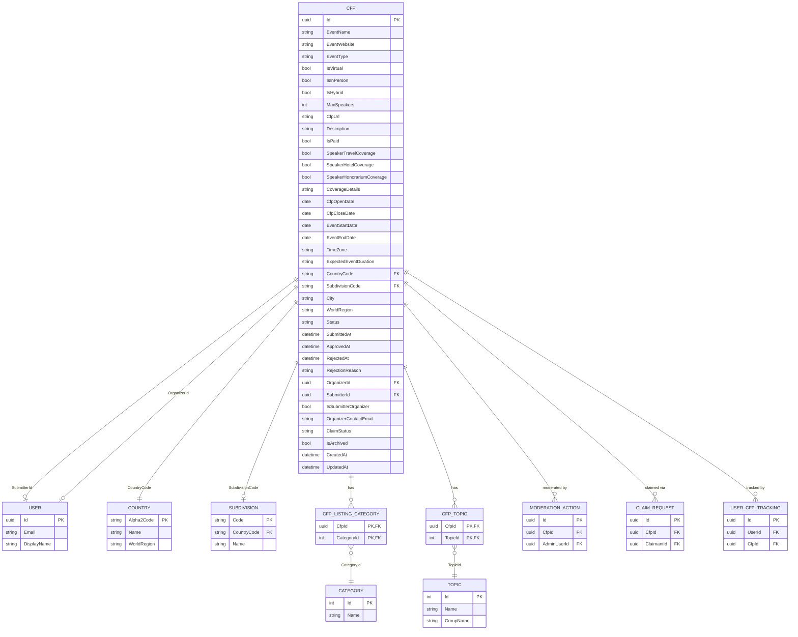

# CFP Data Model

## Purpose

The `Cfp` entity is the primary system-of-record for every Call for Papers listing in CFP Compass. It captures all information about an event's open submission window, the event itself, the geographic location, speaker coverage details, and the current moderation lifecycle state. Every other domain concept — tracking, moderation actions, claim requests — references a `Cfp` as its root aggregate.

The model is authoritative. No upstream system produces `Cfp` data; all records originate through the public submission form or API. Once published (status `Approved`), a CFP is publicly visible on the listing page and accessible via the REST API.

The `Cfp` entity does not represent speaker submissions or talk proposals. It represents the event organizer's Call for Papers — the announcement that an event is accepting speaker applications.

## Schema Definition

### ER Diagram



### Fields

| Field | Type | Nullable | Description |
|---|---|---|---|
| `Id` | `uuid` | No | Primary key. GUID generated on submission. |
| **Event Details** | | | |
| `EventName` | `nvarchar(200)` | No | Name of the event (e.g., "NDC Oslo 2027"). |
| `EventWebsite` | `nvarchar(500)` | No | Canonical URL of the event website. Used for duplicate detection and CFP history lookup. |
| `EventType` | `nvarchar(50)` | No | Enum stored as string: `Conference`, `Meetup`, `Workshop`, `Hackathon`, `Webinar`. |
| `IsVirtual` | `bit` | No | Event is fully virtual (no in-person component). |
| `IsInPerson` | `bit` | No | Event has an in-person component. |
| `IsHybrid` | `bit` | No | Event is hybrid (both virtual and in-person). Mutually inclusive with `IsVirtual` and `IsInPerson`. |
| `MaxSpeakers` | `int` | Yes | Approximate maximum number of speakers the event accepts. Nullable if unknown. |
| **CFP Details** | | | |
| `CfpUrl` | `nvarchar(500)` | No | Direct URL to the CFP submission page (e.g., Sessionize, PaperCall, custom form). Indexed for duplicate detection. |
| `Description` | `nvarchar(max)` | Yes | Rich-text description of the CFP and event. HTML-sanitized on input. |
| `IsPaid` | `bit` | No | Event charges speakers a registration or participation fee. |
| `SpeakerTravelCoverage` | `bit` | No | Event covers or contributes to speaker travel expenses. |
| `SpeakerHotelCoverage` | `bit` | No | Event covers or contributes to speaker hotel accommodation. |
| `SpeakerHonorariumCoverage` | `bit` | No | Event pays a speaker honorarium or stipend. |
| `CoverageDetails` | `nvarchar(1000)` | Yes | Free-text elaboration on coverage terms. HTML-sanitized on input. |
| **Event Scheduling** | | | |
| `CfpOpenDate` | `date` | No | Date the CFP opens for submissions. |
| `CfpCloseDate` | `date` | No | Date the CFP closes. Used for deadline reminder jobs and expiry. Indexed. |
| `EventStartDate` | `date` | Yes | Date the event begins. Nullable if not yet scheduled at CFP time. |
| `EventEndDate` | `date` | Yes | Date the event ends. Nullable if not yet scheduled. |
| `TimeZone` | `nvarchar(100)` | No | IANA Time Zone identifier for the event's local time (e.g., `Europe/Oslo`, `America/New_York`). Validated against TZDB. |
| `ExpectedEventDuration` | `nvarchar(50)` | Yes | Descriptive duration string (e.g., "1 day", "3 days"). Displayed on listing when exact dates are unavailable. |
| **Geographic** | | | |
| `CountryCode` | `char(2)` | No | ISO 3166-1 alpha-2 country code. Foreign key to `Country`. Validated on submission. |
| `SubdivisionCode` | `nvarchar(10)` | Yes | ISO 3166-2 subdivision code (e.g., `US-WA`, `DE-BY`). Foreign key to `Subdivision`. Nullable for country-level or virtual events. |
| `City` | `nvarchar(150)` | Yes | City name. Free text; not normalized to a reference table. |
| `WorldRegion` | `nvarchar(20)` | Yes | UN M.49 world region code (e.g., `150` for Europe, `019` for Americas). Auto-assigned by `WorldRegionAssignmentJob` based on `CountryCode`. Not a user input. |
| **Moderation** | | | |
| `Status` | `nvarchar(50)` | No | Enum stored as string. See lifecycle states below. Indexed. |
| `SubmittedAt` | `datetimeoffset` | No | Timestamp when the submission was received. Set by interceptor. |
| `ApprovedAt` | `datetimeoffset` | Yes | Timestamp when an admin approved the submission. |
| `RejectedAt` | `datetimeoffset` | Yes | Timestamp when an admin rejected the submission. |
| `RejectionReason` | `nvarchar(1000)` | Yes | Admin-provided reason for rejection. Included in rejection email to submitter. |
| `OrganizerId` | `uuid` | Yes | FK to `User`. Set when an authenticated organizer submits, or when a claim is verified. |
| `SubmitterId` | `uuid` | Yes | FK to `User`. Set when submission is made by an authenticated user. Nullable for anonymous submissions. |
| **Organizer / Claim Fields** | | | |
| `IsSubmitterOrganizer` | `bit` | No | `true` if the submitter indicated they are the event organizer; `false` if community-contributed. |
| `OrganizerContactEmail` | `nvarchar(320)` | Yes | Organizer's contact email, supplied by community submitter. Used to send claim invitation. |
| `ClaimStatus` | `nvarchar(50)` | Yes | Enum stored as string: `Unclaimed`, `PendingVerification`, `OrganizerVerified`, `AdminAssigned`. Reflects the claim lifecycle for this CFP. |
| **Audit** | | | |
| `IsArchived` | `bit` | No | Soft-delete / archive flag. CFPs past their deadline by 7+ days are set to `IsArchived = true` by `CfpExpiryJob`. Global query filter excludes archived records from default queries. |
| `CreatedAt` | `datetimeoffset` | No | Record creation timestamp. Set by EF Core interceptor; not editable. |
| `UpdatedAt` | `datetimeoffset` | No | Last modification timestamp. Updated by EF Core interceptor on every save. |

### Status Lifecycle

| Status Value | Meaning |
|---|---|
| `Pending` | Submitted, awaiting admin review. Not publicly visible. |
| `Approved` | Admin-approved. Publicly visible on listing page and via API. |
| `Rejected` | Admin-rejected. Not publicly visible. Submitter notified with reason and reconsideration link. |
| `Reconsidering` | Organizer has requested reconsideration of a rejection. Back in admin queue. |
| `Archived` | Past its CfpCloseDate by 7+ days. Removed from active listing; visible in archive. |

### EventType Enum Values

`Conference` · `Meetup` · `Workshop` · `Hackathon` · `Webinar`

## Partitioning and Identifier Strategy

**Primary Key:** `Id` — GUID (UUID v4), generated at submission time by the API before publishing the event to Service Bus. Using GUIDs rather than sequential integers prevents enumeration of submission IDs in the status-check endpoint and ensures uniqueness across distributed processors.

**Indexed Columns:**
- `Status` — all listing queries filter on `Status = 'Approved'`
- `CfpCloseDate` — deadline reminder job, closing-soon filter
- `CfpUrl` — duplicate detection query
- `EventWebsite` — CFP history lookup (`GetCfpHistory`)
- `CountryCode`, `WorldRegion` — geographic filtering
- `IsArchived` — global query filter relies on this index

**Composite Unique Constraint:** None on the base table. Duplicate detection is advisory (flagged for admin review) rather than a hard constraint, because the same event may legitimately have a second CFP round.

**Global Query Filter:** `IsArchived == false` is applied globally via EF Core's `HasQueryFilter`. All standard repository queries automatically exclude archived records. Archive queries use `IgnoreQueryFilters()` explicitly.

## Data Source and Lifecycle

### Authoritative Source

CFP Compass is the system of record for all `Cfp` data. Records originate from:

1. **Public submission form** (`/submit`) — anonymous or authenticated submitters
2. **Public REST API** (`POST /api/v1/cfps`) — third-party integrations via APIM subscription key
3. **Admin-assisted entry** — future capability; not in MVP scope

No external data source feeds `Cfp` records automatically. All imports require the submission workflow.

### Ingestion Flow

```
Submitter fills /submit form
    │
    ▼
POST /api/v1/submissions (Turnstile token + CFP fields)
    │
    ├── Turnstile validation (Cloudflare API)
    ├── FluentValidation (fields, ISO 3166, IANA TZ)
    │
    ▼
cfp-submission-created event → Azure Service Bus
    │
    ▼
CfpSubmissionProcessor (Azure Function)
    ├── Writes Cfp record (Status = Pending)
    ├── Runs duplicate detection (CfpUrl match)
    └── Triggers StatusUpdateProcessor

Admin reviews pending queue (/admin/pending-submissions)
    │
    ├── Approve → cfp-submission-approved event
    │       └── CfpSubmissionProcessor sets Status = Approved, ApprovedAt
    │
    └── Reject → cfp-submission-rejected event
            └── CfpSubmissionProcessor sets Status = Rejected, RejectedAt, RejectionReason
```

### Lifecycle Management

- **CfpExpiryJob** (daily midnight UTC): queries `Cfp` records where `Status = 'Approved'` and `CfpCloseDate < GETUTCDATE() - 7 days`; sets `IsArchived = true`.
- **WorldRegionAssignmentJob** (every 6 hours): queries `Cfp` records where `WorldRegion IS NULL`; resolves and assigns UN M.49 code from `Country.WorldRegion`.
- **Organizer claim flow**: `ClaimStatus` progresses from `Unclaimed` → `PendingVerification` → `OrganizerVerified` (or `AdminAssigned`) in response to `ClaimRequest` events.

## Access Patterns

### Supported Patterns

| Pattern | Query Characteristics | Notes |
|---|---|---|
| `GetActiveCfps` | Filter by `Status = 'Approved'`, optional filters on `EventType`, `CountryCode`, `WorldRegion`, `CategoryId` (via junction), `TopicId` (via junction); ordered by `CfpCloseDate ASC`; paginated | Primary public listing query; APIM response cache (5 min TTL) |
| `GetCfpById` | Filter by `Id`, `Status = 'Approved'` | Single CFP detail; APIM response cache (1 min TTL) |
| `GetArchivedCfps` | `IgnoreQueryFilters()` + filter `IsArchived = true`; paginated | Past CFPs archive page |
| `GetCfpHistory` | Filter by `EventWebsite` (normalized URL match); ordered by `CfpCloseDate DESC` | Shows history of CFP rounds for a recurring event |
| `GetPendingSubmissions` | Filter by `Status IN ('Pending', 'Reconsidering')`; ordered by `SubmittedAt ASC` | Admin moderation queue |
| `GetCfpBySubmitterId` | Filter by `SubmitterId` | Submitter's submission history for edit/reconsider flow |
| `GetTrackedCfpDeadlines` | Join with `UserCfpTracking`; filter by `CfpCloseDate` within N days | Used by `DeadlineReminderJob` |

### Unsupported Patterns

- **Full-text search across `Description`:** Not supported with SQL `LIKE`; requires Azure Cognitive Search or a dedicated search index (out of scope for MVP). Category and topic filters cover the primary discovery need.
- **Cross-region aggregation queries:** Geographic analytics across all world regions are not a primary access pattern. Admin dashboard summary metrics use pre-aggregated counts, not dynamic group-bys.

## Governance and Retention

**Write access:**
- Public submission endpoint (anonymous/authenticated) — creates `Cfp` records in `Pending` status only
- Admin endpoints — transition status, set `RejectionReason`, `ApprovedAt`, `RejectedAt`
- Azure Function processors — set `IsArchived`, `WorldRegion`, `ClaimStatus`, `OrganizerId` via background jobs
- Organizer (via verified claim) — may update select fields (EventWebsite, Description, CfpUrl, dates) on own CFPs; triggers re-moderation

**Read access:**
- Public listing API and web UI — `Approved`, non-archived records only (enforced via global query filter + status check)
- Admin dashboard — all statuses including `Pending`, `Rejected`, `Reconsidering`
- Archive page — `IsArchived = true` records

**Schema evolution:** Additive-only changes preferred. New nullable columns do not require data backfill. Non-nullable additions require a migration with a default value. Column renames and type changes are breaking and require a versioned migration plan reviewed by the team.

**Retention:** CFP records are never hard-deleted. The soft-delete (`IsArchived`) pattern preserves historical records. This supports the CFP history feature, which shows past CFP rounds for recurring events. `ModerationAction` and `AuditLog` records referencing a `Cfp` must remain intact; therefore hard deletion is prohibited.

## Design Notes

**Why nullable `SubmitterId` and `OrganizerId`?** The public submission form accepts anonymous submissions (no account required). `SubmitterId` is only set when the submitter is authenticated. `OrganizerId` starts null and is assigned through the claim flow — the submitter of a community-contributed CFP is not the organizer.

**Why `IsSubmitterOrganizer` as a boolean rather than inferring from `OrganizerId`?** At submission time, `OrganizerId` cannot be set (the organizer has not claimed yet). `IsSubmitterOrganizer` captures the submitter's self-attestation at submission time, independent of whether a claim is later verified.

**Why advisory duplicate detection rather than a unique constraint on `CfpUrl`?** The same CFP URL may legitimately be re-submitted if it was previously rejected or if the event's CFP page was updated. A hard constraint would prevent re-submission. Duplicate detection flags the submission for admin review, who can determine intent.

**EventWebsite vs. CfpUrl:** `EventWebsite` is the event's main web presence (stable, year-over-year); `CfpUrl` is the specific submission portal (may change per year). CFP history uses `EventWebsite` as the grouping key.

**Hybrid format flags:** `IsVirtual`, `IsInPerson`, and `IsHybrid` are stored as independent booleans rather than a single enum to support future flexibility. A hybrid event has all three as possible truths. The submission form enforces at least one being true.

## Related Specifications

- [Architecture Document — Section 3: Data Architecture](./../.squad/architecture.md)
- [CFP Submission Process Flow](../process-flows/cfp-submission.md)
- [CFP Moderation Process Flow](../process-flows/cfp-moderation.md)
- [Organizer Claim Verification Process Flow](../process-flows/organizer-claim.md)
- [Taxonomy Data Model](taxonomy.md)
- [Moderation Data Model](moderation.md)
- [Claim Data Model](claim.md)
- [Reference Data Model](reference-data.md)
