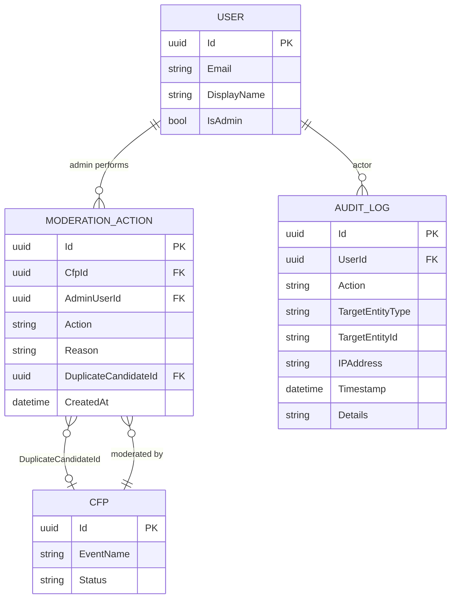

# Moderation Data Model

## Purpose

The moderation model captures the administrative lifecycle of CFP submissions. Every moderation decision made by an admin — approving, rejecting, reconsidering, or flagging a duplicate — is recorded in the `ModerationAction` table. In parallel, all admin actions and significant system events are written to the `AuditLog` table for compliance, traceability, and operational review.

The `ModerationAction` table is the system-of-record for moderation history specific to a single CFP. The `AuditLog` table is the system-of-record for the broader audit trail across all admin operations in CFP Compass.

Both tables are append-only. No records in either table are updated or deleted after creation. This ensures an immutable, auditable record of all decisions.

## Schema Definition

### ER Diagram



### ModerationAction Fields

| Field | Type | Nullable | Description |
|---|---|---|---|
| `Id` | `uuid` | No | Primary key. GUID generated at action time. |
| `CfpId` | `uuid` | No | FK to `Cfp.Id`. Indexed. The CFP this action applies to. |
| `AdminUserId` | `uuid` | No | FK to `User.Id`. The authenticated admin who performed the action. |
| `Action` | `nvarchar(50)` | No | Enum stored as string. See action values below. |
| `Reason` | `nvarchar(1000)` | Yes | Admin-provided explanation. Required for `Rejected` and `DuplicateFlagged`; optional for `Approved` and `Reconsidered`. Included in notification emails to the submitter. |
| `DuplicateCandidateId` | `uuid` | Yes | FK to `Cfp.Id`. Populated only when `Action = 'DuplicateFlagged'`, pointing to the existing CFP record that shares the same `CfpUrl`. |
| `CreatedAt` | `datetimeoffset` | No | Timestamp of the admin action. Set by EF Core interceptor. Never updated. |

### ModerationAction Action Enum Values

| Value | Meaning |
|---|---|
| `Approved` | Admin approved the submission. CFP status transitions to `Approved`. |
| `Rejected` | Admin rejected the submission. CFP status transitions to `Rejected`. `Reason` is required. |
| `Reconsidered` | Admin has chosen to re-review a previously rejected submission following an organizer reconsideration request. CFP status transitions to `Reconsidering`. |
| `DuplicateFlagged` | Admin (or the duplicate detection system) has flagged this submission as a potential duplicate of an existing CFP. `DuplicateCandidateId` identifies the suspected duplicate. CFP may remain `Pending` pending admin decision. |

### AuditLog Fields

| Field | Type | Nullable | Description |
|---|---|---|---|
| `Id` | `uuid` | No | Primary key. GUID generated at log time. |
| `UserId` | `uuid` | Yes | FK to `User.Id`. The user whose action triggered this log entry. Nullable for system-generated entries (e.g., job-triggered state transitions). |
| `Action` | `nvarchar(200)` | No | Short string describing the action (e.g., `CfpApproved`, `UserDisabled`, `ClaimAssigned`, `ApiKeyRevoked`). Indexed. |
| `TargetEntityType` | `nvarchar(100)` | No | The type of entity affected (e.g., `Cfp`, `User`, `ClaimRequest`, `ApiKeyRequest`). |
| `TargetEntityId` | `nvarchar(100)` | No | String-encoded ID of the affected entity (GUID or other identifier). Enables querying all log entries for a specific entity. Indexed. |
| `IPAddress` | `nvarchar(50)` | Yes | Client IP address at the time of the action. Captured from the HTTP request. Nullable for system-initiated actions. |
| `Timestamp` | `datetimeoffset` | No | Timestamp of the logged event. Indexed. |
| `Details` | `nvarchar(max)` | Yes | JSON-serialized supplementary data specific to the action type (e.g., previous status, new status, rejection reason summary). Schema is per-action-type. |

### Audit Log Action Values (Representative)

| Action String | Description |
|---|---|
| `CfpApproved` | Admin approved a CFP submission |
| `CfpRejected` | Admin rejected a CFP submission |
| `CfpReconsidered` | Admin opened a rejected CFP for reconsideration |
| `CfpDuplicateFlagged` | Duplicate detection flagged a CFP |
| `UserDisabled` | Admin disabled a user account |
| `UserEnabled` | Admin re-enabled a user account |
| `ClaimAssigned` | Admin manually assigned an organizer to a CFP |
| `ApiKeyApproved` | Admin approved an API key request |
| `ApiKeyRejected` | Admin rejected an API key request |
| `LoginSuccess` | Successful authentication event |
| `LoginFailed` | Failed authentication attempt |
| `AccountLocked` | Account locked after repeated failures |
| `CfpSubmitted` | New CFP submission received |
| `ReconsiderationRequested` | Organizer requested reconsideration of rejection |

## Partitioning and Identifier Strategy

**Primary Keys:** Both `ModerationAction.Id` and `AuditLog.Id` use GUIDs. Append-only tables benefit from GUIDs over sequential integers to avoid page hotspots on the clustered index during concurrent inserts.

**Indexed Columns on ModerationAction:**
- `CfpId` — retrieve all moderation actions for a specific CFP (moderation history panel)
- `AdminUserId` — admin activity report
- `CreatedAt` — time-range queries for reporting

**Indexed Columns on AuditLog:**
- `Action` — filter by action type in audit reports
- `TargetEntityType` + `TargetEntityId` — composite index supporting entity-specific audit queries (e.g., "all actions taken on CFP {id}")
- `Timestamp` — time-range queries; admin activity report filtered by date
- `UserId` — queries for all actions by a specific admin

**No foreign key constraint on `AuditLog.UserId`:** The audit log is designed to outlive the records it references. If a user is disabled (soft-deleted), their audit log entries remain intact. The `UserId` is stored as a nullable UUID and queried directly; no cascade or restrict behavior is applied.

## Data Source and Lifecycle

### Authoritative Source

`ModerationAction` and `AuditLog` are produced by CFP Compass. No external system writes to these tables.

`ModerationAction` is written in the `CfpSubmissionProcessor` Azure Function when processing moderation events from Service Bus. `AuditLog` is written by an `AuditInterceptor` or application-layer `AuditService` that decorates every admin operation.

### Ingestion Flow

```
Admin clicks "Approve" on a pending submission
    │
    ▼
POST /api/v1/admin/submissions/{id}/approve
    │
    ├── Admin authorization check (Admin claim present)
    ├── Publish cfp-submission-approved event to Service Bus
    └── API returns 202 Accepted

cfp-submission-approved event consumed by CfpSubmissionProcessor
    │
    ├── Update Cfp.Status = 'Approved', Cfp.ApprovedAt = now
    ├── Insert ModerationAction { Action = 'Approved', ... }
    └── Publish to AuditLog { Action = 'CfpApproved', ... }
        └── Both writes in same DB transaction

Duplicate detection (inline during submission processing)
    │
    ├── Query: SELECT Id FROM Cfp WHERE CfpUrl = @submittedUrl
    ├── Match found?
    │   └── Insert ModerationAction { Action = 'DuplicateFlagged', DuplicateCandidateId = matchId }
    │       └── Submission remains Pending; admin queue shows duplicate warning
    └── No match: proceed normally
```

### Lifecycle Management

- **Append-only:** No `UPDATE` or `DELETE` statements are issued against `ModerationAction` or `AuditLog`. Corrections to a moderation decision result in a new `ModerationAction` record (e.g., a second `Approved` after a `Rejected` represents a reconsideration outcome), not an edit.
- **AuditLog retention:** Audit log records are retained indefinitely in Azure SQL. At scale, older records may be moved to Azure Blob Storage (cold archive) if table size becomes a concern. This is a future operational consideration outside MVP scope.
- **Correlation:** Every `ModerationAction` write is accompanied by an `AuditLog` write in the same database transaction, ensuring both records are always consistent.

## Access Patterns

### Supported Patterns

| Pattern | Query Characteristics | Notes |
|---|---|---|
| `GetPendingSubmissions` | Query `Cfp` where `Status IN ('Pending', 'Reconsidering')`; ordered by `SubmittedAt ASC` | Admin moderation queue; not a direct query on `ModerationAction` but informed by it |
| `GetModerationHistory` | Filter `ModerationAction` by `CfpId`; include `AdminUser` navigation; order by `CreatedAt ASC` | CFP detail panel in admin UI — shows full moderation timeline |
| `GetAdminActivityReport` | Filter `ModerationAction` by `AdminUserId` and optional date range; group by `Action` | Admin self-service activity summary |
| `GetAuditLogForEntity` | Filter `AuditLog` by `TargetEntityType` + `TargetEntityId`; order by `Timestamp ASC` | Entity-level audit trail (e.g., all events for a specific CFP or user) |
| `GetAuditLogByAdmin` | Filter `AuditLog` by `UserId`; order by `Timestamp DESC` | Admin activity audit for compliance review |
| `GetRecentAuditLog` | Filter `AuditLog` by `Timestamp` range; paginated | Operational dashboard — recent system events |

### Unsupported Patterns

- **Cross-entity aggregate analytics:** Aggregate reporting across all admin actions (e.g., approval rates by week) is not a primary access pattern in MVP. `AuditLog` rows may be exported to Log Analytics for such reporting if needed.
- **Full-text search over `Details`:** The `Details` JSON field is not indexed for full-text search. Queries against it should use JSON path expressions or be handled by an exporter to a search-optimized store for investigative use cases.

## Governance and Retention

**Write access:**
- `ModerationAction` is written exclusively by Azure Function processors (`CfpSubmissionProcessor`) handling Service Bus moderation events
- `AuditLog` is written by the application-layer `AuditService`, invoked from admin controllers and background processors
- No user-facing endpoint writes directly to either table
- No record in either table is updated or deleted after initial creation

**Read access:**
- Admin users may read `ModerationAction` records for any CFP (via admin UI)
- Admin users may read `AuditLog` records (via admin activity report)
- Non-admin authenticated users have no access to either table
- Submitters see only the outcome of the moderation decision (approval/rejection notification email); they do not see the moderation history directly

**Schema evolution:** Both tables are append-only. New columns may be added with nullable defaults without affecting existing rows. The `Action` enum and `Details` JSON schema are the primary evolution surfaces — new action types require documentation updates and corresponding `AuditLog.Details` schema definitions.

**Retention:** Moderation action records are permanent. Audit log records are permanent in MVP; an archival strategy (move to cold storage after 2 years) may be applied as a future operational decision.

## Design Notes

**Why two separate tables (ModerationAction and AuditLog) rather than one?** `ModerationAction` is a domain-level construct — it is part of the CFP aggregate and is surfaced directly to admins in the moderation UI. `AuditLog` is a cross-cutting compliance mechanism that captures a broader set of events not specific to CFP moderation (user disables, API key changes, login events). Combining them would conflate domain concepts with operational compliance concerns.

**Why append-only?** An immutable audit trail ensures that no retrospective modification of the record is possible, which is essential for compliance and accountability. If an admin mistakenly approves a CFP, the correct resolution is to reject it (generating a new `ModerationAction`), not to edit the approval record.

**Why is `DuplicateCandidateId` a nullable self-referencing FK on ModerationAction rather than a separate table?** Duplicate detection is an infrequent event that is tightly coupled to a single moderation decision. A separate table would add complexity without meaningful benefit at MVP scale. The nullable FK on `ModerationAction` cleanly associates the flag with the specific moderation event that raised it.

**Transaction pairing for ModerationAction + AuditLog:** Ensuring both records are always written atomically (same database transaction) eliminates the possibility of an action being recorded in one table but not the other — a critical consistency requirement for a compliance-oriented audit trail.

## Related Specifications

- [Architecture Document — Section 3: Data Architecture](./../.squad/architecture.md)
- [Architecture Document — Section 13: Security Considerations](./../.squad/architecture.md)
- [CFP Moderation Process Flow](../process-flows/cfp-moderation.md)
- [CFP Data Model](cfp.md)
- [User Data Model](user.md)
