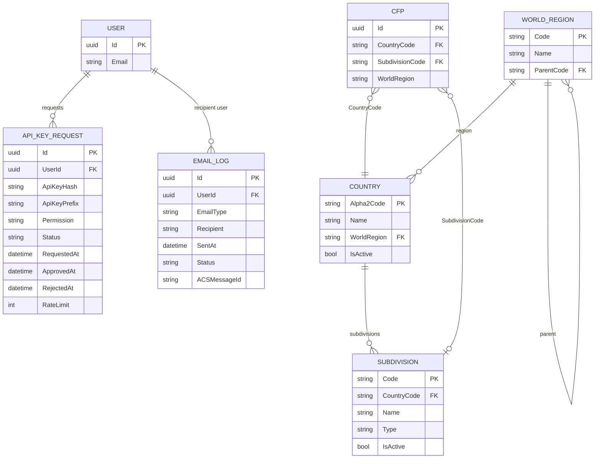

# Reference Data Model

## Purpose

This document covers two categories of supporting entities:

1. **ISO Reference Data** — `Country`, `Subdivision`, and `WorldRegion` provide the canonical geographic classification data used by CFP listings. These entities are seeded from ISO 3166-1, ISO 3166-2, and UN M.49 standards and cached in memory for fast lookups. They are system-of-record for geographic metadata within CFP Compass.

2. **Operational Entities** — `ApiKeyRequest` and `EmailLog` support platform operations. `ApiKeyRequest` manages the lifecycle of third-party API access requests through the APIM subscription model. `EmailLog` provides an append-only record of every email dispatched by the platform, used for delivery tracking, deduplication, and audit.

All reference data entities are seeded via EF Core `HasData()` and are read-only to the application at runtime (admin-managed in future, ISO-sourced for now). Operational entities are written by background processors and application services.

## Schema Definition

### ER Diagram



### Country Fields

| Field | Type | Nullable | Description |
|---|---|---|---|
| `Alpha2Code` | `char(2)` | No | Primary key. ISO 3166-1 alpha-2 code (e.g., `US`, `DE`, `AU`). Two uppercase letters. |
| `Name` | `nvarchar(200)` | No | Official short name of the country (ISO 3166-1 English short name, e.g., "United States of America", "Germany"). |
| `WorldRegion` | `nvarchar(10)` | No | FK to `WorldRegion.Code`. UN M.49 region code assigned to this country (e.g., `021` for Northern America, `155` for Western Europe). Used for the `WorldRegionAssignmentJob` and geographic filtering. |
| `IsActive` | `bit` | No | When `false`, the country is not shown in the country picker (used to hide territories or deprecated codes). Defaults to `true`. |

### Subdivision Fields

| Field | Type | Nullable | Description |
|---|---|---|---|
| `Code` | `nvarchar(10)` | No | Primary key. ISO 3166-2 code (e.g., `US-WA`, `DE-BY`, `AU-NSW`). Country code prefix ensures global uniqueness. |
| `CountryCode` | `char(2)` | No | FK to `Country.Alpha2Code`. Enables the cascading subdivision picker dropdown. Indexed. |
| `Name` | `nvarchar(200)` | No | Official name of the subdivision (e.g., "Washington", "Bavaria", "New South Wales"). |
| `Type` | `nvarchar(50)` | No | ISO 3166-2 subdivision type (e.g., `State`, `Province`, `Region`, `Territory`, `Prefecture`, `Canton`). |
| `IsActive` | `bit` | No | Defaults to `true`. Set to `false` for deprecated or merged subdivisions. |

### WorldRegion Fields

| Field | Type | Nullable | Description |
|---|---|---|---|
| `Code` | `nvarchar(10)` | No | Primary key. UN M.49 numeric code (e.g., `001` for World, `002` for Africa, `019` for Americas, `150` for Europe). |
| `Name` | `nvarchar(150)` | No | UN M.49 region name (e.g., "Europe", "Northern America", "Eastern Asia"). |
| `ParentCode` | `nvarchar(10)` | Yes | FK to `WorldRegion.Code`. Nullable for top-level regions. Enables the UN M.49 hierarchy (e.g., `Western Europe` → parent `Europe` → parent `World`). Used for hierarchical geographic filtering. |

### ApiKeyRequest Fields

| Field | Type | Nullable | Description |
|---|---|---|---|
| `Id` | `uuid` | No | Primary key. GUID generated at request time. |
| `UserId` | `uuid` | No | FK to `User.Id`. The authenticated speaker or organizer requesting API access. |
| `ApiKeyHash` | `nvarchar(500)` | Yes | SHA-256 hash of the issued API key. Set only when the request is approved and an APIM subscription key is generated. The plaintext key is never stored. |
| `ApiKeyPrefix` | `nvarchar(8)` | Yes | First 8 characters of the plaintext API key (e.g., `sk_live_a`). Displayed in the user dashboard to help users identify which key is which. Set at approval time. |
| `Permission` | `nvarchar(50)` | No | Enum stored as string: `Read` (maps to `cfp-compass-read` APIM product) or `ReadWrite` (maps to `cfp-compass-readwrite` APIM product). |
| `Status` | `nvarchar(50)` | No | Enum stored as string: `Pending`, `Approved`, `Rejected`, `Revoked`. |
| `RequestedAt` | `datetimeoffset` | No | Timestamp when the API access request was submitted. |
| `ApprovedAt` | `datetimeoffset` | Yes | Timestamp when the admin approved the request. |
| `RejectedAt` | `datetimeoffset` | Yes | Timestamp when the admin rejected the request. |
| `RateLimit` | `int` | Yes | Custom rate limit override for this subscription (requests/minute). Null uses the APIM product default (100 read / 10 write). |

### ApiKeyRequest Status Enum Values

| Value | Meaning |
|---|---|
| `Pending` | Request submitted; awaiting admin review. |
| `Approved` | Admin approved; APIM subscription key generated; `ApiKeyHash` and `ApiKeyPrefix` populated. |
| `Rejected` | Admin rejected; user notified. No key generated. |
| `Revoked` | Previously approved key has been revoked by admin or user. APIM subscription deactivated. |

### EmailLog Fields

| Field | Type | Nullable | Description |
|---|---|---|---|
| `Id` | `uuid` | No | Primary key. GUID generated at send time. |
| `UserId` | `uuid` | Yes | FK to `User.Id`. Nullable for emails sent to non-registered addresses (e.g., organizer claim invitation sent to an email not yet in the system). |
| `EmailType` | `nvarchar(100)` | No | Enum stored as string. See email type values below. |
| `Recipient` | `nvarchar(320)` | No | Recipient email address. Stored for delivery tracking and deduplication. |
| `SentAt` | `datetimeoffset` | No | Timestamp when the send was attempted. |
| `Status` | `nvarchar(50)` | No | Enum stored as string: `Queued`, `Sent`, `Failed`. |
| `ACSMessageId` | `nvarchar(200)` | Yes | Azure Communication Services message ID returned by the ACS SDK on successful dispatch. Used to correlate with ACS delivery receipts. Null for `Failed` records or if ACS was unreachable. |

### EmailLog EmailType Enum Values

| Value | Description |
|---|---|
| `SubmissionConfirmation` | Sent to submitter upon CFP submission receipt |
| `SubmissionApproved` | Sent to submitter when admin approves CFP |
| `SubmissionRejected` | Sent to submitter when admin rejects CFP |
| `ReconsiderationConfirmed` | Sent to submitter confirming reconsideration request received |
| `ClaimInvitation` | Sent to organizer contact email with verification link |
| `ClaimVerified` | Sent to claimant confirming successful claim |
| `WelcomeEmail` | Sent to new user on account creation |
| `PasswordReset` | Sent to user on password reset request |
| `ApiKeyApproved` | Sent to user when API key request is approved |
| `ApiKeyRejected` | Sent to user when API key request is rejected |
| `DeadlineReminder` | Sent to speaker for tracked CFPs near deadline |
| `WeeklyDigest` | Weekly digest of new and closing-soon CFPs |
| `AccountDisabled` | Sent to user when admin disables their account |
| `AccountEnabled` | Sent to user when admin re-enables their account |

## Partitioning and Identifier Strategy

**Country:** Primary key is the ISO 3166-1 alpha-2 string code. Using the natural key (rather than a surrogate integer) makes `Cfp.CountryCode` directly readable and avoids a join when displaying country names in listings. The `char(2)` type is compact and efficient as a foreign key.

**Subdivision:** Primary key is the ISO 3166-2 string code (e.g., `US-WA`). Same natural key rationale as `Country`. Indexed on `CountryCode` for the cascading dropdown query.

**WorldRegion:** Primary key is the UN M.49 numeric string code (e.g., `150`). Stored as string rather than integer to match the UN standard's three-digit format and avoid confusion with ISO 3166-1 numeric codes.

**ApiKeyRequest:** GUID primary key. Indexed on `UserId` (user dashboard view) and `Status` (admin approval queue).

**EmailLog:** GUID primary key. Indexed on `Recipient` (deduplication check), `UserId` (user email history), and `SentAt` (time-range queries, retention jobs).

## Data Source and Lifecycle

### Authoritative Source

**Country, Subdivision, WorldRegion** are seeded from ISO 3166-1, ISO 3166-2, and UN M.49 datasets via EF Core `HasData()` in the initial database migration. These are treated as static reference data within CFP Compass. Updates to the ISO standards (new country codes, subdivision changes) are applied through new EF Core migrations.

**ApiKeyRequest** records are created by authenticated users via the web application and resolved by admin action.

**EmailLog** records are created by the `NotificationProcessor` Azure Function immediately before and after each email send attempt.

### Ingestion Flow

```
Reference Data (Country / Subdivision / WorldRegion)
    │
    ▼
EF Core Migration (HasData seed)
    ├── ~250 Country records
    ├── ~5,000 Subdivision records
    └── ~50 WorldRegion records (UN M.49 hierarchy)

All reference data cached in IMemoryCache (24h TTL) on first request.

API Key Request
    │
    ▼
POST /api/v1/me/api-access (authenticated)
    ├── Insert ApiKeyRequest { Status = 'Pending', RequestedAt = now }
    └── Admin notified (AuditLog entry)

Admin approves API key
    │
    ▼
POST /api/v1/admin/api-requests/{id}/approve
    ├── APIM subscription created for user (via APIM Management API)
    ├── APIM returns subscription key
    ├── Hash key → ApiKeyHash; capture prefix → ApiKeyPrefix
    ├── Update ApiKeyRequest { Status = 'Approved', ApprovedAt = now }
    └── Send ApiKeyApproved email via NotificationProcessor

Email Send
    │
    ▼
NotificationProcessor processes notification event
    ├── Insert EmailLog { Status = 'Queued', SentAt = now }
    ├── Call ACS SDK: SendAsync(email)
    ├── Success → Update EmailLog { Status = 'Sent', ACSMessageId = id }
    └── Failure → Update EmailLog { Status = 'Failed' }
```

### Lifecycle Management

- **In-memory cache for reference data:** `Country`, `Subdivision`, and `WorldRegion` lists are loaded into `IMemoryCache` with a 24-hour TTL. The cache is populated lazily on first access. Admins can manually trigger a cache refresh via the admin cache endpoint if ISO reference data is updated.
- **WorldRegionAssignmentJob** (every 6 hours): Queries `Cfp` records with `WorldRegion IS NULL`, resolves the region from `Country.WorldRegion`, and assigns it. This job consumes the cached `Country` data and does not incur additional database reads for reference data.
- **ApiKeyRequest revocation:** When an admin revokes an API key, the APIM subscription is deactivated via the APIM Management API, and `ApiKeyRequest.Status` is set to `Revoked`. The `ApiKeyHash` is retained for audit purposes.
- **EmailLog retention:** Email log records are retained for 1 year. Records older than 1 year may be purged or archived. ACS delivery webhook callbacks (if implemented in future) update `Status` from `Sent` to `Delivered` or `Bounced`.

## Access Patterns

### Supported Patterns

| Pattern | Query Characteristics | Notes |
|---|---|---|
| `GetCountriesByWorldRegion` | Filter by `WorldRegion`; order by `Name` | Geographic filter on listing page; served from in-memory cache |
| `GetAllActiveCountries` | Filter `IsActive = true`; order by `Name` | Country picker dropdown; served from in-memory cache |
| `GetSubdivisionsByCountry` | Filter by `CountryCode`; order by `Name` | Cascading subdivision picker; served from in-memory cache |
| `GetWorldRegions` | All records; ordered by hierarchy (`ParentCode`, `Name`) | Region filter on listing page; served from in-memory cache |
| `GetApiKeysByUser` | Filter `ApiKeyRequest` by `UserId`; include active requests | User API access dashboard |
| `GetPendingApiKeyRequests` | Filter `ApiKeyRequest` by `Status = 'Pending'` | Admin API key approval queue |
| `GetEmailLogByUser` | Filter `EmailLog` by `UserId`; order by `SentAt DESC` | User email history (future) |
| `GetRecentEmailLog` | Filter `EmailLog` by `SentAt` range | Operational monitoring of email delivery |

### Unsupported Patterns

- **Free-text country/subdivision search at query time:** Country and subdivision lookups use exact code matching or full list retrieval from cache. Full-text search across country names is handled client-side against the cached list in the picker component — not a database query.
- **Cross-reference ISO standard lookups:** CFP Compass does not query external ISO registries at runtime. All reference data is seeded locally. Changes to ISO standards require a migration.

## Governance and Retention

**Write access:**
- `Country`, `Subdivision`, and `WorldRegion` are seeded via migrations and are read-only at runtime. Future admin-managed updates would require a dedicated admin endpoint.
- `ApiKeyRequest` records are created by authenticated users and updated by admin endpoints and the APIM integration
- `EmailLog` records are created and updated exclusively by the `NotificationProcessor` Azure Function

**Read access:**
- Country, Subdivision, and WorldRegion data is readable by all users (public, authenticated, admin) — it is used in public submission forms and listing filters
- `ApiKeyRequest` records are readable by the owning user and admins
- `EmailLog` records are accessible to admins only in MVP

**Schema evolution:** ISO reference data tables are the most stable in the system. Changes to `Country` or `Subdivision` schema require careful migration planning given the foreign key relationship with `Cfp.CountryCode` and `Cfp.SubdivisionCode`. The `WorldRegion.Code` type as a string code (rather than integer) allows adding UN M.49 sub-region codes without type changes.

**Retention:**
- Reference data: indefinite (no TTL; updated via migration on ISO standard changes)
- `ApiKeyRequest`: indefinite (audit trail; revoked records retained)
- `EmailLog`: 1 year active retention; then archival or purge (defined in future operational runbook)

## Design Notes

**Why use ISO natural keys (string codes) rather than surrogate integer keys for Country and Subdivision?** The ISO codes are globally unique, stable, and human-readable. Using them as primary keys makes `Cfp.CountryCode` directly interpretable without a join. The performance difference between a `char(2)` and an `int` foreign key at CFP Compass's expected scale is negligible.

**Why cache reference data in IMemoryCache rather than a distributed cache (Redis)?** Country, subdivision, and world region data is static for 24 hours and identical across all API instances. `IMemoryCache` (process-local) is sufficient and avoids the network hop to Redis for every request. In a multi-instance deployment, each instance populates its own cache independently — acceptable because the data is identical across instances and refreshes automatically on TTL expiry.

**Why not store the API key plaintext in a secure vault rather than only the hash?** The API key is an APIM subscription key managed by Azure API Management. APIM is the source of truth for the key. CFP Compass stores only a hash for correlation purposes (e.g., to identify which request a revoked key belongs to) and the prefix for user identification. Full key recovery is performed through the APIM portal if needed.

**Why append EmailLog records before and update after sending?** Recording the `Queued` state before calling ACS ensures that a send attempt is always logged, even if the application crashes mid-send. This enables operational investigation of missing emails and prevents duplicate sends if the `Queued` record serves as a deduplication key before each retry.

## Related Specifications

- [Architecture Document — Section 3: Data Architecture](./../.squad/architecture.md)
- [Architecture Document — Section 4: API Design](./../.squad/architecture.md)
- [CFP Data Model](cfp.md)
- [User Data Model](user.md)
- [Asynchronous Write Pattern Process Flow](../process-flows/api-write-pattern.md)
