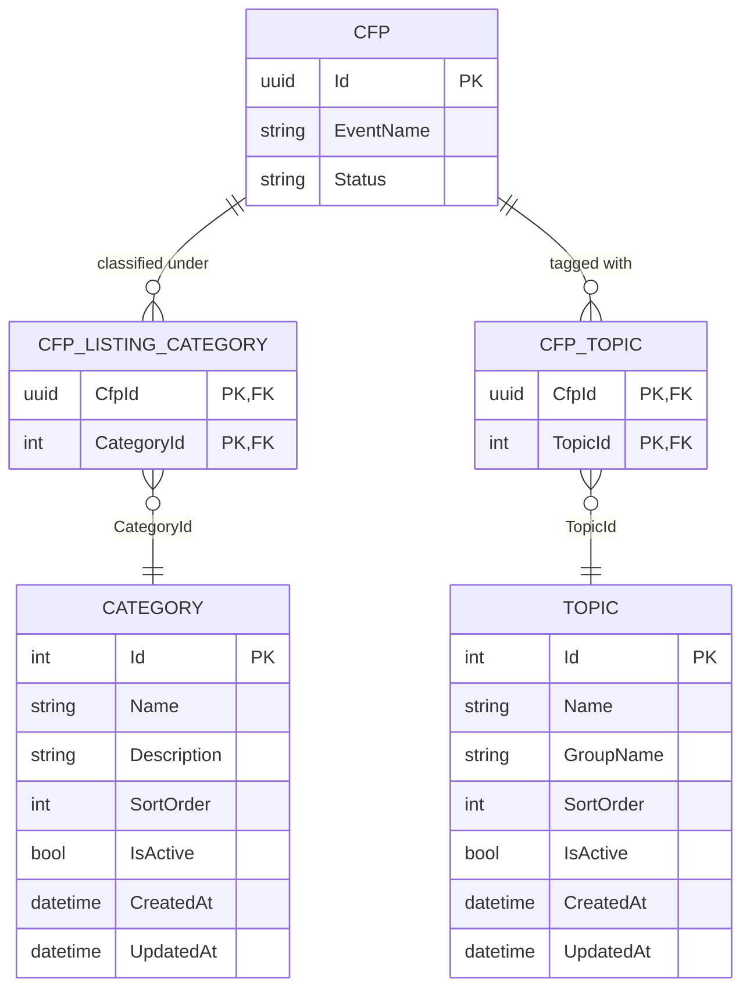

# Taxonomy Data Model

## Purpose

The taxonomy model defines the controlled vocabulary for classifying CFP listings. It consists of two independent classification axes:

1. **Categories (Primary Domains):** Broad subject areas that a CFP belongs to. At least one is required on every submitted CFP. A CFP may belong to multiple primary domains simultaneously (e.g., a conference on Cloud Native security spans both "Cloud & Infrastructure" and "Security & Privacy").

2. **Topics (Secondary Tags):** Fine-grained tags grouped by theme. Fully optional on submission. A CFP may have zero or many topic tags, drawn from any group.

Both `Category` and `Topic` are seeded via EF Core `HasData()` as part of the initial database migration. They are admin-extensible: administrators may add new categories and topics from the admin UI without requiring a code change. Categories and topics are never free-text; all values are drawn from the managed list.

Junction tables (`CfpListingCategory`, `CfpTopic`) connect CFPs to their selected categories and topics. Filter queries against these junction tables use `EXISTS` / `JOIN` semantics, so a CFP tagged with multiple values appears in results for any one of its tags (OR logic within a filter group).

## Schema Definition

### ER Diagram



### Category Fields

| Field | Type | Nullable | Description |
|---|---|---|---|
| `Id` | `int` | No | Primary key. Integer, seeded with stable values (1–10 for initial domains). |
| `Name` | `nvarchar(200)` | No | Display name of the primary domain (e.g., "Cloud & Infrastructure"). Unique. |
| `Description` | `nvarchar(500)` | Yes | Optional description displayed on the filter panel to help submitters choose correctly. |
| `SortOrder` | `int` | No | Controls display ordering in the submission form and filter panel. Lower values appear first. |
| `IsActive` | `bit` | No | When `false`, the category is hidden from the submission form and filters but retained for historical CFPs. Defaults to `true`. |
| `CreatedAt` | `datetimeoffset` | No | Record creation timestamp. Set by EF Core interceptor. |
| `UpdatedAt` | `datetimeoffset` | No | Last modification timestamp. Set by EF Core interceptor. |

### Topic Fields

| Field | Type | Nullable | Description |
|---|---|---|---|
| `Id` | `int` | No | Primary key. Integer, seeded with stable values. |
| `Name` | `nvarchar(200)` | No | Display name of the secondary tag (e.g., ".NET", "Kubernetes", "LLMs"). Unique within `GroupName`. |
| `GroupName` | `nvarchar(150)` | No | Logical grouping for display in the UI (e.g., "Programming Languages", "Cloud Providers"). Topics are rendered grouped by `GroupName` in the submission form. |
| `SortOrder` | `int` | No | Controls display ordering within the group. Lower values appear first. |
| `IsActive` | `bit` | No | When `false`, the topic is hidden from the submission form and filters but retained for historical CFPs. Defaults to `true`. |
| `CreatedAt` | `datetimeoffset` | No | Record creation timestamp. |
| `UpdatedAt` | `datetimeoffset` | No | Last modification timestamp. |

### CfpListingCategory Fields (Junction Table)

| Field | Type | Nullable | Description |
|---|---|---|---|
| `CfpId` | `uuid` | No | FK to `Cfp.Id`. Part of composite primary key. |
| `CategoryId` | `int` | No | FK to `Category.Id`. Part of composite primary key. |

No additional fields. Composite primary key `(CfpId, CategoryId)` enforces uniqueness. EF Core configures this as a keyless join entity with `HasKey(e => new { e.CfpId, e.CategoryId })`.

### CfpTopic Fields (Junction Table)

| Field | Type | Nullable | Description |
|---|---|---|---|
| `CfpId` | `uuid` | No | FK to `Cfp.Id`. Part of composite primary key. |
| `TopicId` | `int` | No | FK to `Topic.Id`. Part of composite primary key. |

Composite primary key `(CfpId, TopicId)`. Same pattern as `CfpListingCategory`.

## Seeded Taxonomy

The following categories and topics are seeded via EF Core `HasData()` in the initial migration. Seeded records use fixed, stable integer IDs to ensure migration idempotency.

### Primary Domains (Categories)

| Id | Name | Description |
|---|---|---|
| 1 | Software Development & Engineering | General programming, languages, frameworks, tooling, architecture, testing, DevOps |
| 2 | Cloud & Infrastructure | Cloud platforms, distributed systems, networking, SRE, observability, infrastructure automation |
| 3 | Data, AI & Machine Learning | Data engineering, analytics, ML/AI, LLMs, MLOps, data science |
| 4 | Security & Privacy | Application security, cloud security, governance, compliance, identity, threat detection |
| 5 | Web, Mobile & Frontend | Web technologies, frontend frameworks, UX/UI, mobile development |
| 6 | DevOps, Platform Engineering & Automation | CI/CD, platform teams, IaC, GitOps, automation, reliability |
| 7 | Enterprise & Architecture | Software architecture, system design, integration, enterprise platforms, modernization |
| 8 | Open Source & Community | OSS ecosystems, maintainership, community governance, tooling |
| 9 | Product, Design & Innovation | Product management, design systems, research, innovation practices |
| 10 | Specialized Domains | Niche or vertical-specific tech (e.g., fintech, health tech, IoT, robotics, gaming) |

### Secondary Tag Groups (Topics)

Topics are seeded with stable integer IDs and grouped for display. Representative members of each group are listed; the full set is defined in the seed migration.

#### Programming Languages (GroupName: `Programming Languages`)

`.NET` · `Java` · `JavaScript / TypeScript` · `Python` · `Go` · `Rust` · `C++` · `Kotlin` · `Swift` · `Ruby` · `PHP` · `Scala` · `C` · `Elixir`

#### Frameworks & Ecosystems (GroupName: `Frameworks & Ecosystems`)

`ASP.NET Core` · `React` · `Angular` · `Vue.js` · `Next.js` · `Spring Boot` · `Django` · `Node.js` · `FastAPI` · `Flutter` · `Blazor` · `Rails` · `Laravel`

#### Cloud Providers (GroupName: `Cloud Providers`)

`Azure` · `AWS` · `Google Cloud` · `Multi-cloud` · `Hybrid cloud` · `On-premises modernization`

#### AI/ML Focus Areas (GroupName: `AI/ML Focus Areas`)

`Large Language Models (LLMs)` · `Generative AI` · `MLOps` · `Applied Machine Learning` · `AI Ethics & Responsibility` · `Computer Vision` · `NLP` · `AI Agents`

#### Architecture Styles (GroupName: `Architecture Styles`)

`Event-driven Architecture` · `Microservices` · `Serverless` · `Domain-Driven Design` · `Monolith Modernization` · `API Design` · `CQRS / Event Sourcing` · `Service Mesh`

#### Infrastructure Practices (GroupName: `Infrastructure Practices`)

`Infrastructure as Code` · `Terraform` · `Kubernetes` · `Containers & Docker` · `Networking` · `Observability` · `Site Reliability Engineering` · `GitOps` · `FinOps`

#### Security Topics (GroupName: `Security Topics`)

`Application Security` · `Cloud Security` · `Identity & Access Management` · `Zero Trust` · `Red Team / Offensive Security` · `Blue Team / Defensive Security` · `Purple Team` · `Supply Chain Security` · `Compliance & Governance`

#### Data Topics (GroupName: `Data Topics`)

`Data Engineering` · `Data Warehousing` · `Analytics & BI` · `Data Streaming` · `Databases (SQL & NoSQL)` · `Data Governance` · `Real-time Analytics` · `Graph Databases`

#### Developer Experience (GroupName: `Developer Experience`)

`Developer Tooling` · `Productivity` · `Technical Documentation` · `Testing & QA` · `Automation` · `Developer Portals` · `Inner Source`

#### Community & Career (GroupName: `Community & Career`)

`Public Speaking` · `Technical Leadership` · `Mentoring & Coaching` · `Diversity, Equity & Inclusion` · `Community Building` · `Open Source Contribution` · `Career Development`

## Partitioning and Identifier Strategy

**Category primary key:** Integer, stable seed values (1–10). Admin-created categories receive the next sequential integer. Integer keys reduce join overhead on the `CfpListingCategory` junction table, which is queried heavily on every listing page load.

**Topic primary key:** Integer, stable seed values assigned per group (e.g., Programming Languages: 1–20, Frameworks: 21–40, etc., allowing room for admin additions within each group band). Integer keys serve the same join-efficiency purpose as category IDs.

**Junction table keys:** Composite primary keys `(CfpId, CategoryId)` and `(CfpId, TopicId)` enforce uniqueness and serve as clustered indexes. Query patterns filter by either `CfpId` (get all tags for a CFP) or `CategoryId`/`TopicId` (get all CFPs with this tag), so non-clustered covering indexes exist on `CategoryId` and `TopicId` columns respectively.

**No soft-delete on taxonomy:** `IsActive = false` rather than `IsArchived`. Historical junction records that reference deactivated categories or topics are preserved for data integrity; the UI simply does not present deactivated values for new selections.

## Data Source and Lifecycle

### Authoritative Source

CFP Compass is the system of record for all taxonomy data. The initial seed set is defined in the EF Core `HasData()` configuration in `CFPCompass.Infrastructure`. Admin-created additions are written directly to the `Category` and `Topic` tables via the admin UI.

### Ingestion Flow

```
Initial Deployment
    │
    ▼
EF Core Migration (HasData seed)
    ├── 10 Category records inserted (if not present)
    └── ~100 Topic records inserted (if not present)

Admin Adds New Category
    │
    ▼
POST /api/v1/admin/categories
    ├── FluentValidation (name unique, sort order valid)
    └── Category record inserted, IsActive = true
        └── In-memory cache invalidated (24h refresh)

Admin Deactivates a Topic
    │
    ▼
PUT /api/v1/admin/topics/{id} (IsActive = false)
    ├── Topic.IsActive set to false
    └── Topic excluded from submission form and filters
        (existing CfpTopic junction records retained)
```

### Lifecycle Management

- **In-memory cache:** Both `Category` and `Topic` lists are cached in `IMemoryCache` with a 24-hour TTL. The cache is populated on first request and refreshed automatically. Admin changes trigger a manual cache refresh via the admin cache-management endpoint.
- **Deactivation vs. deletion:** Categories and topics are never hard-deleted. Setting `IsActive = false` hides them from new submissions and filters while preserving historical associations.
- **Seed idempotency:** EF Core `HasData()` uses the stable integer IDs to ensure seeds are applied exactly once. Re-running migrations on an existing database does not re-insert seed records.

## Access Patterns

### Supported Patterns

| Pattern | Query Characteristics | Notes |
|---|---|---|
| `GetActiveCategories` | Filter `IsActive = true`; order by `SortOrder` | Submission form, filter panel; served from in-memory cache |
| `GetActiveTopics` | Filter `IsActive = true`; order by `GroupName`, `SortOrder` | Submission form, filter panel; served from in-memory cache |
| `GetCategoriesForCfp` | Join `CfpListingCategory` by `CfpId` | CFP detail display, edit form population |
| `GetTopicsForCfp` | Join `CfpTopic` by `CfpId` | CFP detail display, edit form population |
| `GetCfpsByCategory` | `EXISTS` on `CfpListingCategory` where `CategoryId = X` | Category filter on listing page |
| `GetCfpsByTopic` | `EXISTS` on `CfpTopic` where `TopicId = X` | Topic filter on listing page |
| `GetCfpsByMultipleCategories` | `JOIN CfpListingCategory` + `GROUP BY` or `EXISTS` per tag | Multi-category OR filter |
| `GetAllCategories` (admin) | All records including `IsActive = false` | Admin taxonomy management page |

### Unsupported Patterns

- **Hierarchical category queries:** Categories are flat (no parent/child). Hierarchical browsing (e.g., "all Cloud subtopics") is not supported. The `GroupName` on `Topic` provides a display grouping but not a queryable hierarchy.
- **Topic synonym or alias lookup:** Topics are matched by exact ID only. Synonym resolution (e.g., "K8s" matching "Kubernetes") is not implemented. All tags use canonical names as defined in the seed set.

## Governance and Retention

**Write access:**
- Admin users may create, update (`Name`, `Description`, `SortOrder`, `IsActive`), and deactivate categories and topics
- No non-admin user may modify taxonomy records
- EF Core `HasData()` seed is applied only during migrations; it is not re-applied at runtime

**Read access:**
- All authenticated and anonymous users may read active categories and topics (used in the submission form and filter panel)
- Admin users may view all records including inactive ones

**Schema evolution:** The `Category` and `Topic` tables are intentionally simple. Adding new columns requires a migration with a default value for existing rows. The `GroupName` column on `Topic` is the only denormalized field; if topic grouping requirements become complex, a `TopicGroup` table could be introduced, but the flat approach is preferred for MVP.

**Retention:** Junction records (`CfpListingCategory`, `CfpTopic`) are retained permanently for historical integrity. If a `Category` or `Topic` is deactivated, existing junction records are not removed. This ensures that archived CFPs continue to show their original taxonomy assignments.

## Design Notes

**Why two separate classification axes?** Primary domains are required and broad — they define the primary audience of a CFP. Topics are optional and fine-grained — they support search and discovery. Combining them into a single taxonomy would force submitters to make overly specific required choices and would complicate the filter UI, which presents the two axes separately.

**Why OR logic within filter groups?** A CFP on "Azure Kubernetes Service observability" is relevant to a speaker interested in Azure, in Kubernetes, or in observability. Requiring AND logic across topic filters would produce near-zero results for most multi-tag CFPs. OR within a group and AND across groups (e.g., Category=Cloud AND Topic=Kubernetes) is the standard pattern for faceted search.

**Why not a free-text tag system?** Free-text tags create classification inconsistency at scale (e.g., "ML", "machine-learning", "Machine Learning", "AI/ML" all representing the same concept). A curated, admin-extensible controlled vocabulary ensures filter pages remain coherent and maintainable.

**Integer vs. GUID keys for taxonomy:** Integer keys are preferred over GUIDs for `Category` and `Topic` because these records are referenced in junction tables that are joined on nearly every listing query. Integer foreign keys on junction tables reduce index size and improve join performance compared to GUID foreign keys.

## Related Specifications

- [Architecture Document — Section 3: Data Architecture](./../.squad/architecture.md)
- [CFP Data Model](cfp.md)
- [CFP Submission Process Flow](../process-flows/cfp-submission.md)
