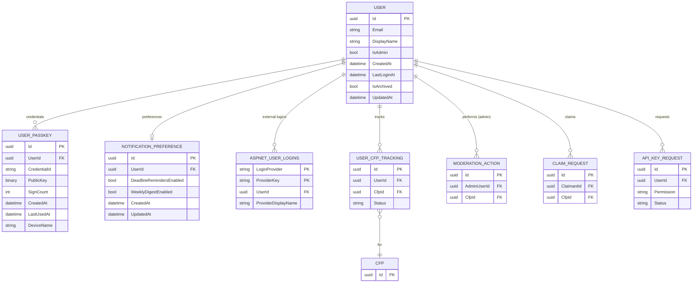

# User Data Model

## Purpose

The `User` entity is the system-of-record for all authenticated participants in CFP Compass — speakers, organizers, and administrators. It extends the ASP.NET Core Identity `IdentityUser` base type (persisted in the `AspNetUsers` table) with application-specific fields. Associated entities capture passkey credentials (`UserPasskeys`) and per-user notification preferences (`NotificationPreference`).

This model is authoritative. No upstream identity provider controls user records; ASP.NET Core Identity is the canonical source. External OAuth logins (Google, GitHub, Microsoft) are mapped to a local `User` record on first use and stored in the standard `AspNetUserLogins` table.

Administrators are identified by email match against the `CFPCOMPASS_ADMIN_EMAILS` environment variable, evaluated on every login. The `IsAdmin` flag on the `User` record reflects the result of this check and is refreshed each time the user authenticates.

## Schema Definition

### ER Diagram



### User Fields

The `User` class extends `IdentityUser<Guid>`. The `AspNetUsers` table contains all standard Identity columns plus the application-specific additions below.

| Field | Type | Nullable | Description |
|---|---|---|---|
| `Id` | `uuid` | No | Primary key. GUID assigned by ASP.NET Core Identity. |
| `Email` | `nvarchar(256)` | No | User's email address. Unique. Used for login, notifications, and admin identification. Inherited from `IdentityUser`. |
| `NormalizedEmail` | `nvarchar(256)` | No | Uppercased email for case-insensitive lookups. Inherited from `IdentityUser`. Indexed. |
| `UserName` | `nvarchar(256)` | No | Set equal to `Email` on registration. Inherited from `IdentityUser`. |
| `PasswordHash` | `nvarchar(max)` | Yes | bcrypt password hash. Nullable — users who register via OAuth or passkey-only do not have a password. |
| `DisplayName` | `nvarchar(150)` | Yes | Optional public display name shown on the dashboard. Not exposed publicly on CFP listings. |
| `IsAdmin` | `bit` | No | `true` if the user's email is present in `CFPCOMPASS_ADMIN_EMAILS` at login time. Refreshed on every successful authentication. |
| `CreatedAt` | `datetimeoffset` | No | Account creation timestamp. Set by EF Core interceptor. |
| `LastLoginAt` | `datetimeoffset` | Yes | Timestamp of most recent successful login. Updated on every authentication event. |
| `IsArchived` | `bit` | No | Soft-delete flag. Disabled accounts are set to `IsArchived = true` by admin action. Global query filter excludes archived users from standard queries. |
| `UpdatedAt` | `datetimeoffset` | No | Last record modification timestamp. Maintained by EF Core interceptor. |

Standard ASP.NET Core Identity columns also present: `PhoneNumber`, `PhoneNumberConfirmed`, `EmailConfirmed`, `TwoFactorEnabled`, `LockoutEnabled`, `LockoutEnd`, `AccessFailedCount`, `ConcurrencyStamp`, `SecurityStamp`.

### UserPasskeys Fields

Stores FIDO2/WebAuthn credentials registered by the user via `Fido2NetLib`. One user may register multiple passkeys (e.g., phone, laptop, hardware key).

| Field | Type | Nullable | Description |
|---|---|---|---|
| `Id` | `uuid` | No | Primary key. |
| `UserId` | `uuid` | No | FK to `User.Id`. Indexed. |
| `CredentialId` | `nvarchar(500)` | No | Base64-encoded FIDO2 credential ID. Unique. Used for passkey lookup during assertion. Indexed. |
| `PublicKey` | `varbinary(max)` | No | CBOR-encoded COSE public key stored as binary. Never exposed via API. |
| `SignCount` | `int` | No | FIDO2 signature counter. Updated on every successful assertion to detect cloned authenticators. |
| `CreatedAt` | `datetimeoffset` | No | Timestamp when the passkey was registered. |
| `LastUsedAt` | `datetimeoffset` | Yes | Timestamp of the most recent successful assertion using this credential. |
| `DeviceName` | `nvarchar(150)` | Yes | User-assigned friendly name for the credential (e.g., "iPhone 16", "YubiKey 5"). Displayed in account settings. |

### NotificationPreference Fields

One record per user. Created with defaults on account registration.

| Field | Type | Nullable | Description |
|---|---|---|---|
| `Id` | `uuid` | No | Primary key. |
| `UserId` | `uuid` | No | FK to `User.Id`. Unique index (one preference record per user). |
| `DeadlineRemindersEnabled` | `bit` | No | User opts in to deadline reminder emails (7, 3, 1 day before tracked CFP deadline). Default: `true`. |
| `WeeklyDigestEnabled` | `bit` | No | User opts in to weekly digest emails (new CFPs + closing-soon CFPs). Default: `true`. |
| `CreatedAt` | `datetimeoffset` | No | Record creation timestamp. Set on account registration. |
| `UpdatedAt` | `datetimeoffset` | No | Last modification timestamp. Updated when preferences change. |

## Partitioning and Identifier Strategy

**Primary Key:** `Id` — GUID matching the ASP.NET Core Identity convention (`IdentityUser<Guid>`). The same GUID is used as the foreign key in all related tables (`UserCfpTracking`, `ModerationAction`, `ClaimRequest`, `UserPasskeys`, `NotificationPreference`, `ApiKeyRequest`).

**Indexed Columns:**
- `NormalizedEmail` — case-insensitive email lookup for login and `GetUserByEmail`
- `UserPasskeys.CredentialId` — passkey assertion lookup (`GetUserByCredentialId`)
- `UserPasskeys.UserId` — enumerate credentials for a user in account settings
- `NotificationPreference.UserId` — unique index; one record per user

**Admin Identification:** The `IsAdmin` flag is not a security boundary on its own. Admin API endpoints enforce authorization by re-checking the `Admin` claim in the authentication cookie, which is issued at login time based on the environment variable check. The flag is stored for quick query access (admin dashboard, user list).

## Data Source and Lifecycle

### Authoritative Source

CFP Compass is the system of record for all `User` data. Records are created through:

1. **Email/password registration** (`/account/register`) — creates an `AspNetUsers` record directly
2. **OAuth social login** (Google, GitHub, Microsoft) — creates or links an `AspNetUsers` record on first use via `AspNetUserLogins`
3. **Passkey registration** — registers a `UserPasskeys` record linked to an existing `User`

No users are imported from external directories. ASP.NET Core Identity manages all password hashing, email confirmation tokens, lockout counters, and security stamps.

### Ingestion Flow

```
New User Registration (Email/Password)
    │
    ▼
POST /api/v1/account/register
    │
    ├── FluentValidation (email format, password complexity)
    ├── Identity: CreateAsync(user, password)
    ├── Creates NotificationPreference record (defaults)
    └── Sends Welcome Email via ACS

OAuth Login (Google / GitHub / Microsoft)
    │
    ▼
ExternalLoginCallback
    │
    ├── Existing external login? → Sign in
    └── New? → CreateAsync(user) + AddLoginAsync(externalLogin)
            └── Creates NotificationPreference record (defaults)

Passkey Registration
    │
    ▼
POST /api/v1/account/passkey/register-complete
    │
    ├── Fido2NetLib: MakeNewCredentialAsync()
    └── Inserts UserPasskeys record
```

### Lifecycle Management

- **Account lockout:** ASP.NET Core Identity automatically locks accounts after 5 consecutive failed login attempts (15-minute lockout). `LockoutEnd` and `AccessFailedCount` are managed by Identity.
- **Soft-delete (disable):** Admin action sets `IsArchived = true`. The global EF Core query filter excludes the user from standard lookups, effectively disabling login. The Identity `SecurityStamp` is rotated to invalidate any active sessions.
- **Admin status:** Re-evaluated on every login by comparing `User.Email` against `CFPCOMPASS_ADMIN_EMAILS`. Adding or removing an email from the environment variable takes effect on the user's next login without any database change.
- **Passkey sign count:** Updated after every successful FIDO2 assertion. A decreasing sign count indicates a cloned authenticator — `Fido2NetLib` raises an exception and the login is rejected.

## Access Patterns

### Supported Patterns

| Pattern | Query Characteristics | Notes |
|---|---|---|
| `GetUserByEmail` | Filter by `NormalizedEmail` | Login, admin lookup, forgot-password flow |
| `GetUserById` | Filter by `Id` | Profile, preferences, tracking dashboard |
| `GetUserByCredentialId` | Filter `UserPasskeys` by `CredentialId` | Passkey assertion lookup; resolves to `User` |
| `GetAdminUsers` | Filter by `IsAdmin = true` | Admin dashboard — list of admins |
| `GetNotificationPreferences` | Filter `NotificationPreference` by `UserId` | Preferences page, email job eligibility check |
| `GetUserPasskeys` | Filter `UserPasskeys` by `UserId` | Account settings — list registered devices |
| `GetUsersForDigest` | Filter `NotificationPreference.WeeklyDigestEnabled = true` | `WeeklyDigestJob` recipient list |
| `GetUsersForDeadlineReminders` | Join `NotificationPreference` + `UserCfpTracking` | `DeadlineReminderJob` candidate list |

### Unsupported Patterns

- **Password hash access:** `PasswordHash` is never read directly by application code. ASP.NET Core Identity handles all password verification internally.
- **Bulk user export:** Not an access pattern in MVP. GDPR data export if required would be a future capability.
- **Cross-user activity queries:** There is no pattern for querying one user's activity relative to another. All user queries are scoped to a single user ID.

## Governance and Retention

**Write access:**
- Users may update their own `DisplayName` and `NotificationPreference` via authenticated endpoints
- Admin endpoints may set `IsArchived = true` or `false` on any user
- ASP.NET Core Identity manages `PasswordHash`, `SecurityStamp`, `LockoutEnd`, `AccessFailedCount` internally
- `LastLoginAt` is updated by the application on successful authentication

**Read access:**
- Authenticated users may read their own profile, preferences, and passkey list
- Admin users may read all user records (list and detail)
- No public user profile endpoint — `DisplayName` and identity are not exposed publicly

**Schema evolution:** The `User` entity extends `IdentityUser<Guid>`. Changes to the base Identity schema should align with ASP.NET Core Identity migration guides. Application-specific columns can be added with standard EF Core migrations. The `UserPasskeys` table structure is determined by the FIDO2 attestation response contract — changes should be validated against `Fido2NetLib` compatibility.

**Retention:** User records are never hard-deleted. Soft-delete (`IsArchived`) preserves referential integrity with `ModerationAction`, `UserCfpTracking`, and `ClaimRequest` records. Passkey records for a disabled user remain in the database but are unreachable via the login flow. If a user requests full account deletion (future GDPR capability), a tombstone pattern should be evaluated before implementing hard deletes.

## Design Notes

**Why extend `IdentityUser` rather than a separate profile table?** Keeping application-specific fields (`DisplayName`, `IsAdmin`, `CreatedAt`, `LastLoginAt`) directly on `AspNetUsers` avoids an extra join on every authentication event. The number of additional columns is small. A separate `UserProfile` table would be warranted only if the profile data were significantly larger or independently queryable at scale.

**Why store `IsAdmin` in the database if it is re-evaluated on every login?** The flag enables the admin dashboard to query for admin users without parsing an environment variable. It also surfaces in the user management UI. The environment variable remains the authoritative source; the database field is a cache of the last-evaluated value.

**Social login identity linking:** When a user authenticates via OAuth for the first time, the system checks whether a `User` record already exists with the same email (e.g., the user previously registered with email/password). If so, the external login is linked to the existing account rather than creating a duplicate. This prevents duplicate user records for the same person using different auth methods.

**Passkey as primary auth method:** Passkeys are the preferred authentication method. Email/password remains available as a fallback. Users who register via OAuth may add a passkey from their account settings without setting a password.

## Related Specifications

- [Architecture Document — Section 5: Authentication & Identity](./../.squad/architecture.md)
- [CFP Submission Process Flow](../process-flows/cfp-submission.md)
- [Speaker CFP Tracking Process Flow](../process-flows/speaker-cfp-tracking.md)
- [CFP Tracking Data Model](cfp-tracking.md)
- [Moderation Data Model](moderation.md)
- [Claim Data Model](claim.md)
- [Reference Data Model](reference-data.md)
