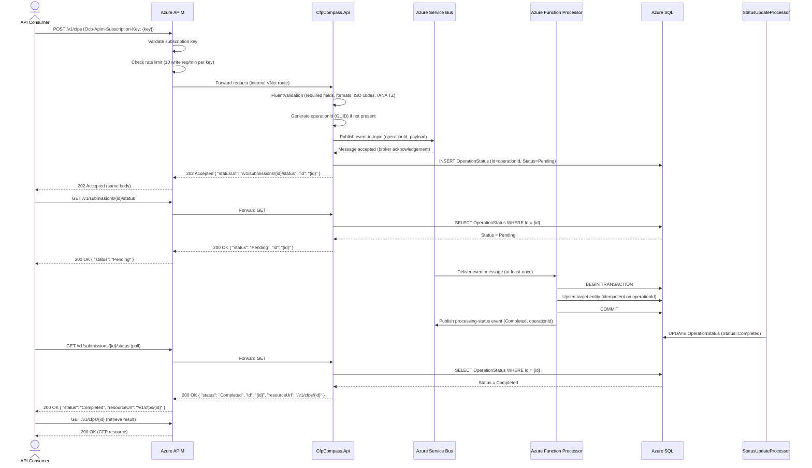
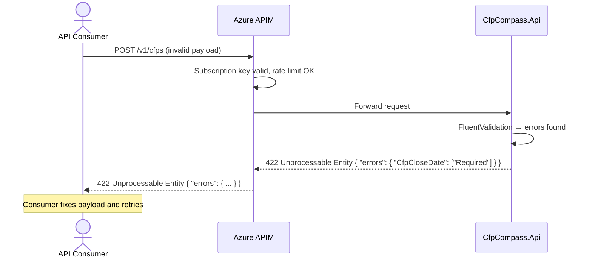
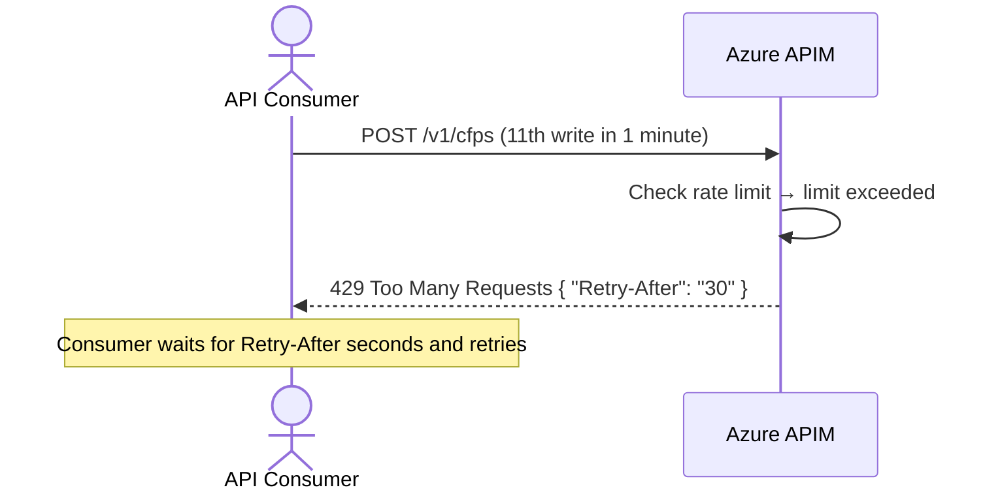
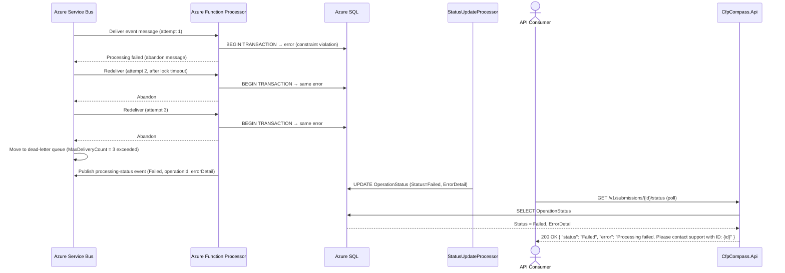

# Asynchronous Write Pattern (Event-Driven) Process Flow

## Purpose and Scope

This document describes the generic asynchronous write pattern used by all state-changing operations (POST and PUT) in CFP Compass that are exposed via Azure API Management (APIM). Rather than performing a synchronous database write and returning the result directly, the API validates the request, publishes an event to Azure Service Bus, and returns `HTTP 202 Accepted` immediately. An Azure Function processor subscribes to the Service Bus topic, performs the database write, and updates a processing status record that the caller can poll.

This document covers:
- APIM subscription key validation and rate limiting
- API request validation (FluentValidation)
- Service Bus event publishing and acknowledgement
- Async Function processing and database write
- Status polling by the caller
- Idempotency semantics

This pattern is the authoritative description of the write path for CFP submissions, CFP updates, and all other POST/PUT operations that flow through APIM. Specific business-logic flows that use this pattern are documented separately (see [CFP Submission Process Flow](cfp-submission.md) and [CFP Moderation Process Flow](cfp-moderation.md)).

## Actors and Systems

| Actor/System | Role/Description |
|---|---|
| API Consumer | A third-party client (e.g., integration tool, event platform) or the Blazor Web App making authenticated write requests using an APIM subscription key. |
| Azure API Management (APIM) | API gateway. Validates subscription keys, enforces rate limiting (10 req/min for writes), applies CORS and request-size policies, and routes requests to the API backend. |
| CfpCompass.Api | ASP.NET Core Web API backend running in Azure Container Apps. Validates requests, publishes events to Service Bus, and manages processing status records. |
| Azure Service Bus | Standard-tier message broker. Topic-per-aggregate pattern. Delivers events to subscribed Azure Function processors with at-least-once delivery. |
| Azure Function Processor | Azure Function (Consumption plan) subscribed to a Service Bus topic. Processes events: validates, writes to Azure SQL, and publishes downstream events. |
| Azure SQL | Persistent relational store. Receives committed writes from Azure Function processors. |
| StatusUpdateProcessor | Azure Function subscribed to the `processing-status` topic. Updates the status record for the operation from `Pending` → `Processing` → `Completed` (or `Failed`). |

## Preconditions and Assumptions

- The API consumer holds a valid APIM subscription key for the appropriate product (`cfp-compass-read` or `cfp-compass-readwrite`).
- The subscription has not exceeded its rate limit (10 write requests/minute for `cfp-compass-readwrite`).
- Azure Service Bus Standard tier is provisioned with the relevant topic and subscriptions.
- The Azure Function processor for the relevant aggregate is deployed and healthy.
- Azure SQL is accessible from the Azure Function processor.
- The `Ocp-Apim-Subscription-Key` header is present in all write requests.

## Process Overview

A consumer sends a POST or PUT request through APIM. APIM validates the subscription key and applies rate limiting. The request reaches the API backend, which validates the payload using FluentValidation. On successful validation, the API assigns a GUID for the operation (if not already present), publishes an event to the appropriate Service Bus topic, and immediately returns `HTTP 202 Accepted` with a `statusUrl` pointing to a polling endpoint.

The consumer polls the status endpoint. Meanwhile, an Azure Function processor picks up the Service Bus message, performs the database write, and publishes a status update event. `StatusUpdateProcessor` updates the operation's status from `Pending` to `Completed` (or `Failed`). On the next poll, the consumer receives `Completed` with the result.

## Happy Path

An API consumer submits a write operation, polls for completion, and receives the result. See Figure 1.

<strong>Figure 1: Asynchronous Write Pattern — Happy Path</strong>

**Steps:**

1. API consumer sends a POST (or PUT) request to APIM with the `Ocp-Apim-Subscription-Key` header and the request payload.
2. APIM validates the subscription key against the `cfp-compass-readwrite` product. Invalid or missing keys are rejected immediately.
3. APIM checks the rate limit for this subscription key (10 write requests/minute). If within limits, the request proceeds.
4. APIM routes the request to the Container App API backend over the internal VNet route.
5. The API runs FluentValidation on the request payload: required fields, field formats, ISO 3166 country/subdivision codes, IANA time zone identifiers, HTTPS URL schemes, field length limits.
6. The API assigns a GUID (`operationId`) for this operation if the caller did not provide one.
7. The API publishes an event message to the appropriate Service Bus topic. The message includes the `operationId` and full payload as the message body.
8. Service Bus acknowledges the message (the message is durably stored in the broker).
9. The API inserts an `OperationStatus` record in Azure SQL with `Status = 'Pending'`.
10. The API returns `HTTP 202 Accepted` with body `{ "statusUrl": "/v1/submissions/{id}/status", "id": "{id}" }`.
11. APIM forwards the 202 response to the consumer.
12. Consumer polls `GET /v1/submissions/{id}/status`.
13. APIM forwards the GET to the API.
14. The API queries `OperationStatus` by `Id`. Status is `Pending`; returned to the consumer.
15. Consumer waits briefly and polls again.
16. The Azure Function processor receives the Service Bus message.
17. The processor begins a database transaction and upserts the target entity using the `operationId` for idempotency checking. If the entity with this `operationId` already exists (duplicate delivery), the upsert is a no-op.
18. The transaction commits successfully.
19. The processor publishes a `processing-status` event to the `processing-status` topic with `Status = 'Completed'` and the `operationId`.
20. `StatusUpdateProcessor` receives the event and updates `OperationStatus.Status = 'Completed'`.
21. Consumer polls the status endpoint again.
22. The API returns `Status = 'Completed'` with a `resourceUrl` pointing to the created/updated resource.
23. Consumer calls `GET /v1/cfps/{id}` to retrieve the full resource.

## Primary Alternatives

### Alternative 1: Consumer Uses Webhook Instead of Polling

For API consumers who prefer a push notification over polling, a webhook URL may be registered with the API. When the operation completes, the API sends an HTTP POST to the consumer's webhook endpoint with the operation result. Webhook registration is a future capability; polling is the MVP-supported pattern.

This alternative is documented here for completeness but is not implemented in the MVP. Consumers should use the polling pattern described in the happy path.

## Error and Exception Flows

### Validation Failure (400 Bad Request)

If FluentValidation rejects the request payload, the API returns `HTTP 400 Bad Request` with a structured error map. No event is published to Service Bus and no status record is created. The consumer must correct the payload and retry.

<strong>Figure 2: Asynchronous Write Pattern — Validation Failure Exception Flow</strong>

**Steps:**

1. Consumer sends a POST with a payload that fails validation (e.g., missing required field, invalid country code).
2. APIM subscription key is valid and rate limit is not exceeded.
3. APIM forwards the request to the API backend.
4. FluentValidation identifies one or more validation errors.
5. The API returns `HTTP 422 Unprocessable Entity` with a field-keyed error object.
6. APIM forwards the 422 to the consumer.
7. No event is published to Service Bus. No status record is created.
8. The consumer corrects the payload and retries.

### Rate Limit Exceeded (429 Too Many Requests)

If the consumer exceeds the APIM rate limit for write operations (10 requests/minute for the `cfp-compass-readwrite` product), APIM returns `HTTP 429 Too Many Requests` before the request reaches the API backend.

<strong>Figure 3: Asynchronous Write Pattern — Rate Limit Exceeded Exception Flow</strong>

**Steps:**

1. Consumer sends a write request that exceeds the allowed rate (11th write request within a 60-second window).
2. APIM evaluates the rate limit policy for the subscription key.
3. APIM returns `HTTP 429 Too Many Requests` with a `Retry-After` header indicating when the consumer may retry.
4. The request never reaches the API backend.
5. Consumer waits for the `Retry-After` period and retries.

### Function Processing Failure (Message Dead-Lettered)

If the Azure Function processor fails to process a Service Bus message after 3 delivery attempts (due to an unrecoverable error such as a data constraint violation or unexpected exception), the message is moved to the dead-letter queue. The `StatusUpdateProcessor` is notified with `Status = 'Failed'`. The consumer's next status poll returns `Failed`.

<strong>Figure 4: Asynchronous Write Pattern — Function Processing Failure (Dead-Letter) Exception Flow</strong>

**Steps:**

1. Service Bus delivers the event message to the Azure Function processor (attempt 1).
2. The processor encounters an error during the database write (e.g., unique constraint violation on a field other than `operationId`). The transaction rolls back.
3. The processor abandons the message (does not complete it), returning it to the queue.
4. Service Bus redelivers the message after the message lock timeout (attempt 2). Same error occurs.
5. Service Bus redelivers for a third time (attempt 3). Same error.
6. `MaxDeliveryCount` (3) is exceeded. Service Bus moves the message to the dead-letter queue.
7. A dead-letter queue monitor (not shown — operational concern) logs and alerts on the dead-lettered message.
8. The processor publishes a `processing-status` event with `Status = 'Failed'` and an error detail string.
9. `StatusUpdateProcessor` updates `OperationStatus.Status = 'Failed'` with the error detail.
10. The consumer's next status poll returns `{ "status": "Failed", "error": "Processing failed. Please contact support with ID: {id}" }`.
11. The consumer should not retry the original write automatically — the failure may indicate a data problem. Manual investigation of the dead-letter queue is required.

## State and Data Considerations

The `OperationStatus` record is the correlation anchor for the async write pattern. It is created by the API (synchronously, before the 202 is returned) and updated by `StatusUpdateProcessor` (asynchronously, after the processor completes). The status transitions are:

| Status | Set By | Meaning |
|---|---|---|
| `Pending` | API (synchronous) | Event published; processor not yet started |
| `Processing` | Azure Function Processor | Message received; database write in progress |
| `Completed` | StatusUpdateProcessor | Write committed; resource is available |
| `Failed` | StatusUpdateProcessor | Write failed after max retries; dead-lettered |

**Idempotency:** The Azure Function processor uses the `operationId` (GUID pre-assigned by the API) as the idempotency key for all writes. The first delivery of a message produces the write; subsequent deliveries of the same message (at-least-once Service Bus semantics) result in a no-op because the entity with that `operationId` already exists. This is implemented via an `INSERT WHERE NOT EXISTS` or EF Core upsert pattern.

**Status record lifetime:** `OperationStatus` records are retained for 24 hours after reaching a terminal state (`Completed` or `Failed`), then purged by a background cleanup job. Callers should retrieve the completed resource via `resourceUrl` rather than relying on long-term status record persistence.

## Notes and Comments

- The 202 pattern requires consumers to implement polling or accept eventual consistency. This is a deliberate architectural choice to decouple API responsiveness from Azure SQL serverless cold-start latency and to provide resilience against transient database unavailability.
- The status polling interval should be at least 1 second and use exponential backoff. For typical workloads, processing completes within 2–5 seconds of the 202 response. A maximum polling timeout of 60 seconds is recommended; after that, consumers should surface a "processing timeout" message and provide a manual check mechanism.
- The `resourceUrl` returned in a `Completed` status response is the canonical URL for the resource via APIM (e.g., `/v1/cfps/{id}`). Consumers should use this URL for subsequent reads.
- Dead-letter queue monitoring is an operational responsibility. Dead-lettered messages should trigger an alert (configured via Azure Monitor on the Service Bus namespace). Manual review is required to determine the root cause and whether a corrected resubmission is appropriate.
- APIM response caching does not apply to POST/PUT operations. Only GET endpoints are cached.
- The `Ocp-Apim-Subscription-Key` header is the only authentication mechanism for API consumers. It must be kept secret and should be rotated periodically. Consumers who believe their key has been compromised should revoke it via the APIM developer portal and request a new one.

## References

- [Architecture Document — Section 1: Event-Driven Write Architecture](./../.squad/architecture.md)
- [Architecture Document — Section 4: API Design — APIM Topology](./../.squad/architecture.md)
- [Architecture Document — Section 7: Service Bus Message Processors](./../.squad/architecture.md)
- [CFP Submission Process Flow](cfp-submission.md)
- [CFP Moderation Process Flow](cfp-moderation.md)
- [Reference Data Model — ApiKeyRequest](../data-models/reference-data.md)
