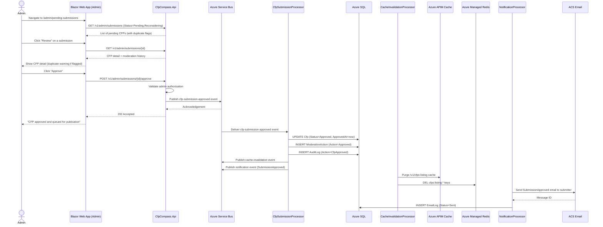
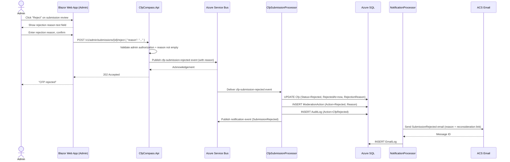
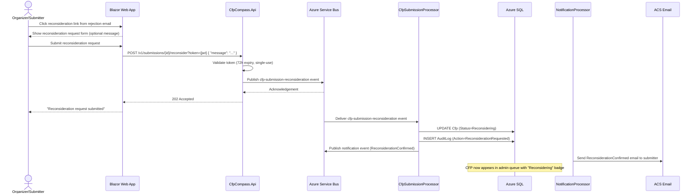
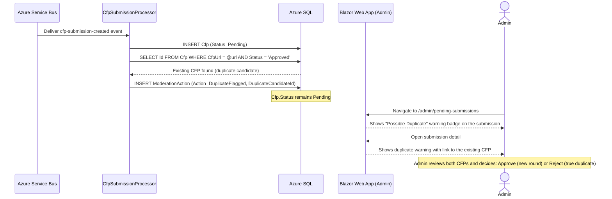

# CFP Moderation Process Flow

## Purpose and Scope

This document describes the process by which an administrator reviews submitted CFPs and publishes or rejects them. It covers the approval flow (making a CFP publicly visible), the rejection flow (notifying the submitter with a reason and reconsideration option), the reconsideration flow (admin re-reviewing a previously rejected CFP), and cache invalidation triggered on each state transition.

This document covers:
- Admin review of the pending submissions queue
- Duplicate detection flag display
- Approve, reject, and reconsider actions
- Event-driven processing and cache invalidation
- Notification emails to submitters

This document does not cover CFP submission intake (see [CFP Submission Process Flow](cfp-submission.md)) or organizer claim invitations sent after approval (see [Organizer Claim Verification Process Flow](organizer-claim.md)).

## Actors and Systems

| Actor/System | Role/Description |
|---|---|
| Admin | Authenticated user whose email is in `CFPCOMPASS_ADMIN_EMAILS`. Reviews the pending submissions queue and takes moderation actions. |
| Blazor Web App (Admin pages) | Renders the admin moderation UI at `/admin/pending-submissions` and `/admin/review/{id}`. Sends moderation actions to the API. |
| CfpCompass.Api | Receives moderation action requests, validates admin authorization, and publishes events to Service Bus. |
| Azure Service Bus | Message broker. Receives `cfp-submission-approved` and `cfp-submission-rejected` events and delivers them to subscribed processors. |
| CfpSubmissionProcessor | Azure Function. Updates `Cfp.Status`, `ApprovedAt`/`RejectedAt`, and inserts `ModerationAction` and `AuditLog` records. |
| CacheInvalidationProcessor | Azure Function. Purges APIM response cache and Redis keys for CFP listing and detail endpoints after successful state transitions. |
| NotificationProcessor | Azure Function. Sends approval or rejection emails to the submitter via ACS. On approval of a community-submitted CFP, also initiates the organizer claim invitation. |
| Azure SQL | Persistent store. Receives all state updates and audit records. |
| ACS Email | Azure Communication Services. Delivers transactional notification emails. |

## Preconditions and Assumptions

- The admin is authenticated and has the `Admin` claim in their session cookie (assigned at login based on `CFPCOMPASS_ADMIN_EMAILS`).
- At least one CFP is in `Pending` or `Reconsidering` status in Azure SQL.
- Azure Service Bus is available.
- `CfpSubmissionProcessor`, `CacheInvalidationProcessor`, and `NotificationProcessor` Azure Functions are deployed and running.
- APIM cache purge is available via the APIM Management API endpoint accessible to `CacheInvalidationProcessor`.
- Azure Managed Redis is accessible from `CacheInvalidationProcessor`.

## Process Overview

The admin navigates to the pending submissions queue, which displays all CFPs in `Pending` or `Reconsidering` status ordered by submission time. Each submission shows a duplicate detection warning if `CfpUrl` matches an existing published CFP. The admin opens a submission for detailed review and chooses to approve or reject it.

On approval, the API publishes a `cfp-submission-approved` event to Service Bus. `CfpSubmissionProcessor` updates the CFP status, `CacheInvalidationProcessor` invalidates the public listing cache, and `NotificationProcessor` sends the approval email and — for community-submitted CFPs — the organizer claim invitation. On rejection, a similar flow runs with a rejection reason and a reconsideration link in the notification email.

## Happy Path (Approve)

An admin approves a pending CFP, making it immediately visible on the public listing after cache invalidation. See Figure 1.

<strong>Figure 1: CFP Moderation — Approve Happy Path</strong>

**Steps:**

1. Admin navigates to `/admin/pending-submissions`.
2. The web app calls `GET /v1/admin/submissions` filtered to `Status IN ('Pending', 'Reconsidering')`.
3. The API returns the list of pending submissions. Submissions where `DuplicateFlagged = true` show a warning badge.
4. Admin clicks "Review" on a specific submission.
5. The web app calls `GET /v1/admin/submissions/{id}` to load full CFP detail and moderation history.
6. The admin reviews all CFP fields, the submitter's contact email, and any duplicate detection flag.
7. Admin clicks "Approve."
8. The web app sends `POST /v1/admin/submissions/{id}/approve`.
9. The API validates the admin's authorization (Admin claim present in session).
10. The API publishes `cfp-submission-approved` event to the `cfp-submissions` Service Bus topic.
11. The API returns `202 Accepted`.
12. The web app shows "CFP approved and queued for publication."
13. `CfpSubmissionProcessor` receives the event from Service Bus.
14. Processor updates `Cfp.Status = 'Approved'` and `Cfp.ApprovedAt = now` in Azure SQL.
15. Processor inserts a `ModerationAction` record with `Action = 'Approved'`.
16. Processor inserts an `AuditLog` record with `Action = 'CfpApproved'`.
17. Processor publishes a `cache-invalidation` event and a `notification` event.
18. `CacheInvalidationProcessor` calls the APIM Management API to purge the `/v1/cfps` listing cache.
19. `CacheInvalidationProcessor` deletes relevant Redis keys (`cfps:listing:*`).
20. `NotificationProcessor` sends the `SubmissionApproved` email to the submitter's contact email via ACS.
21. ACS delivers the email and returns a message ID.
22. `NotificationProcessor` inserts an `EmailLog` record with `Status = 'Sent'`.

## Primary Alternatives

### Alternative 1: Reject Submission

The admin chooses to reject a submission, providing a mandatory rejection reason. The submitter receives a notification email with the reason and a link to request reconsideration.

<strong>Figure 2: CFP Moderation — Reject Submission</strong>

**Steps:**

1. Admin clicks "Reject" on the submission review page.
2. The web app reveals a rejection reason text field.
3. Admin enters a clear explanation (e.g., "The CFP URL is not accessible; please verify and resubmit.") and confirms.
4. The web app sends `POST /v1/admin/submissions/{id}/reject` with `{ "reason": "..." }`.
5. The API validates admin authorization and that `reason` is non-empty (required for rejections).
6. The API publishes `cfp-submission-rejected` event to Service Bus.
7. The API returns `202 Accepted`.
8. The web app shows "CFP rejected."
9. `CfpSubmissionProcessor` updates `Cfp.Status = 'Rejected'`, `Cfp.RejectedAt`, and `Cfp.RejectionReason`.
10. Processor inserts `ModerationAction` (`Action = 'Rejected'`) and `AuditLog` (`Action = 'CfpRejected'`).
11. Processor publishes a notification event.
12. `NotificationProcessor` sends the `SubmissionRejected` email including the rejection reason and a "Request Reconsideration" link (contains a signed token).
13. ACS delivers the email. `EmailLog` record inserted.

### Alternative 2: Reconsideration Request

After receiving a rejection email, the organizer may click the "Request Reconsideration" link. This transitions the CFP to `Reconsidering` status and surfaces it in the admin queue with a "Reconsidering" badge, prompting the admin to re-evaluate.

<strong>Figure 3: CFP Moderation — Reconsideration Request</strong>

**Steps:**

1. Organizer clicks the "Request Reconsideration" link in the rejection email. The link contains a signed JWT token (72-hour expiry, single-use).
2. The web app shows a reconsideration request form with an optional message field.
3. Organizer submits the request (with or without a supplementary message).
4. The web app sends `POST /v1/submissions/{id}/reconsider?token={jwt}` with the optional message.
5. The API validates the token (signature, expiry, single-use).
6. The API publishes `cfp-submission-reconsideration` event to Service Bus.
7. The API returns `202 Accepted`.
8. The web app confirms "Reconsideration request submitted."
9. `CfpSubmissionProcessor` sets `Cfp.Status = 'Reconsidering'`.
10. Processor inserts an `AuditLog` record (`Action = 'ReconsiderationRequested'`).
11. `NotificationProcessor` sends a `ReconsiderationConfirmed` email to the submitter confirming the request was received.
12. The CFP now appears in the admin queue with a "Reconsidering" badge for admin attention.

## Error and Exception Flows

### Duplicate CFP Detection Flag

When `CfpSubmissionProcessor` detects that the submitted `CfpUrl` matches an existing published CFP, it inserts a `ModerationAction` with `Action = 'DuplicateFlagged'` and a reference to the existing CFP. The admin sees a warning on the review page. The admin decides whether to approve (if it is a new CFP round for the same event), reject (if it is truly a duplicate), or take no immediate action.

<strong>Figure 4: CFP Moderation — Duplicate Detection Flag Exception Flow</strong>

**Steps:**

1. `CfpSubmissionProcessor` inserts the new `Cfp` record with `Status = Pending`.
2. Processor queries for any existing `Cfp` where `CfpUrl` matches and `Status = 'Approved'`.
3. A match is found (an existing live CFP has the same URL).
4. Processor inserts a `ModerationAction` record with `Action = 'DuplicateFlagged'` and `DuplicateCandidateId` pointing to the existing CFP.
5. The new CFP status remains `Pending` — the flag is advisory only.
6. The admin sees a "Possible Duplicate" warning badge in the pending queue.
7. On the review page, the duplicate warning includes a link to the existing published CFP.
8. Admin reviews both records and makes a determination: approve (new CFP round for the same event), reject with a "Duplicate submission" reason, or proceed without action if the flag is a false positive.

## State and Data Considerations

Every moderation decision writes to two tables atomically: `ModerationAction` (domain record, scoped to the CFP) and `AuditLog` (compliance record, cross-cutting). Both writes occur within a single database transaction in `CfpSubmissionProcessor`. If either write fails, the transaction rolls back, the Service Bus message is not marked complete, and redelivery occurs after the lock timeout.

`Cfp.Status` transitions on moderation actions:
- `Pending` → `Approved` (admin approves)
- `Pending` → `Rejected` (admin rejects)
- `Rejected` → `Reconsidering` (organizer requests reconsideration)
- `Reconsidering` → `Approved` (admin approves on re-review)
- `Reconsidering` → `Rejected` (admin rejects again)

Cache invalidation is triggered only on `Approved` transitions, not on rejections. Rejected and reconsidering CFPs are never publicly visible, so no cache keys need to be invalidated for those transitions.

## Notes and Comments

- The admin queue orders submissions by `SubmittedAt ASC` (oldest first) to ensure all submissions are reviewed in fair order and no submission is starved indefinitely.
- A submission with `DuplicateFlagged` but no admin action remains in the queue indefinitely until the admin takes an explicit approve or reject action. The flag does not auto-reject.
- An admin may approve a duplicate-flagged submission if it represents a new CFP round for a recurring event. The `ModerationAction` record with `Action = 'DuplicateFlagged'` is preserved in the history; the subsequent `Approved` action overrides the effective status.
- The `Reason` field on `ModerationAction` is included in the rejection email verbatim. Admins should write clear, constructive rejection reasons suitable for external communication.
- Re-reviewing a reconsideration request produces a new `ModerationAction` record. The full history (Rejected → Reconsidered → Approved/Rejected again) is visible on the CFP's moderation history panel in the admin UI.

## References

- [CFP Data Model](../data-models/cfp.md)
- [Moderation Data Model](../data-models/moderation.md)
- [CFP Submission Process Flow](cfp-submission.md)
- [Organizer Claim Verification Process Flow](organizer-claim.md)
- [Asynchronous Write Pattern Process Flow](api-write-pattern.md)
- [Architecture Document — Section 3: Data Architecture](./../.squad/architecture.md)
- [Architecture Document — Section 4: APIM Response Caching](./../.squad/architecture.md)
