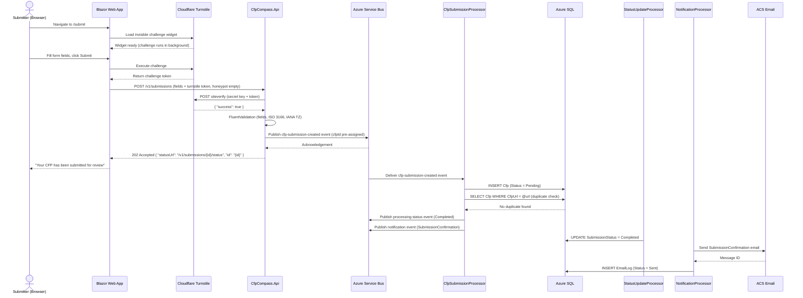
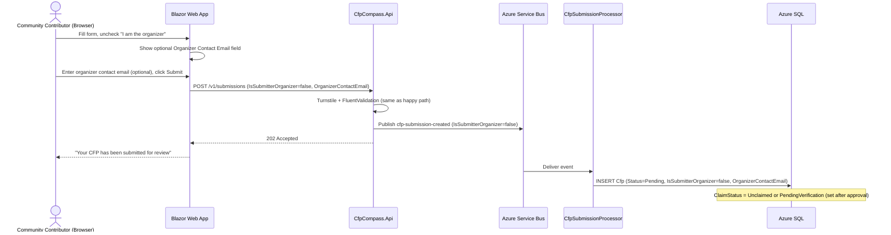
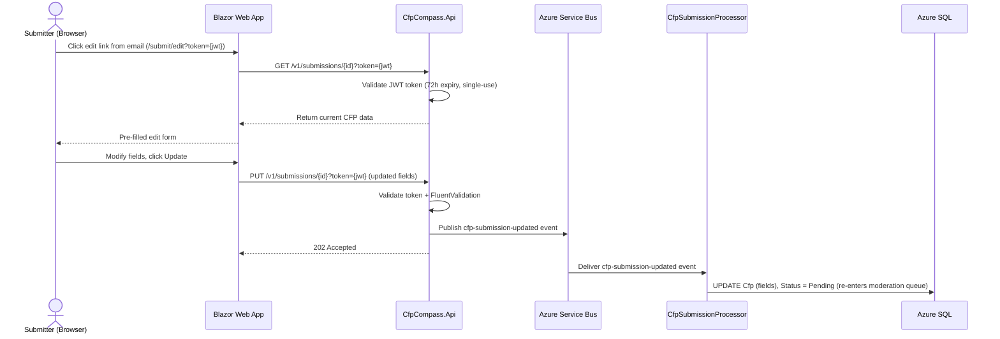
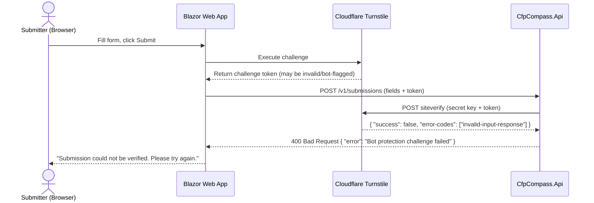
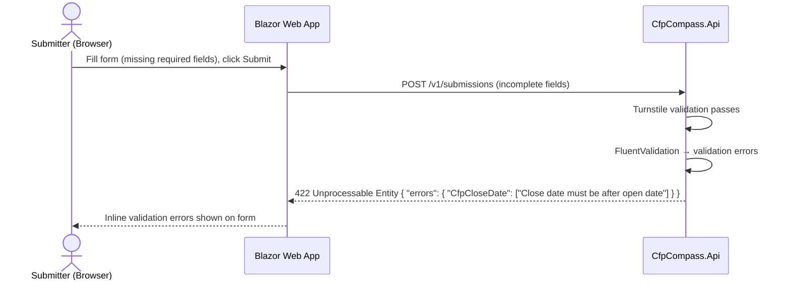
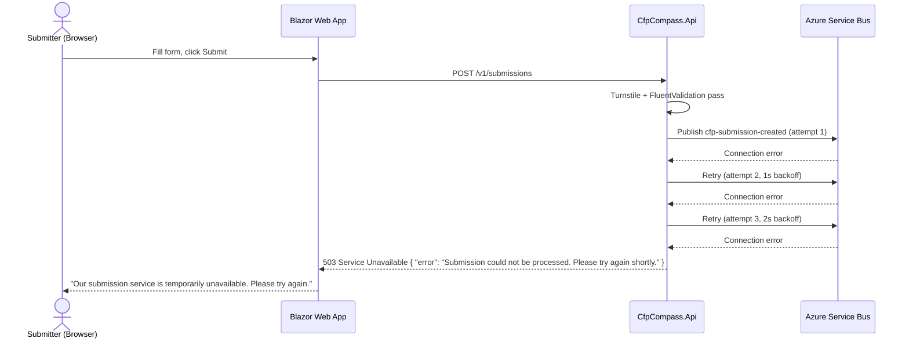

# CFP Submission Process Flow

## Purpose and Scope

This document describes the end-to-end process by which a CFP listing enters CFP Compass — from the submitter filling out the public form through bot protection, validation, asynchronous event-driven processing, persistence, and submission confirmation. The process applies equally to organizers submitting their own CFPs and to community contributors submitting on behalf of an event they did not organize.

This document covers:
- The public web form submission path (`/submit`)
- The API submission path (`POST /v1/submissions`)
- Turnstile bot protection validation
- Async event-driven write via Azure Service Bus
- Submission confirmation email dispatch

This document does not cover CFP moderation (see [CFP Moderation Process Flow](cfp-moderation.md)) or the organizer claim flow triggered after approval (see [Organizer Claim Verification Process Flow](organizer-claim.md)).

## Actors and Systems

| Actor/System | Role/Description |
|---|---|
| Submitter (Browser) | Organizer or community contributor filling the public submission form at `/submit`. May be anonymous or authenticated. |
| Blazor Web App | Renders the submission form, performs client-side field validation, and sends the submission to the API. |
| Cloudflare Turnstile | Invisible bot-protection challenge embedded in the submission form. Issues a challenge token the API validates server-side. |
| CfpCompass.Api | Receives the submission request, validates the Turnstile token, validates CFP fields, and publishes the event to Service Bus. Returns HTTP 202. |
| Azure Service Bus | Message broker. Receives the `cfp-submission-created` event and delivers it to subscribed Azure Function processors. |
| CfpSubmissionProcessor | Azure Function subscribed to the `cfp-submissions` topic. Processes the event: writes the `Cfp` record to Azure SQL and runs duplicate detection. |
| Azure SQL | Persistent relational store. Receives the committed `Cfp` record with `Status = Pending`. |
| StatusUpdateProcessor | Azure Function subscribed to the `processing-status` topic. Updates the submission status record from `Pending` → `Processing` → `Completed`. |
| NotificationProcessor | Azure Function subscribed to the `notifications` topic. Sends the submission confirmation email via ACS. |
| ACS Email | Azure Communication Services. Delivers the transactional confirmation email to the submitter's contact email address. |

## Preconditions and Assumptions

- The public `/submit` page is accessible to all users without authentication.
- Cloudflare Turnstile is configured with a valid site key (rendered in the browser) and secret key (used by the API for server-side verification).
- Azure Service Bus Standard tier is available and the `cfp-submissions` topic and subscriptions are provisioned.
- Azure Function processors (`CfpSubmissionProcessor`, `NotificationProcessor`, `StatusUpdateProcessor`) are deployed and running on Consumption plan.
- Azure SQL is accessible from the Azure Function processors.
- ACS Email is configured and the sender domain is verified.
- Country codes, subdivision codes, and IANA time zone identifiers are loaded into the reference data tables and available for validation.

## Process Overview

A submitter fills the CFP form, which includes a Cloudflare Turnstile invisible challenge completed in the browser. Upon submission, the API validates the Turnstile token with Cloudflare, then validates all CFP fields using FluentValidation (including ISO 3166 country/subdivision validation and IANA time zone validation). On successful validation, the API publishes a `cfp-submission-created` event to Azure Service Bus and immediately returns HTTP 202 Accepted with a status-check URL.

The submission is processed asynchronously by `CfpSubmissionProcessor`, which writes the `Cfp` record to Azure SQL with `Status = Pending` and checks for duplicate URLs. The submitter receives a confirmation email via ACS once processing completes. The submitted CFP enters the admin moderation queue and is not publicly visible until approved.

## Happy Path

The main flow covers a submitter completing the public form, passing bot protection, passing validation, and receiving a confirmation email after async processing. See Figure 1.

<strong>Figure 1: CFP Submission — Happy Path</strong>

**Steps:**

1. Submitter navigates to `/submit` in the browser.
2. The Blazor Web App loads the submission form, embedding the Cloudflare Turnstile invisible challenge widget.
3. The Turnstile widget runs a background browser challenge to assess whether the visitor is human.
4. Submitter fills in all required CFP fields (event name, type, dates, URL, location, contact email, categories, etc.) and clicks "Submit."
5. The Blazor form executes the Turnstile challenge and receives a challenge token from Cloudflare.
6. The form sends `POST /v1/submissions` to the API, including all CFP fields and the Turnstile token. The honeypot field is empty (confirming human submission).
7. The API sends the Turnstile token to Cloudflare's `siteverify` endpoint for server-side validation.
8. Cloudflare returns `{ "success": true }`.
9. The API runs FluentValidation on all CFP fields: required fields present, `CfpCloseDate > CfpOpenDate`, ISO 3166-1 alpha-2 country code valid, ISO 3166-2 subdivision code valid for the given country (if provided), IANA time zone identifier valid, `CfpUrl` is a valid HTTPS URL.
10. The API generates a GUID for the new CFP (`cfpId`) and publishes a `cfp-submission-created` event to the `cfp-submissions` Service Bus topic.
11. Service Bus acknowledges the publish.
12. The API returns `HTTP 202 Accepted` with body `{ "statusUrl": "/v1/submissions/{id}/status", "id": "{id}" }`.
13. The web app displays "Your CFP has been submitted for review" to the submitter.
14. `CfpSubmissionProcessor` receives the event from Service Bus, inserts the `Cfp` record into Azure SQL with `Status = Pending`.
15. The processor queries for any existing `Cfp` where `CfpUrl` matches the submitted URL (duplicate detection).
16. No duplicate found; processing continues normally.
17. The processor publishes a `processing-status` event (Completed) and a `notifications` event (SubmissionConfirmation).
18. `StatusUpdateProcessor` updates the submission status record to `Completed`.
19. `NotificationProcessor` calls ACS to send the submission confirmation email to the submitter's contact email address.
20. ACS delivers the email and returns a message ID.
21. `NotificationProcessor` records an `EmailLog` entry with `Status = Sent` and the ACS message ID.

## Primary Alternatives

### Alternative 1: Community Contributor Submission (Not the Organizer)

A community contributor submits a CFP on behalf of an organizer they are not. They uncheck the "I am the event organizer" checkbox and optionally provide the organizer's contact email. The submission proceeds identically through validation and processing, but the resulting `Cfp` record is flagged with `IsSubmitterOrganizer = false` and `ClaimStatus = PendingVerification` (if an organizer email was provided). The organizer claim invitation is sent after admin approval, not at submission time.

<strong>Figure 2: CFP Submission — Community Contributor (Not the Organizer)</strong>

**Steps:**

1. Community contributor fills the submission form and unchecks "I am the event organizer."
2. The form reveals an optional "Organizer Contact Email" field.
3. Contributor enters the organizer's known email address and clicks "Submit."
4. Form sends `POST /v1/submissions` with `IsSubmitterOrganizer = false` and `OrganizerContactEmail` populated.
5. API validates Turnstile and all fields (same as happy path).
6. API publishes `cfp-submission-created` event with `IsSubmitterOrganizer = false`.
7. API returns 202 Accepted; web app confirms submission.
8. `CfpSubmissionProcessor` inserts the `Cfp` record with `IsSubmitterOrganizer = false` and the `OrganizerContactEmail`.
9. The claim invitation is deferred until the CFP is approved by an admin (handled in the [Organizer Claim Verification Process Flow](organizer-claim.md)).

### Alternative 2: Edit Pending or Rejected Submission

A submitter who has a pending or rejected submission may edit it using a token-authenticated link sent in the original confirmation or rejection email. The edit flow uses the same validation but publishes a `cfp-submission-updated` event rather than a `cfp-submission-created` event.

<strong>Figure 3: CFP Submission — Edit Pending or Rejected Submission</strong>

**Steps:**

1. Submitter clicks the "Edit your submission" link from the confirmation or rejection email.
2. The link includes a short-lived JWT token (72-hour expiry, single-use).
3. The web app calls `GET /v1/submissions/{id}?token={jwt}` to retrieve the current submission data.
4. The API validates the JWT token (signature, expiry, single-use check).
5. The web app renders a pre-filled form with the current CFP data.
6. Submitter modifies fields and clicks "Update."
7. Web app sends `PUT /v1/submissions/{id}?token={jwt}` with the updated fields.
8. API validates the token and runs FluentValidation on the updated fields.
9. API publishes `cfp-submission-updated` event to Service Bus.
10. API returns 202 Accepted.
11. `CfpSubmissionProcessor` processes the event: updates the `Cfp` record fields and sets `Status = Pending` (re-enters the moderation queue).

## Error and Exception Flows

### Turnstile Validation Failure

If the Cloudflare Turnstile server-side verification fails (the token is invalid, expired, or represents a bot), the API rejects the submission immediately with HTTP 400. No event is published to Service Bus and no record is created in Azure SQL.

<strong>Figure 4: CFP Submission — Turnstile Validation Failure Exception Flow</strong>

**Steps:**

1. Submitter submits the form with a Turnstile token.
2. API calls Cloudflare's `siteverify` endpoint with the token.
3. Cloudflare returns `{ "success": false }`.
4. API returns `HTTP 400 Bad Request` with error message.
5. Web app displays "Submission could not be verified. Please try again."
6. No record is written to Azure SQL. No event is published.

### Field Validation Failure

If FluentValidation rejects the submission (missing required fields, invalid country code, invalid time zone, etc.), the API returns HTTP 422 with structured validation errors. No event is published.

<strong>Figure 5: CFP Submission — Field Validation Failure Exception Flow</strong>

**Steps:**

1. Submitter submits the form with one or more invalid or missing fields.
2. Turnstile validation passes.
3. FluentValidation detects errors (e.g., missing `CfpCloseDate`, invalid country code).
4. API returns `HTTP 422 Unprocessable Entity` with a field-keyed error map.
5. Web app renders inline validation error messages adjacent to the offending fields.
6. No record is written and no event is published.

### Service Bus Unavailable

If the Azure Service Bus publish fails (transient network error, Service Bus namespace unavailable), the API retries with exponential backoff. After 3 retries, the API returns HTTP 503 to the caller, and no submission record is created. Service Bus Standard tier provides at-least-once delivery; once a message is published, the processor retry policy handles transient processor failures.

<strong>Figure 6: CFP Submission — Service Bus Unavailable Exception Flow</strong>

**Steps:**

1. Submitter submits a valid form.
2. Turnstile and FluentValidation pass.
3. API attempts to publish the event to Service Bus.
4. Service Bus returns a connection error.
5. API retries up to 3 times with exponential backoff (Polly resilience policy).
6. All retries fail.
7. API returns `HTTP 503 Service Unavailable`.
8. Web app displays "Our submission service is temporarily unavailable. Please try again."
9. No record is written to Azure SQL. Submitter may retry after the Service Bus recovers.

## State and Data Considerations

On receipt of a valid submission, a `Cfp` record is written with `Status = Pending` and `IsArchived = false`. The record is invisible to public queries (global query filter on `Status = 'Approved'`) until an admin approves it.

The processing status record (queried via `GET /v1/submissions/{id}/status`) transitions through: `Pending` (event published, not yet consumed) → `Processing` (function processing event) → `Completed` (Cfp record written) or `Failed` (processor encountered an unrecoverable error after retries).

If `CfpSubmissionProcessor` finds a duplicate `CfpUrl`, it inserts a `ModerationAction` record with `Action = DuplicateFlagged` and sets a flag visible in the admin moderation queue. The CFP record status remains `Pending` — the duplicate flag is advisory, not a rejection.

## Notes and Comments

- The honeypot field is an additional `<input type="text">` hidden via CSS (not `type="hidden"`). If its value is non-empty on the server, the API rejects the submission without calling Cloudflare — this catches simple bots that fill all visible fields but ignore CSS visibility rules.
- The `cfpId` GUID is pre-assigned by the API before publishing to Service Bus, so the status-check URL can be returned immediately in the 202 response without waiting for the processor to write the record.
- Submission edit tokens (JWT) are single-use: the API marks the token as consumed on first use. Reuse of the same token returns HTTP 401.
- The `CfpSubmissionProcessor` uses the Service Bus message ID for deduplication — if the same message is delivered twice (at-least-once delivery), the processor checks for an existing `Cfp` record with the same `Id` before inserting.
- Rate limiting at the app level (10 CFP submissions per hour per IP) applies before Turnstile validation, to reject obviously abusive sources without incurring Cloudflare API calls.

## References

- [CFP Data Model](../data-models/cfp.md)
- [CFP Moderation Process Flow](cfp-moderation.md)
- [Organizer Claim Verification Process Flow](organizer-claim.md)
- [Asynchronous Write Pattern Process Flow](api-write-pattern.md)
- [Architecture Document — Section 1: Event-Driven Write Architecture](./../.squad/architecture.md)
- [Architecture Document — Section 9: Bot Protection](./../.squad/architecture.md)
