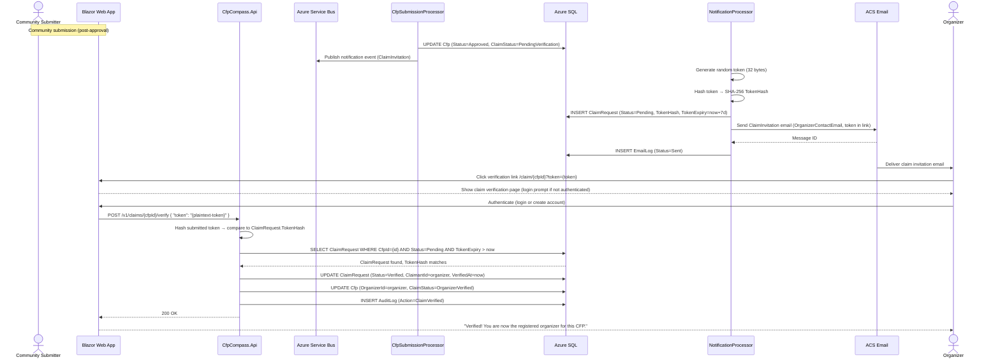
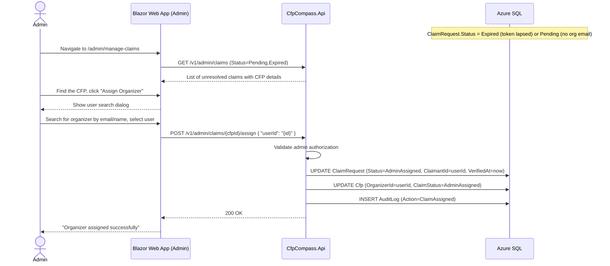
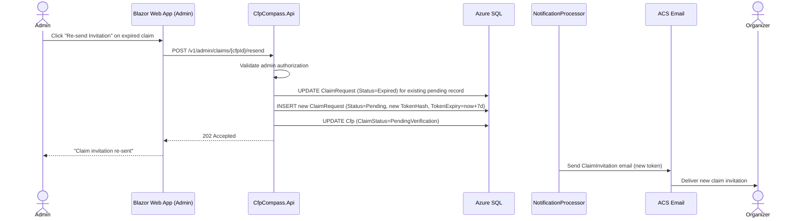
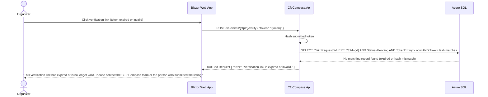
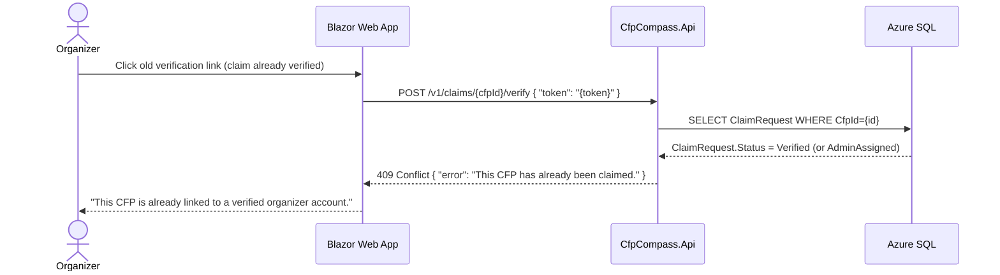

# Organizer Claim Verification Process Flow

## Purpose and Scope

This document describes the process by which an event organizer establishes verified ownership of a CFP listing that was submitted to CFP Compass by a community contributor (not the organizer themselves). Community-submitted CFPs are published as "Unverified — Awaiting Organizer Claim." A claim invitation is sent to the organizer's contact email with a time-limited verification link. When the organizer clicks the link and confirms their identity, the CFP is linked to their account.

This document covers:
- The community submission path that initiates the claim
- Claim invitation email dispatch after CFP approval
- Organizer verification via email token
- Admin fallback assignment when the organizer does not respond
- Token expiry handling

This document does not cover the initial CFP submission (see [CFP Submission Process Flow](cfp-submission.md)) or the moderation approval that precedes claim invitation dispatch (see [CFP Moderation Process Flow](cfp-moderation.md)).

## Actors and Systems

| Actor/System | Role/Description |
|---|---|
| Community Submitter | An authenticated or anonymous user who submits a CFP on behalf of an event they do not organize. Sets `IsSubmitterOrganizer = false`. |
| Blazor Web App | Renders the submission form (claim flag checkbox), the claim verification landing page, and the admin manage-claims page. |
| CfpCompass.Api | Receives the claim verification request (`POST /v1/claims/{cfpId}/verify`) and the admin assignment request (`POST /v1/admin/claims/{cfpId}/assign`). |
| Azure SQL | Persistent store for `ClaimRequest`, `Cfp`, and `AuditLog` records. |
| Azure Service Bus | Message broker. `cfp-submission-approved` event triggers claim invitation creation and dispatch. |
| CfpSubmissionProcessor | Azure Function. Sets `Cfp.ClaimStatus` and publishes notification events after processing an approval event. |
| NotificationProcessor | Azure Function. Creates the `ClaimRequest` record, generates the verification token, and sends the claim invitation email via ACS. |
| ACS Email | Azure Communication Services. Delivers the claim invitation email containing the verification link to the organizer's contact email. |
| Organizer | The actual event organizer who receives the claim invitation email and must verify their identity via the link. |
| Admin | Authenticates on `/admin/manage-claims` to manually assign an organizer when the automated claim flow fails. |

## Preconditions and Assumptions

- The CFP was submitted with `IsSubmitterOrganizer = false` and `OrganizerContactEmail` populated.
- The CFP has been approved by an admin (Status = `Approved`), triggering the `cfp-submission-approved` event.
- `NotificationProcessor` is deployed and capable of receiving the approval event from Service Bus.
- The organizer's contact email address is valid and deliverable.
- ACS Email is configured with a verified sender domain.
- The claim verification link endpoint (`/claim/{cfpId}?token={token}`) is publicly accessible.

## Process Overview

After a community-submitted CFP is approved, the `NotificationProcessor` generates a cryptographically random verification token, stores its SHA-256 hash in a new `ClaimRequest` record, and sends a claim invitation email to the `OrganizerContactEmail` address. The email contains a verification link valid for 7 days.

When the organizer clicks the link, they land on a verification page. If not already authenticated, they are prompted to log in or create an account. After authentication, the API validates the token and links their account to the CFP as the verified organizer.

If the organizer does not act within 7 days, the token expires. An admin may assign the organizer manually from the manage-claims dashboard as a fallback.

## Happy Path

An organizer receives a claim invitation, authenticates, and verifies ownership of their CFP listing. See Figure 1.

<strong>Figure 1: Organizer Claim Verification — Happy Path</strong>

**Steps:**

1. (Preceding step) A community-submitted CFP has been approved by an admin. `CfpSubmissionProcessor` sets `Cfp.Status = 'Approved'` and `Cfp.ClaimStatus = 'PendingVerification'`, then publishes a `notifications` event for a claim invitation.
2. `NotificationProcessor` generates a cryptographically random 32-byte token.
3. The processor computes the SHA-256 hash of the token.
4. The processor inserts a `ClaimRequest` record with `Status = 'Pending'`, `TokenHash`, and `TokenExpiry = now + 7 days`.
5. The processor calls ACS to send the `ClaimInvitation` email to `Cfp.OrganizerContactEmail`. The email body contains a verification link: `/claim/{cfpId}?token={plaintext-token}`.
6. ACS delivers the email to the organizer.
7. `NotificationProcessor` inserts an `EmailLog` record.
8. The organizer opens the email and clicks the verification link.
9. The browser navigates to the claim verification page on the Blazor Web App.
10. If the organizer is not already authenticated, the page prompts them to log in or create a CFP Compass account.
11. Organizer authenticates.
12. The web app sends `POST /v1/claims/{cfpId}/verify` with the plaintext token from the URL.
13. The API hashes the submitted token and queries for a `ClaimRequest` where `CfpId` matches, `Status = 'Pending'`, `TokenExpiry > now`, and `TokenHash` matches.
14. The query finds a matching record.
15. The API updates `ClaimRequest.Status = 'Verified'`, `ClaimantId = organizer.Id`, `VerifiedAt = now`.
16. The API updates `Cfp.OrganizerId = organizer.Id` and `Cfp.ClaimStatus = 'OrganizerVerified'`.
17. The API inserts an `AuditLog` record (`Action = 'ClaimVerified'`).
18. Both database updates occur in a single transaction.
19. The API returns `200 OK`.
20. The web app displays "Verified! You are now the registered organizer for this CFP."

## Primary Alternatives

### Alternative 1: Admin Fallback Assignment

The organizer does not respond to the claim invitation within 7 days (or the organizer email was not provided). An admin manually assigns an organizer account from the manage-claims dashboard.

<strong>Figure 2: Organizer Claim Verification — Admin Fallback Assignment</strong>

**Steps:**

1. An admin navigates to `/admin/manage-claims`.
2. The web app calls `GET /v1/admin/claims` filtered to `Status IN ('Pending', 'Expired')`.
3. The admin sees CFPs with unresolved claim requests, including those where the token has expired.
4. Admin clicks "Assign Organizer" for the relevant CFP.
5. A user search dialog appears; the admin searches by email or display name to find the organizer's account.
6. Admin selects the organizer and confirms.
7. The web app sends `POST /v1/admin/claims/{cfpId}/assign` with `{ "userId": "{id}" }`.
8. The API validates admin authorization.
9. The API updates `ClaimRequest.Status = 'AdminAssigned'`, `ClaimantId`, `VerifiedAt = now`.
10. The API updates `Cfp.OrganizerId` and `Cfp.ClaimStatus = 'AdminAssigned'`.
11. The API inserts an `AuditLog` record (`Action = 'ClaimAssigned'`).
12. The API returns `200 OK`.
13. The web app confirms "Organizer assigned successfully."

### Alternative 2: Re-Send Claim Invitation

An admin re-sends a claim invitation for a CFP where the original invitation expired or the organizer did not receive it. This creates a new `ClaimRequest` record with a fresh token and expiry.

<strong>Figure 3: Organizer Claim Verification — Re-Send Claim Invitation</strong>

**Steps:**

1. Admin clicks "Re-send Invitation" on a claim with `Status = 'Expired'` or `Status = 'Pending'` (stuck).
2. The web app sends `POST /v1/admin/claims/{cfpId}/resend`.
3. The API validates admin authorization.
4. The API marks the existing `ClaimRequest` as `Status = 'Expired'` (if not already).
5. The API inserts a new `ClaimRequest` record with a fresh token, new hash, and `TokenExpiry = now + 7 days`.
6. The API updates `Cfp.ClaimStatus = 'PendingVerification'`.
7. The API returns `202 Accepted`.
8. `NotificationProcessor` sends a new `ClaimInvitation` email with the fresh verification link.
9. The organizer receives the new invitation email.

## Error and Exception Flows

### Expired or Invalid Token

If the organizer clicks the verification link after the token has expired (more than 7 days), or the token is malformed, the API returns an error and prompts the organizer to contact support or wait for an admin to re-send.

<strong>Figure 4: Organizer Claim Verification — Expired Token Exception Flow</strong>

**Steps:**

1. Organizer clicks a claim verification link more than 7 days after it was sent, or the link URL has been corrupted.
2. The web app sends `POST /v1/claims/{cfpId}/verify` with the token.
3. The API hashes the token and queries for a matching `ClaimRequest` that is `Status = 'Pending'` and `TokenExpiry > now`.
4. No matching record is found (token hash mismatch, status already resolved, or expiry passed).
5. The API returns `HTTP 400 Bad Request` with an error message.
6. The web app displays "This verification link has expired or is no longer valid" with contact instructions.
7. The organizer must contact the CFP Compass team or wait for an admin to re-send the invitation.

### Claim Already Resolved

If the organizer (or an admin) has already verified or assigned the claim, and the organizer clicks an old email link, the API returns a conflict response — the claim is already resolved.

<strong>Figure 5: Organizer Claim Verification — Already Claimed Exception Flow</strong>

**Steps:**

1. Organizer clicks an old or saved verification link after the claim was already resolved.
2. The web app sends `POST /v1/claims/{cfpId}/verify` with the token.
3. The API queries the `ClaimRequest` and finds `Status = 'Verified'` or `Status = 'AdminAssigned'`.
4. The API returns `HTTP 409 Conflict` with "This CFP has already been claimed."
5. The web app displays an appropriate message. If the organizer is the verified owner, the web app may redirect them to their organizer dashboard.

## State and Data Considerations

The `ClaimRequest.Status` and `Cfp.ClaimStatus` are always updated together in a single database transaction to prevent inconsistency between the claim record and the CFP listing. If the transaction rolls back, both fields remain in their prior state.

The plaintext verification token is never persisted. It lives only in the email link URL. After the organizer clicks the link, the token is submitted to the API, hashed, and compared — then discarded. The stored `TokenHash` is a one-way SHA-256 hash that cannot be reversed to recover the original token.

A CFP may accumulate multiple `ClaimRequest` records over time (initial invitation, expired re-sends, admin overrides). The active claim is the one with `Status = 'Pending'`. Historical records are retained for audit. Only one `Pending` claim may exist per CFP at a time; the admin re-send flow explicitly marks the prior record as `Expired` before creating the new one.

## Notes and Comments

- The claim invitation email is sent to `Cfp.OrganizerContactEmail`, which may be different from any registered user's email. If the organizer does not yet have a CFP Compass account, the verification link lands on a page that prompts account creation. The claim is associated with the account created during this session.
- If `OrganizerContactEmail` is not provided at submission time (the community submitter did not know the organizer's email), a `ClaimRequest` record is created with `Status = 'Pending'` but no email is sent. The CFP appears in the admin manage-claims dashboard as "Awaiting contact email." The admin must either find the organizer's email and trigger a manual re-send, or use the admin assignment fallback.
- The `CfpExpiryJob` that handles CFP archival also contains a pass that marks `ClaimRequest` records as `Expired` when `TokenExpiry < now`. This ensures the admin dashboard accurately reflects which invitations are still actionable.
- Organizers who have claimed a CFP gain edit access to it (select fields: `EventWebsite`, `Description`, `CfpUrl`, dates) via the organizer dashboard. Edits re-enter the moderation queue.

## References

- [Claim Data Model](../data-models/claim.md)
- [CFP Data Model](../data-models/cfp.md)
- [CFP Submission Process Flow](cfp-submission.md)
- [CFP Moderation Process Flow](cfp-moderation.md)
- [Architecture Document — Section 13: Security Considerations — Organizer Claim Spoofing](./../.squad/architecture.md)
