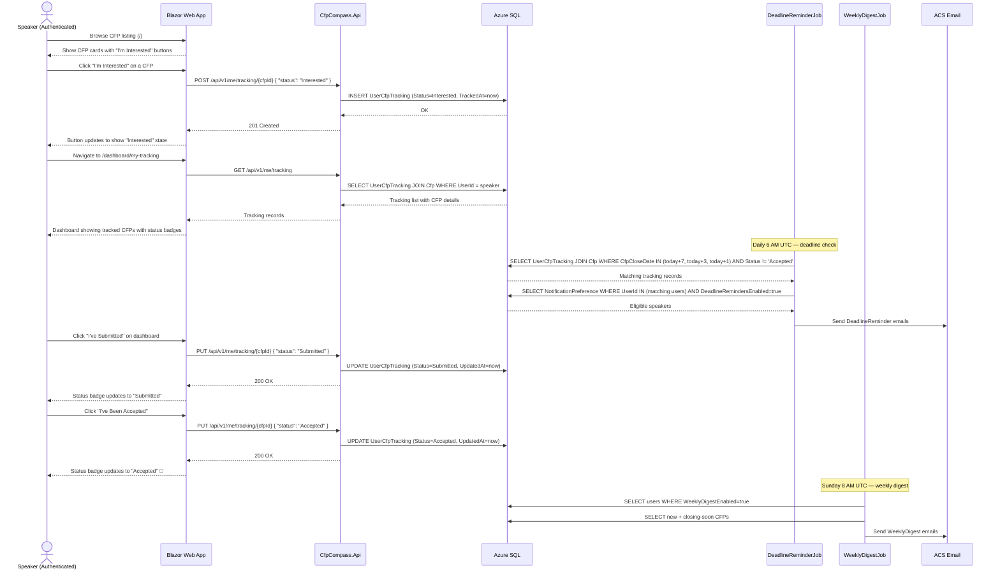
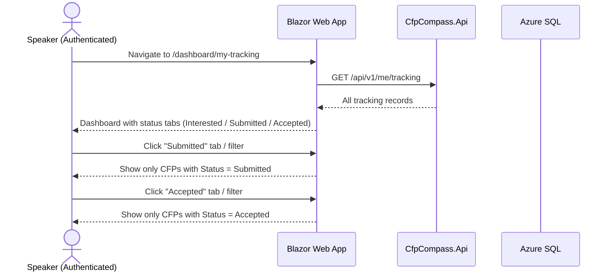
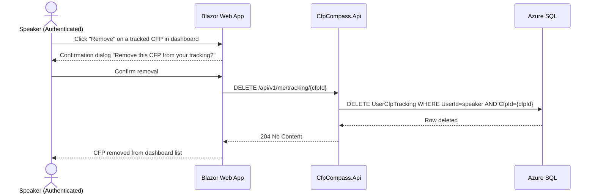
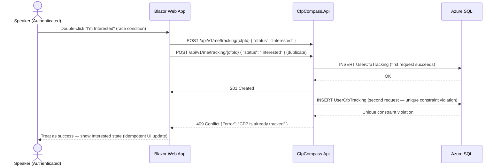

# Speaker CFP Tracking Process Flow

## Purpose and Scope

This document describes the process by which an authenticated speaker tracks their engagement with CFP listings — from expressing initial interest through marking a proposal submitted and recording an acceptance outcome. It also covers the two notification workflows that operate against tracked CFPs: deadline reminders (daily) and the weekly digest.

This document covers:
- Tracking a CFP as "Interested"
- Updating tracking status to "Submitted" and "Accepted"
- Viewing and filtering the tracking dashboard
- Deadline reminder emails (7, 3, and 1 day before close)
- Weekly digest email for opted-in speakers

This document does not cover the public CFP listing browse and filter experience (covered by the CFP listing UI), CFP submission by organizers (see [CFP Submission Process Flow](cfp-submission.md)), or notification preference management (part of the Account Settings flow).

## Actors and Systems

| Actor/System | Role/Description |
|---|---|
| Speaker (Authenticated) | An authenticated user browsing CFP listings and tracking their engagement. Must be logged in to use the tracking feature. |
| Blazor Web App | Renders the CFP listing page (tracking buttons), the tracking dashboard at `/dashboard/my-tracking`, and account settings. |
| CfpCompass.Api | Receives tracking create/update requests from the web app and persists `UserCfpTracking` records. |
| Azure SQL | Persistent store for `UserCfpTracking`, `Cfp`, and `NotificationPreference` records. |
| DeadlineReminderJob | Azure Container Apps Job (daily 6 AM UTC). Queries tracking records for upcoming CFP deadlines and dispatches reminder emails. |
| WeeklyDigestJob | Azure Container Apps Job (Sunday 8 AM UTC). Queries opted-in speakers and assembles weekly digest emails. |
| ACS Email | Azure Communication Services. Delivers deadline reminder and weekly digest emails. |

## Preconditions and Assumptions

- The speaker is authenticated (logged in via email/password, passkey, or OAuth).
- The CFP being tracked has `Status = 'Approved'` and `IsArchived = false`.
- A `NotificationPreference` record exists for the speaker (created on account registration with `DeadlineRemindersEnabled = true` and `WeeklyDigestEnabled = true`).
- `DeadlineReminderJob` and `WeeklyDigestJob` are scheduled and running as Azure Container Apps Jobs.
- ACS Email is configured and operational.

## Process Overview

A speaker browsing the CFP listing page sees "I'm Interested" buttons on each CFP card. Clicking the button creates a `UserCfpTracking` record. As the speaker progresses — submitting a talk proposal, then learning the outcome — they update the tracking status from their dashboard. The dashboard at `/dashboard/my-tracking` displays all tracked CFPs with their current status and allows filtering by status tier.

Two background jobs operate against tracking data: `DeadlineReminderJob` sends timely email reminders at 7, 3, and 1 day before a tracked CFP's deadline; `WeeklyDigestJob` sends a weekly summary of new CFPs and CFPs closing soon to opted-in speakers.

## Happy Path

A speaker tracks a CFP from interest through acceptance, receives deadline reminders, and sees their tracking history on the dashboard. See Figure 1.



<div align="center" aria-label="Sequence diagram showing the full speaker CFP tracking workflow from initial interest to acceptance, with deadline reminders and weekly digest">
<strong>Figure 1: Speaker CFP Tracking — Happy Path</strong>
</div>

**Steps:**

1. Speaker browses the public CFP listing page (`/`). Each CFP card displays an "I'm Interested" button (shown only for authenticated speakers; unauthenticated visitors see a prompt to log in).
2. Speaker clicks "I'm Interested" on a CFP.
3. The web app sends `POST /api/v1/me/tracking/{cfpId}` with `{ "status": "Interested" }`.
4. The API inserts a `UserCfpTracking` record (`Status = 'Interested'`, `TrackedAt = now`). The composite unique constraint `(UserId, CfpId)` ensures one record per speaker per CFP.
5. The API returns `201 Created`.
6. The button on the CFP card updates to show "Interested" state (filled bookmark icon or similar).
7. Speaker navigates to `/dashboard/my-tracking`.
8. The web app calls `GET /api/v1/me/tracking` to load all tracking records with CFP details.
9. The dashboard renders tracked CFPs in three tabs or filter groups: Interested, Submitted, Accepted.
10. **DeadlineReminderJob** runs daily at 6 AM UTC. It queries `UserCfpTracking` joined with `Cfp` for records where `CfpCloseDate` falls in exactly 7, 3, or 1 days from today and `Status` is `Interested` or `Submitted` (not `Accepted`).
11. For each match, it checks `NotificationPreference.DeadlineRemindersEnabled = true`.
12. `DeadlineReminderJob` sends `DeadlineReminder` emails via ACS for each eligible speaker/CFP combination.
13. Speaker submits their talk proposal to the event externally. Returns to the CFP Compass dashboard.
14. Speaker clicks "I've Submitted" on their tracked CFP.
15. The web app sends `PUT /api/v1/me/tracking/{cfpId}` with `{ "status": "Submitted" }`.
16. The API updates the `UserCfpTracking` record (`Status = 'Submitted'`, `UpdatedAt = now`).
17. The dashboard status badge updates to "Submitted."
18. After the event notifies the speaker of acceptance, the speaker returns to the dashboard.
19. Speaker clicks "I've Been Accepted."
20. The web app sends `PUT /api/v1/me/tracking/{cfpId}` with `{ "status": "Accepted" }`.
21. The API updates the record (`Status = 'Accepted'`).
22. The dashboard shows the "Accepted" badge. No further reminder emails are sent for this CFP.
23. **WeeklyDigestJob** runs every Sunday at 8 AM UTC. It queries all users with `NotificationPreference.WeeklyDigestEnabled = true`, assembles a digest of newly published CFPs and CFPs closing within 7 days, and sends `WeeklyDigest` emails via ACS. The digest highlights the speaker's tracked CFPs that are closing soon.

## Primary Alternatives

### Alternative 1: Filter Tracking Dashboard by Status

A speaker with many tracked CFPs uses the dashboard filter to view only CFPs at a specific stage of their workflow.



<div align="center" aria-label="Sequence diagram showing a speaker filtering their CFP tracking dashboard by status">
<strong>Figure 2: Speaker CFP Tracking — Filter Dashboard by Status</strong>
</div>

**Steps:**

1. Speaker navigates to `/dashboard/my-tracking`.
2. The web app loads all tracking records for the speaker in a single API call.
3. The dashboard renders tabs or filter buttons for Interested, Submitted, and Accepted.
4. Speaker clicks "Submitted" to see only CFPs they have already submitted proposals for.
5. The filter is applied client-side (the full list is already loaded); no additional API call.
6. Speaker may switch between filter tabs freely.

### Alternative 2: Remove a Tracked CFP

A speaker removes a CFP from their tracking list (e.g., they decide not to submit).



<div align="center" aria-label="Sequence diagram showing a speaker removing a CFP from their tracking list">
<strong>Figure 3: Speaker CFP Tracking — Remove Tracked CFP</strong>
</div>

**Steps:**

1. Speaker clicks "Remove" on a tracked CFP entry in their dashboard.
2. The web app shows a confirmation dialog.
3. Speaker confirms the removal.
4. The web app sends `DELETE /api/v1/me/tracking/{cfpId}`.
5. The API deletes the `UserCfpTracking` record for `(UserId, CfpId)`.
6. The API returns `204 No Content`.
7. The web app removes the CFP entry from the dashboard list.

## Error and Exception Flows

### Attempting to Track an Unauthenticated Session

If an unauthenticated visitor attempts to click "I'm Interested," the web app redirects to the login page. The tracking button is not rendered as a functional action for unauthenticated users — it instead shows a tooltip or redirect prompt.

```mermaid
sequenceDiagram
    actor Visitor as Unauthenticated Visitor
    participant Web as Blazor Web App
    participant API as CfpCompass.Api

    Visitor->>Web: Click "I'm Interested" on a CFP (not logged in)
    Web-->>Visitor: Show "Log in to track CFPs" prompt / redirect to /account/login
    Note over Web: No API call is made; tracking requires authentication
```

<div align="center" aria-label="Sequence diagram showing the redirect flow when an unauthenticated visitor attempts to track a CFP">
<strong>Figure 4: Speaker CFP Tracking — Unauthenticated Access Exception Flow</strong>
</div>

**Steps:**

1. An unauthenticated visitor clicks the tracking button on a CFP card.
2. The Blazor component detects no active authentication state.
3. The web app displays a "Log in to track CFPs" prompt or redirects to `/account/login` with a return URL.
4. No API call is made. No tracking record is created.

### Duplicate Tracking Attempt

If a speaker attempts to track a CFP they are already tracking (e.g., by submitting the same request twice in rapid succession), the API returns HTTP 409 Conflict. The web app handles this gracefully by treating the conflict as a no-op.



<div align="center" aria-label="Sequence diagram showing the conflict response when a speaker attempts to track an already-tracked CFP">
<strong>Figure 5: Speaker CFP Tracking — Duplicate Tracking Attempt Exception Flow</strong>
</div>

**Steps:**

1. Speaker double-clicks the "I'm Interested" button, sending two concurrent POST requests.
2. The first request succeeds: the `UserCfpTracking` record is inserted.
3. The second request fails: the composite unique constraint `(UserId, CfpId)` raises a conflict.
4. The API returns `HTTP 409 Conflict`.
5. The web app treats the 409 as a successful idempotent operation — the CFP is already tracked, which is the desired state. The UI shows the "Interested" state.

## State and Data Considerations

`UserCfpTracking.Status` is the only mutable field after creation. `TrackedAt` is immutable (set once on creation). `UpdatedAt` is refreshed on every status change by the EF Core interceptor.

Deadline reminder emails are sent at most once per (speaker, CFP, day-threshold) combination. The `DeadlineReminderJob` does not maintain a separate sent-log per threshold — it relies on the job's daily schedule and the `CfpCloseDate` value. If the job runs at 6 AM UTC and a CFP closes at 11:59 PM UTC on the same day (today+1 threshold), the reminder is sent. The job does not re-send for the same threshold if it has already run that day.

The `WeeklyDigestJob` sends one email per user per week. It does not send individual CFP notifications; it aggregates new and closing-soon CFPs into a single digest email.

When a CFP is archived (`Cfp.IsArchived = true`), the `DeadlineReminderJob` no longer generates reminders for it. Tracking records for archived CFPs remain and are displayed on the dashboard with an "Archived" label.

## Notes and Comments

- The `GetUserTrackedCfpIds` access pattern (a lightweight query returning only `CfpId` values for a user) is used when rendering the CFP listing page. It allows the listing to highlight already-tracked CFPs without fetching full tracking records for every CFP on the page.
- Speakers may update their status in any direction (e.g., revert from `Submitted` to `Interested`). The application does not enforce forward-only progression; it records the speaker's self-reported state.
- The tracking dashboard is accessible only to authenticated speakers. Organizers who have verified their claim see the same dashboard (they may also track other events' CFPs as speakers).
- `DeadlineReminderJob` sends reminders for exactly 7, 3, and 1 days before `CfpCloseDate`. A CFP closing in 4 days does not trigger a reminder until the 3-day threshold. This is intentional — sending reminders on every day would be excessive.
- If a speaker has `DeadlineRemindersEnabled = false`, the `DeadlineReminderJob` skips their tracking records entirely. The preference check is part of the job's eligibility query.

## References

- [CFP Tracking Data Model](../data-models/cfp-tracking.md)
- [User Data Model](../data-models/user.md)
- [CFP Data Model](../data-models/cfp.md)
- [Architecture Document — Section 7: Background Services & Workers](./../.squad/architecture.md)
- [Architecture Document — Section 8: Email Architecture](./../.squad/architecture.md)
